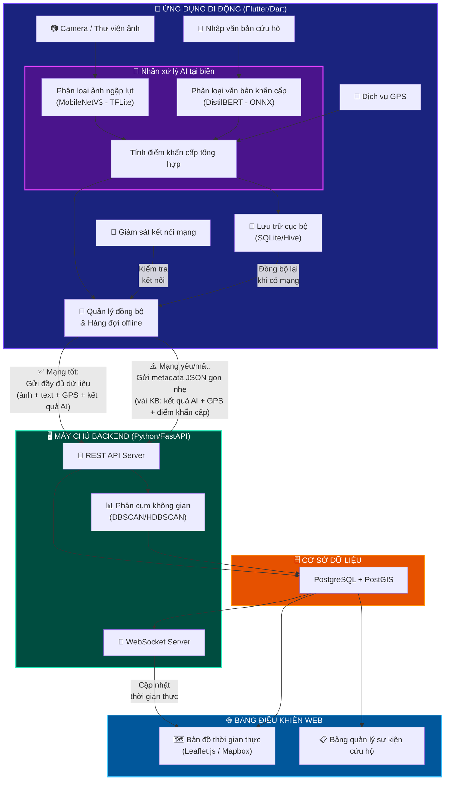
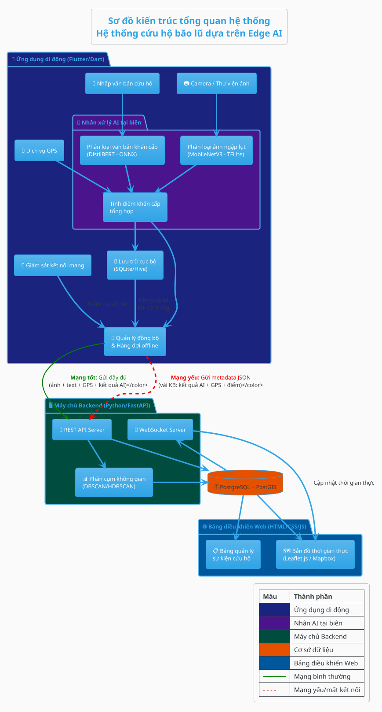
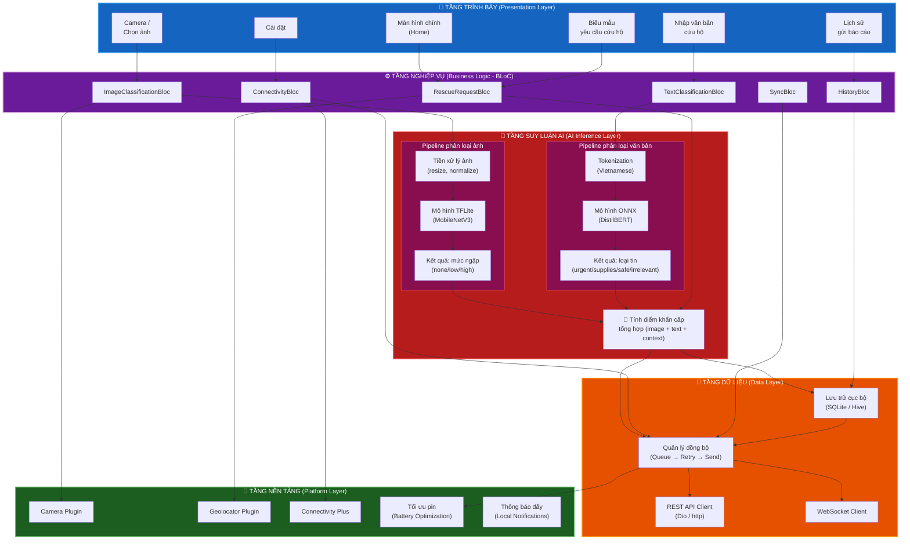
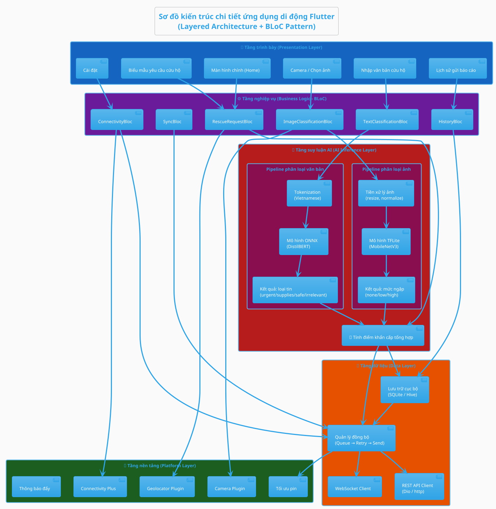
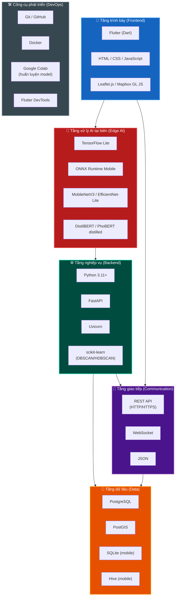
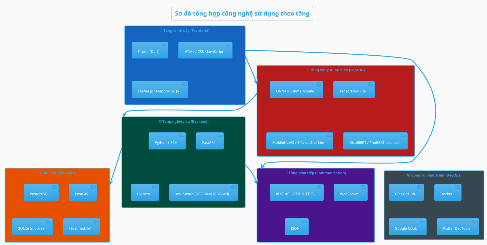
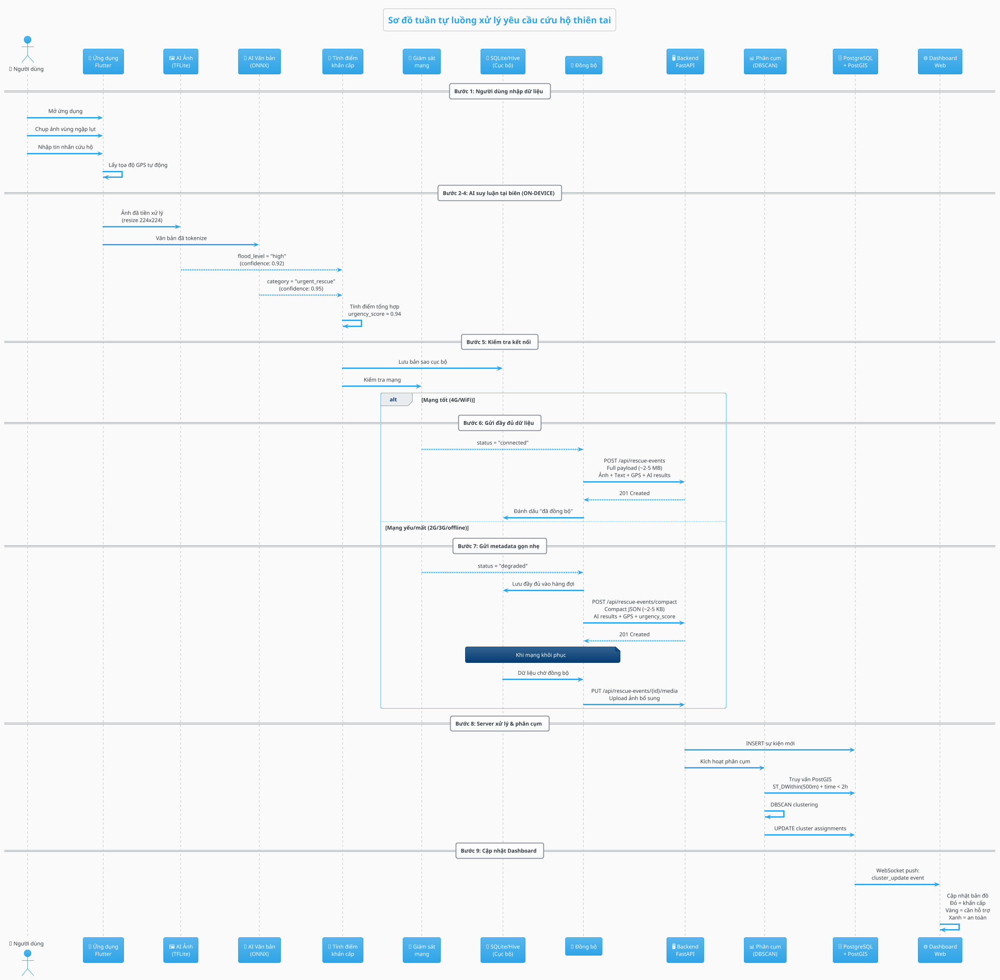

# THIẾT KẾ KIẾN TRÚC HỆ THỐNG
## Hệ thống phân tích đa phương thức và phân cụm sự kiện cứu hộ bão lũ dựa trên Edge AI

---

### 1. Sơ đồ kiến trúc tổng quan hệ thống

#### 1.1. Mermaid

**Chú thích (Legend):**
| Ký hiệu | Ý nghĩa |
|---|---|
| 🟪 Tím đậm | Ứng dụng di động (Flutter/Dart) |
| 🟣 Tím nhạt | Nhân xử lý AI tại biên (Edge AI) |
| 🟩 Xanh lá | Máy chủ Backend (Python/FastAPI) |
| 🟧 Cam | Cơ sở dữ liệu (PostgreSQL + PostGIS) |
| 🔵 Xanh dương | Bảng điều khiển Web |
| ✅ Đường liền | Luồng dữ liệu khi mạng bình thường |
| ⚠️ Đường đứt | Luồng dữ liệu khi mạng yếu/mất kết nối |

#### 1.2. PlantUML

#### 1.3. Mô tả

Kiến trúc hệ thống được thiết kế theo mô hình **lai (Hybrid)** gồm 4 tầng chính:

1. **Ứng dụng di động (Mobile App):** Được xây dựng bằng Flutter/Dart, chạy đa nền tảng (Android/iOS). Điểm cốt lõi là **nhân xử lý AI tại biên** chạy trực tiếp trên điện thoại người dùng, cho phép phân loại ảnh ngập lụt (TensorFlow Lite) và phân loại văn bản khẩn cấp (ONNX Runtime) mà **không cần kết nối Internet**. Hệ thống tự động tính điểm khẩn cấp tổng hợp từ kết quả AI và dữ liệu GPS.

2. **Cơ chế truyền dữ liệu thích ứng (Adaptive Data Transmission):**
   - **Khi mạng tốt (4G/WiFi):** Gửi toàn bộ dữ liệu bao gồm ảnh gốc, văn bản, tọa độ GPS và kết quả AI lên server.
   - **Khi mạng yếu/mất (2G/3G/offline):** Chỉ gửi gói metadata JSON gọn nhẹ (vài KB) chứa: kết quả phân loại AI, tọa độ GPS, điểm khẩn cấp và tóm tắt văn bản. Dữ liệu đầy đủ được lưu vào hàng đợi cục bộ (SQLite/Hive) và tự động đồng bộ khi kết nối được khôi phục.

3. **Máy chủ Backend:** Sử dụng Python với FastAPI, tiếp nhận dữ liệu từ ứng dụng di động, thực hiện phân cụm không gian các sự kiện cứu hộ bằng thuật toán DBSCAN/HDBSCAN kết hợp PostGIS để gom nhóm các báo cáo trùng lặp theo vị trí địa lý.

4. **Bảng điều khiển Web (Dashboard):** Hiển thị bản đồ thời gian thực với Leaflet.js/Mapbox, cập nhật liên tục qua WebSocket. Các sự kiện cứu hộ được phân cụm và hiển thị theo mã màu ưu tiên (đỏ = khẩn cấp, vàng = cần hỗ trợ, xanh = an toàn).

---

### 2. Sơ đồ kiến trúc chi tiết ứng dụng di động

#### 2.1. Mermaid

#### 2.2. PlantUML

#### 2.3. Mô tả

Ứng dụng di động được thiết kế theo **kiến trúc phân tầng (Layered Architecture)** kết hợp **BLoC (Business Logic Component)** pattern để quản lý trạng thái. Lý do chọn BLoC:

- **Tách biệt rõ ràng** giữa UI và logic nghiệp vụ, phù hợp với ứng dụng có nhiều luồng xử lý phức tạp (AI inference, sync, connectivity monitoring).
- **Reactive programming** với Stream giúp UI tự động cập nhật khi trạng thái thay đổi (ví dụ: kết quả AI hoàn thành, trạng thái mạng thay đổi).
- **Testability cao** — mỗi BLoC có thể được unit test độc lập.
- **Được Flutter community hỗ trợ mạnh mẽ** với thư viện `flutter_bloc`.

**Các tầng chi tiết:**

1. **Tầng trình bày:** Gồm 6 màn hình chính — Trang chủ, Chụp/chọn ảnh, Nhập văn bản, Biểu mẫu cứu hộ, Lịch sử, Cài đặt. Mỗi màn hình kết nối với BLoC tương ứng.

2. **Tầng nghiệp vụ (BLoC):** 6 BLoC quản lý các luồng xử lý — phân loại ảnh, phân loại văn bản, tạo yêu cầu cứu hộ, giám sát kết nối, đồng bộ dữ liệu, lịch sử.

3. **Tầng suy luận AI:** Hai pipeline xử lý song song:
   - **Pipeline ảnh:** Tiền xử lý (resize 224×224, normalize) → MobileNetV3 TFLite → Phân loại mức ngập (none/low/high).
   - **Pipeline văn bản:** Tokenization tiếng Việt → DistilBERT ONNX → Phân loại tin nhắn (urgent_rescue/need_supplies/safe_update/irrelevant).
   - **Tính điểm khẩn cấp tổng hợp** từ cả hai pipeline kết hợp ngữ cảnh (vị trí, thời gian).

4. **Tầng dữ liệu:** Lưu trữ cục bộ bằng SQLite/Hive cho hàng đợi offline. Quản lý đồng bộ tự động retry với exponential backoff khi mạng yếu.

5. **Tầng nền tảng:** Tích hợp các plugin native — Camera, GPS (Geolocator), giám sát kết nối (Connectivity Plus), tối ưu pin để AI inference không tiêu hao quá nhiều tài nguyên.

---

### 3. Bảng mô tả các module chính

| # | Tên Module | Mô tả chức năng | Công nghệ sử dụng | Người phụ trách |
| --- | --- | --- | --- | --- |
| 1 | Module Camera & Chụp ảnh | Thu thập ảnh từ camera thiết bị hoặc thư viện ảnh. Hỗ trợ chụp ảnh trực tiếp với giao diện tùy chỉnh, nén ảnh trước khi xử lý AI. | Flutter (camera, image_picker plugin) | Nguyễn Thanh Trọng, Cao Tường Hưng |
| 2 | Module AI Phân loại ảnh (on-device) | Chạy mô hình AI ngay trên điện thoại để phân loại ảnh ngập lụt thành 3 mức: không ngập (none), ngập nhẹ (low), ngập nặng (high). Tiền xử lý ảnh (resize 224×224, normalize) trước khi đưa vào mô hình. | TensorFlow Lite, MobileNetV3 / EfficientNet-Lite | Lê Thị Ngọc Ảnh, Nguyễn Như Quỳnh, Ngô Hưng Thịnh, Cao Tường Hưng |
| 3 | Module Nhập & Xử lý văn bản | Cung cấp giao diện nhập tin nhắn cứu hộ bằng tiếng Việt. Thực hiện tiền xử lý văn bản: chuẩn hóa Unicode, loại bỏ ký tự đặc biệt, tokenization. | Flutter (TextInput), Dart | Nguyễn Thanh Trọng, Cao Tường Hưng |
| 4 | Module AI Phân loại văn bản (on-device) | Chạy mô hình NLP trên thiết bị để phân loại tin nhắn thành 4 nhóm: cứu hộ khẩn cấp (urgent_rescue), cần vật tư (need_supplies), cập nhật an toàn (safe_update), không liên quan (irrelevant). | ONNX Runtime Mobile, DistilBERT / PhoBERT distilled | Lê Thị Ngọc Ảnh, Nguyễn Như Quỳnh, Ngô Hưng Thịnh, Cao Tường Hưng |
| 5 | Module Tính điểm khẩn cấp | Kết hợp kết quả từ module phân loại ảnh và văn bản cùng thông tin ngữ cảnh (thời gian, vị trí) để tính điểm khẩn cấp tổng hợp (0.0 – 1.0). Công thức có trọng số cho từng yếu tố. | Dart (thuật toán tự xây dựng) | Nguyễn Thanh Trọng, Cao Tường Hưng |
| 6 | Module Hàng đợi Offline & Đồng bộ dữ liệu | Lưu trữ dữ liệu cứu hộ vào hàng đợi cục bộ khi mất kết nối. Tự động đồng bộ với server khi mạng được khôi phục với cơ chế retry (exponential backoff). Hỗ trợ 2 chế độ gửi: đầy đủ (mạng tốt) và gọn nhẹ (mạng yếu). | SQLite / Hive (Flutter), Dart Isolates | Nguyễn Thanh Trọng, Cao Tường Hưng |
| 7 | Module GPS & Dịch vụ vị trí | Lấy tọa độ GPS chính xác của thiết bị. Hỗ trợ reverse geocoding để hiển thị địa chỉ. Tối ưu pin khi thu thập vị trí liên tục. | Flutter (geolocator, geocoding plugin) | Nguyễn Thanh Trọng, Cao Tường Hưng |
| 8 | Module Giám sát kết nối mạng | Liên tục kiểm tra trạng thái mạng (WiFi/4G/3G/2G/offline). Đo lường băng thông thực tế để quyết định chế độ gửi dữ liệu (đầy đủ hoặc gọn nhẹ). Phát sự kiện khi trạng thái mạng thay đổi. | Flutter (connectivity_plus plugin) | Nguyễn Thanh Trọng, Cao Tường Hưng |
| 9 | Module REST API Client | Gửi dữ liệu cứu hộ lên server qua HTTP. Hỗ trợ multipart upload (ảnh), JSON request (metadata). Xử lý authentication, retry logic, error handling. | Dart (Dio / http package) | Nguyễn Thanh Trọng, Cao Tường Hưng |
| 10 | Module Backend API Server | Tiếp nhận và xử lý dữ liệu cứu hộ từ ứng dụng di động. Cung cấp REST API endpoints và WebSocket server cho cập nhật thời gian thực. Xác thực và phân quyền người dùng. | Python, FastAPI, Uvicorn | Lê Thị Ngọc Ảnh, Nguyễn Như Quỳnh |
| 11 | Module Phân cụm không gian (Spatial Clustering Engine) | Gom nhóm các sự kiện cứu hộ trùng lặp dựa trên vị trí địa lý và ngữ nghĩa. Sử dụng thuật toán DBSCAN/HDBSCAN kết hợp truy vấn không gian PostGIS. Cập nhật cụm theo thời gian thực khi có dữ liệu mới. | Python, scikit-learn (DBSCAN/HDBSCAN), PostGIS | Nguyễn Thanh Trọng, Ngô Hưng Thịnh |
| 12 | Module Cơ sở dữ liệu | Lưu trữ dữ liệu sự kiện cứu hộ, kết quả phân cụm, thông tin người dùng. Hỗ trợ truy vấn không gian (spatial queries) cho bản đồ và phân cụm. | PostgreSQL, PostGIS | Nguyễn Thanh Trọng, Cao Tường Hưng |
| 13 | Module Bảng điều khiển Web & Bản đồ | Hiển thị bản đồ thời gian thực với các sự kiện cứu hộ đã phân cụm. Mã màu theo mức độ khẩn cấp (đỏ/vàng/xanh). Cập nhật tự động qua WebSocket. Bảng quản lý danh sách sự kiện với bộ lọc. | HTML/CSS/JavaScript, Leaflet.js / Mapbox GL JS | Lê Thị Ngọc Ảnh, Nguyễn Như Quỳnh |
| 14 | Module Xác thực người dùng | Đăng ký, đăng nhập, quản lý phiên làm việc cho người dùng ứng dụng di động và quản trị viên dashboard. Hỗ trợ JWT token-based authentication. | FastAPI (python-jose), Flutter (secure_storage) | Lê Thị Ngọc Ảnh, Nguyễn Như Quỳnh |

---

### 4. Sơ đồ tổng hợp công nghệ sử dụng

#### 4.1. Mermaid

#### 4.2. PlantUML

---

### 5. Sơ đồ tuần tự luồng xử lý yêu cầu cứu hộ

#### 5.1. Mermaid

```mermaid
sequenceDiagram
    actor User as 👤 Người dùng
    participant App as 📱 Ứng dụng Flutter
    participant ImgAI as 🖼️ AI Phân loại ảnh<br/>(TFLite - MobileNetV3)
    participant TxtAI as 📝 AI Phân loại văn bản<br/>(ONNX - DistilBERT)
    participant Score as 🔴 Tính điểm khẩn cấp
    participant NetMon as 📶 Giám sát mạng
    participant LocalDB as 💾 SQLite/Hive<br/>(Hàng đợi cục bộ)
    participant Sync as 🔄 Quản lý đồng bộ
    participant API as 🖥️ Backend FastAPI
    participant Cluster as 📊 Phân cụm không gian<br/>(DBSCAN)
    participant DB as 🗄️ PostgreSQL<br/>+ PostGIS
    participant WS as 🔗 WebSocket Server
    participant Dashboard as 🌐 Bảng điều khiển Web<br/>(Leaflet.js)

    Note over User,Dashboard: 🚨 LUỒNG XỬ LÝ YÊU CẦU CỨU HỘ THIÊN TAI

    rect rgb(25, 118, 210)
        Note over User,App: Bước 1: Người dùng nhập dữ liệu
        User->>App: Mở ứng dụng
        User->>App: Chụp ảnh vùng ngập lụt
        User->>App: Nhập tin nhắn cứu hộ<br/>("Nước ngập nóc nhà,<br/>cần cứu hộ gấp!")
        App->>App: Lấy tọa độ GPS tự động
    end

    rect rgb(183, 28, 28)
        Note over App,Score: Bước 2-4: AI suy luận tại biên (ON-DEVICE)
        par Xử lý song song trên thiết bị
            App->>ImgAI: Gửi ảnh đã tiền xử lý<br/>(resize 224x224, normalize)
            ImgAI-->>Score: Kết quả: flood_level = "high"<br/>(confidence: 0.92)
        and
            App->>TxtAI: Gửi văn bản đã tokenize
            TxtAI-->>Score: Kết quả: category = "urgent_rescue"<br/>(confidence: 0.95)
        end
        Score->>Score: Tính điểm khẩn cấp tổng hợp<br/>urgency_score = 0.94<br/>(weighted: 0.4*image + 0.4*text + 0.2*context)
    end

    rect rgb(74, 20, 140)
        Note over Score,Sync: Bước 5: Kiểm tra kết nối mạng
        Score->>LocalDB: Lưu bản sao cục bộ<br/>(phòng mất dữ liệu)
        Score->>NetMon: Kiểm tra trạng thái mạng
    end

    alt ✅ Mạng tốt (4G/WiFi - bandwidth > 1 Mbps)
        rect rgb(27, 94, 32)
            Note over Sync,API: Bước 6: Gửi đầy đủ dữ liệu
            NetMon-->>Sync: status = "connected"
            Sync->>API: POST /api/rescue-events<br/>📦 Full payload (~2-5 MB):<br/>• Ảnh gốc (JPEG)<br/>• Văn bản đầy đủ<br/>• GPS (lat, lng)<br/>• Kết quả AI<br/>• urgency_score: 0.94
            API-->>Sync: 201 Created ✅
            Sync->>LocalDB: Đánh dấu "đã đồng bộ"
        end
    else ⚠️ Mạng yếu/mất kết nối (2G/3G/offline)
        rect rgb(230, 81, 0)
            Note over Sync,API: Bước 7: Gửi metadata gọn nhẹ
            NetMon-->>Sync: status = "degraded" hoặc "offline"
            Sync->>LocalDB: Lưu dữ liệu đầy đủ vào hàng đợi
            Note over Sync: Chỉ gửi metadata JSON (~2-5 KB)
            Sync->>API: POST /api/rescue-events/compact<br/>📄 Compact payload (~2-5 KB):<br/>{"flood_level": "high",<br/>"category": "urgent_rescue",<br/>"urgency_score": 0.94,<br/>"lat": 16.054, "lng": 108.223,<br/>"text_summary": "Ngập nóc nhà, cứu hộ gấp",<br/>"has_pending_media": true}
            API-->>Sync: 201 Created ✅
            Note over LocalDB,Sync: ⏳ Khi mạng khôi phục
            LocalDB->>Sync: Lấy dữ liệu chờ đồng bộ
            Sync->>API: PUT /api/rescue-events/{id}/media<br/>📦 Upload ảnh gốc bổ sung
        end
    end

    rect rgb(0, 77, 64)
        Note over API,DB: Bước 8: Server xử lý & phân cụm
        API->>DB: INSERT sự kiện cứu hộ mới
        API->>Cluster: Kích hoạt phân cụm
        Cluster->>DB: Truy vấn PostGIS:<br/>ST_DWithin(point, 500m)<br/>+ thời gian < 2h
        Cluster->>Cluster: Chạy DBSCAN<br/>(eps=500m, min_samples=2)
        Cluster->>DB: UPDATE cluster_id<br/>cho các sự kiện gần nhau
        Cluster->>DB: UPDATE cluster priority<br/>= MAX(urgency_score)
    end

    rect rgb(1, 87, 155)
        Note over WS,Dashboard: Bước 9: Cập nhật Dashboard thời gian thực
        DB->>WS: Trigger: sự kiện mới / cụm cập nhật
        WS->>Dashboard: WebSocket push:<br/>{"type": "cluster_update",<br/>"cluster_id": 42,<br/>"priority": "critical",<br/>"event_count": 5,<br/>"center": [16.054, 108.223]}
        Dashboard->>Dashboard: 🗺️ Cập nhật bản đồ:<br/>• Marker đỏ = khẩn cấp (score > 0.7)<br/>• Marker vàng = cần hỗ trợ (0.4-0.7)<br/>• Marker xanh = an toàn (< 0.4)<br/>• Popup: chi tiết cụm sự kiện
    end

    Note over User,Dashboard: ✅ Toàn bộ luồng hoàn tất<br/>Từ khi người dùng gửi tin → Hiển thị trên bản đồ: ~2-5 giây (mạng tốt)
```

#### 5.2. PlantUML

#### 5.3. Mô tả

Sơ đồ tuần tự mô tả **toàn bộ vòng đời của một yêu cầu cứu hộ** từ khi người dùng gửi thông tin đến khi hiển thị trên bản đồ dashboard. Các bước chính:

1. **Thu thập dữ liệu (Bước 1):** Người dùng mở ứng dụng, chụp ảnh vùng ngập lụt và/hoặc nhập tin nhắn cứu hộ bằng tiếng Việt. Hệ thống tự động lấy tọa độ GPS.

2. **Suy luận AI tại biên (Bước 2–4):** Đây là điểm **khác biệt cốt lõi** của hệ thống. Hai pipeline AI chạy **song song ngay trên điện thoại**:
   - MobileNetV3 (TFLite) phân loại mức ngập: none/low/high
   - DistilBERT (ONNX) phân loại tin nhắn: urgent_rescue/need_supplies/safe_update/irrelevant
   - Điểm khẩn cấp tổng hợp được tính với công thức có trọng số (0.4 × image + 0.4 × text + 0.2 × context)

3. **Truyền dữ liệu thích ứng (Bước 5–7):** Hệ thống kiểm tra kết nối mạng và chọn chế độ gửi phù hợp:
   - **Mạng tốt:** Gửi payload đầy đủ (~2–5 MB) bao gồm ảnh gốc.
   - **Mạng yếu/offline:** Chỉ gửi gói JSON gọn nhẹ (~2–5 KB) chứa kết quả AI và metadata. Ảnh gốc được lưu trong hàng đợi cục bộ và tự động upload khi mạng khôi phục.

4. **Phân cụm trên server (Bước 8):** Backend sử dụng DBSCAN kết hợp PostGIS để gom nhóm các sự kiện cứu hộ trong bán kính 500m và khung thời gian 2 giờ, loại bỏ trùng lặp.

5. **Hiển thị Dashboard (Bước 9):** Bản đồ cập nhật thời gian thực qua WebSocket với mã màu ưu tiên:
   - 🔴 Đỏ: Khẩn cấp (urgency_score > 0.7)
   - 🟡 Vàng: Cần hỗ trợ (0.4 – 0.7)
   - 🟢 Xanh: An toàn (< 0.4)

**Thời gian phản hồi dự kiến:** ~2–5 giây từ khi người dùng gửi đến khi hiển thị trên bản đồ (trong điều kiện mạng bình thường).
