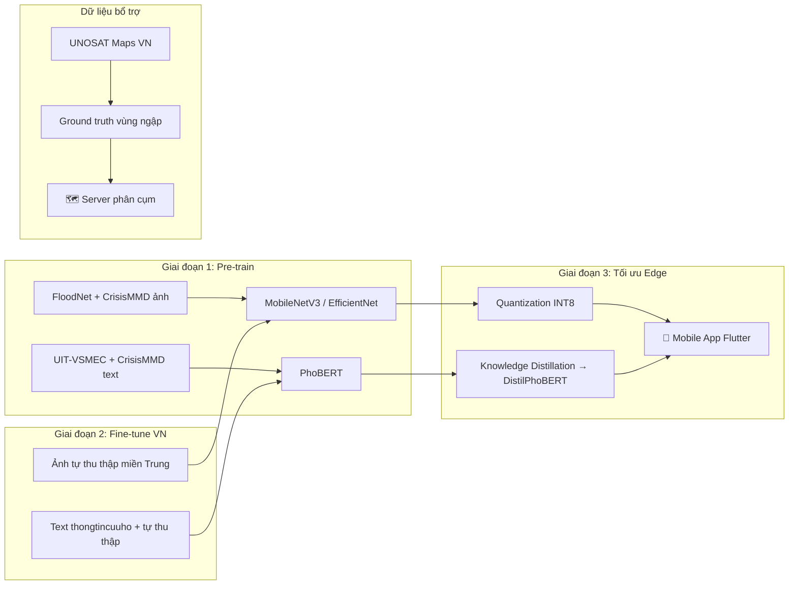

# Tổng Hợp Bộ Dataset Phù Hợp Cho Đề Tài Cứu Hộ Bão Lũ

## Yêu cầu dataset từ thuyết minh

- **Hình ảnh**: nhận diện mức độ ngập lụt, thiệt hại nhà cửa — đặc biệt bối cảnh miền Trung Việt Nam
- **Văn bản**: phân loại tin nhắn khẩn cấp tiếng Việt (Zalo, Facebook)
- Cần dữ liệu đa dạng: ảnh trên không, ảnh mặt đất, text mạng xã hội

---

## A. Dataset Hình Ảnh

### 1. 🌊 FloodNet — Ảnh UAV hậu bão lũ (Chuẩn quốc tế)

| Tiêu chí | Chi tiết |
|---|---|
| **Nguồn** | University of Maryland / IEEE |
| **Kích thước** | ~2,343 ảnh UAV độ phân giải cao |
| **Nhãn** | 10 lớp: Building-Flooded, Building-Non-Flooded, Road-Flooded, Road-Non-Flooded, Water, Tree, Vehicle, Pool, Grass, Mud/Sand |
| **Nhiệm vụ** | Image Classification, Semantic Segmentation, Visual QA (~11,000 cặp câu hỏi-ảnh) |
| **Download** | [GitHub - BinaLab/FloodNet](https://github.com/BinaLab/FloodNet-Supervised_v1.0) |
| **License** | Nghiên cứu |

**Tại sao phù hợp:**
- Chất lượng nhãn cao, đã được chuẩn hóa cho nghiên cứu
- Phân biệt rõ ràng **nhà ngập vs. nhà không ngập**, **đường ngập vs. đường không ngập**
- Dùng làm **base dataset** cho transfer learning trước khi fine-tune với ảnh Việt Nam

> [!IMPORTANT]
> FloodNet chụp sau bão Harvey (Mỹ). Các nhà ở kiểu Mỹ khác biệt với nhà ở miền Trung VN → **cần fine-tune thêm** với dữ liệu Việt Nam.

---

### 2. 📸 CrisisMMD v2.0 — Ảnh + Text đa thiên tai (Chuẩn quốc tế)

| Tiêu chí | Chi tiết |
|---|---|
| **Nguồn** | QCRI (Qatar Computing Research Institute) |
| **Kích thước** | ~18,082 tweets + ảnh từ 7 sự kiện thiên tai (2017) |
| **Nhãn ảnh** | **Informativeness** (có thông tin / không), **Humanitarian** (thiệt hại hạ tầng, cứu hộ, người bị ảnh hưởng...), **Damage Severity** (nặng / nhẹ / không) |
| **Download** | [CrisisNLP.org](https://crisisnlp.qcri.org/crisismmd) hoặc [Hugging Face](https://huggingface.co/datasets/CrisisMMD) |
| **Dung lượng** | ~1.8 GB |

**Tại sao phù hợp:**
- **Multimodal** — có cả ảnh lẫn text, phù hợp hoàn hảo với đề tài đa phương thức
- Nhãn phân loại **mức độ thiệt hại** (severe/mild/none) → trực tiếp dùng được cho bài toán ưu tiên cứu hộ
- Nhãn **humanitarian categories** bao gồm "Rescue, volunteering or donation effort"
- Dữ liệu từ mạng xã hội → cùng nguồn với dữ liệu thực tế của đề tài

---

### 3. 📷 Close-View Flood Dataset (CVFD) — Ảnh mặt đất (Kaggle)

| Tiêu chí | Chi tiết |
|---|---|
| **Nguồn** | Kaggle |
| **Đặc điểm** | Ảnh góc nhìn mặt đất (ground-level), giống ảnh người dân chụp |
| **Nhãn** | Binary Classification (ngập/không ngập) + Segmentation masks (nước lũ, người) |
| **Download** | [Kaggle - CVFD](https://www.kaggle.com/datasets/) |

**Tại sao phù hợp:**
- **Góc nhìn giống ảnh người dùng chụp từ điện thoại** → sát thực tế nhất với ứng dụng mobile
- Có mask cho nước lũ và người → hỗ trợ YOLOv8-Nano phát hiện đối tượng
- Bổ sung cho FloodNet (ảnh trên cao) → đa dạng góc nhìn

---

### 4. 🌍 Flood Classification Dataset (Combined) — Phân loại nhị phân (Kaggle)

| Tiêu chí | Chi tiết |
|---|---|
| **Nguồn** | Kaggle |
| **Đặc điểm** | Tổng hợp từ nhiều nguồn, phân loại flooded vs. non-flooded |
| **Download** | [Kaggle - Flood Classification](https://www.kaggle.com/) |

**Tại sao phù hợp:**
- Dùng để **pre-train** model nhận dạng cảnh ngập lụt tổng quát
- Kết hợp với FloodNet để tăng cường dữ liệu

---

### 5. 🛰️ UNOSAT Flood Maps Vietnam — Bản đồ ngập Việt Nam từ vệ tinh

| Tiêu chí | Chi tiết |
|---|---|
| **Nguồn** | UNOSAT (LHQ) + Sentinel-1 SAR |
| **Đặc điểm** | Bản đồ vùng ngập thực tế tại Việt Nam (bão Yagi 2024, các trận lũ miền Trung) |
| **Download** | [HDX - Humanitarian Data Exchange](https://data.humdata.org/) |

**Tại sao phù hợp:**
- **Dữ liệu thực tế tại Việt Nam** — bao gồm miền Trung
- Dùng để tạo ground truth cho vị trí ngập thực tế
- Kết hợp với thuật toán phân cụm không gian trong đề tài

---

### 6. 🇻🇳 Dữ liệu tự thu thập — Ảnh bão lũ miền Trung Việt Nam

| Tiêu chí | Chi tiết |
|---|---|
| **Nguồn gợi ý** | Facebook groups cứu hộ miền Trung, báo chí VN, thongtincuuho.org |
| **Sự kiện chính** | Bão Noru 2022, lũ miền Trung 2020, bão Yagi 2024 |
| **Mục tiêu** | 500-1000 ảnh có gán nhãn mức độ ngập + thiệt hại |

**Cách thu thập:**
```
1. Web crawling từ Facebook/Zalo groups cứu hộ (dùng API hoặc Selenium)
2. Thu thập ảnh từ báo chí: VnExpress, Tuổi Trẻ, Dân Trí (mục thiên tai)
3. Ảnh vệ tinh từ Google Earth Engine cho vùng miền Trung
4. Gán nhãn thủ công: mức_ngập (thấp/trung/cao), thiệt_hại (nhẹ/nặng/nghiêm_trọng)
5. Data augmentation: xoay, lật, thay đổi sáng/tương phản
```

> [!CAUTION]
> **Lưu ý bản quyền**: Cần xin phép hoặc ghi nguồn khi thu thập ảnh từ mạng xã hội. Nên ẩn thông tin cá nhân trong ảnh trước khi sử dụng cho nghiên cứu.

---

## B. Dataset Văn Bản

### 1. 💬 UIT-VSMEC — Phân tích cảm xúc tiếng Việt

| Tiêu chí | Chi tiết |
|---|---|
| **Nguồn** | UIT (ĐH CNTT TP.HCM) |
| **Kích thước** | ~6,927 câu tiếng Việt từ mạng xã hội |
| **Nhãn** | 7 lớp: Sadness, Enjoyment, Anger, Disgust, Fear, Surprise, Other |
| **Download** | [GitHub UIT-NLP](https://github.com/uitnlp) |

**Tại sao phù hợp:**
- Nhãn **Fear** và **Sadness** trực tiếp liên quan đến ngữ cảnh khẩn cấp
- Tiếng Việt bản địa, hiểu sắc thái ngôn ngữ mạng xã hội VN
- Dùng làm **pre-train cho PhoBERT** trước khi fine-tune trên dữ liệu cứu hộ

---

### 2. 📱 CrisisLexT26 — Tweets thiên tai đa ngôn ngữ

| Tiêu chí | Chi tiết |
|---|---|
| **Nguồn** | CrisisLex.org |
| **Kích thước** | Tweets từ 26 sự kiện thiên tai (2012-2013) |
| **Nhãn** | Informativeness + 6 humanitarian categories |
| **Download** | [CrisisLex.org](https://crisislex.org/) |

**Tại sao phù hợp:**
- Nhãn humanitarian rất chi tiết → dùng làm **mẫu nhãn (label schema)** cho dữ liệu tiếng Việt
- Giúp thiết kế hệ thống phân loại tin nhắn theo nhóm: cứu hộ, thiệt hại, quyên góp, v.v.

---

### 3. 🆘 thongtincuuho.org — Dữ liệu cứu hộ thực tế Việt Nam

| Tiêu chí | Chi tiết |
|---|---|
| **Nguồn** | Dự án cộng đồng của kỹ sư VN |
| **Đặc điểm** | Bản đồ cứu hộ thời gian thực, thu thập từ mạng xã hội VN |
| **Phạm vi** | Huế, Đà Nẵng, Quảng Nam, Đăk Lăk, Khánh Hòa, Lâm Đồng, Gia Lai |
| **Website** | [thongtincuuho.org](https://thongtincuuho.org) |

**Tại sao phù hợp:**
- **Nguồn dữ liệu thực tế nhất cho miền Trung VN** — đúng bối cảnh đề tài
- Có phân loại: kêu cứu, nước dâng, sạt lở, mất tích, v.v.
- Dữ liệu được hứa cung cấp cho nghiên cứu sau khi kết thúc dự án → **liên hệ để xin dữ liệu**

> [!TIP]
> Nên liên hệ trực tiếp đội ngũ thongtincuuho.org để xin chia sẻ dữ liệu cho mục đích nghiên cứu. Đây là nguồn **quý nhất** cho đề tài vì chứa dữ liệu cứu hộ thực tế có vị trí, thời gian và nội dung text.

---

### 4. 🇻🇳 Dữ liệu tự thu thập — Văn bản cứu hộ tiếng Việt

| Tiêu chí | Chi tiết |
|---|---|
| **Nguồn gợi ý** | Zalo groups, Facebook pages cứu hộ, comments báo chí |
| **Mục tiêu** | 2,000-5,000 tin nhắn có gán nhãn |

**Schema nhãn đề xuất (dựa trên CrisisMMD + bối cảnh VN):**

| Nhãn | Ví dụ |
|---|---|
| `kêu_cứu_khẩn_cấp` | "Cứu với! Nước dâng nóc nhà rồi, có người già và trẻ nhỏ" |
| `báo_ngập` | "Đường quốc lộ 1A đoạn qua Quảng Bình ngập 1m" |
| `thiệt_hại` | "Nhà bị sập mái, đồ đạc trôi hết" |
| `cứu_trợ` | "Đoàn cứu trợ đang phát lương thực ở xã Phong Điền" |
| `cảnh_báo` | "Nước sông Hương đang lên nhanh, bà con cẩn thận" |
| `thông_tin_chung` | "Dự báo bão số 4 sẽ đổ bộ vào Đà Nẵng chiều nay" |

**Cách thu thập:**
```
1. Web crawling Facebook groups: "Cứu hộ miền Trung", "Hỗ trợ bão lũ", v.v.
2. Lọc comments chứa keyword: "cứu", "ngập", "sạt lở", "mất tích", "kẹt",...
3. Gán nhãn thủ công (mỗi sample cần 2 người gán nhãn độc lập)
4. Tính Kappa score để đảm bảo chất lượng nhãn
```

---

## C. Bảng Tổng Hợp

| # | Dataset | Loại | Kích thước | Ngữ cảnh VN | Mục đích sử dụng |
|---|---|---|---|---|---|
| 1 | **FloodNet** | Ảnh UAV | 2,343 ảnh | ❌ (Mỹ) | Pre-train phân loại + segmentation ảnh ngập |
| 2 | **CrisisMMD v2.0** | Ảnh + Text | 18,082 mẫu | ❌ (Quốc tế) | Pre-train đa phương thức, mẫu phân loại thiệt hại |
| 3 | **CVFD** | Ảnh mặt đất | Đang mở rộng | ❌ (Quốc tế) | Bổ sung ảnh góc nhìn người dùng |
| 4 | **Flood Classification** | Ảnh | Tổng hợp | ❌ (Quốc tế) | Pre-train binary classification |
| 5 | **UNOSAT Maps VN** | Bản đồ vệ tinh | Nhiều sự kiện | ✅ | Ground truth vùng ngập tại VN |
| 6 | **UIT-VSMEC** | Text tiếng Việt | 6,927 câu | ✅ | Pre-train cảm xúc tiếng Việt |
| 7 | **CrisisLexT26** | Text tiếng Anh | 26 sự kiện | ❌ (Quốc tế) | Schema nhãn humanitarian |
| 8 | **thongtincuuho.org** | Text + vị trí | Thời gian thực | ✅ (Miền Trung) | Dữ liệu thực tế cứu hộ VN |
| 9 | **Tự thu thập (ảnh)** | Ảnh VN | ~500-1000 ảnh | ✅ (Miền Trung) | Fine-tune cho bối cảnh VN |
| 10 | **Tự thu thập (text)** | Text tiếng Việt | ~2000-5000 câu | ✅ (Miền Trung) | Fine-tune phân loại tin nhắn VN |

---

## D. Chiến Lược Sử Dụng Dataset



> [!IMPORTANT]
> **Ưu tiên hàng đầu:** Liên hệ thongtincuuho.org và thu thập dữ liệu ảnh/text thực tế từ miền Trung VN. Các dataset quốc tế (FloodNet, CrisisMMD) chỉ dùng để pre-train, **mô hình cuối cùng bắt buộc phải fine-tune với dữ liệu Việt Nam** để có kết quả chính xác trong bối cảnh nhà ở, địa hình và ngôn ngữ đặc thù.
