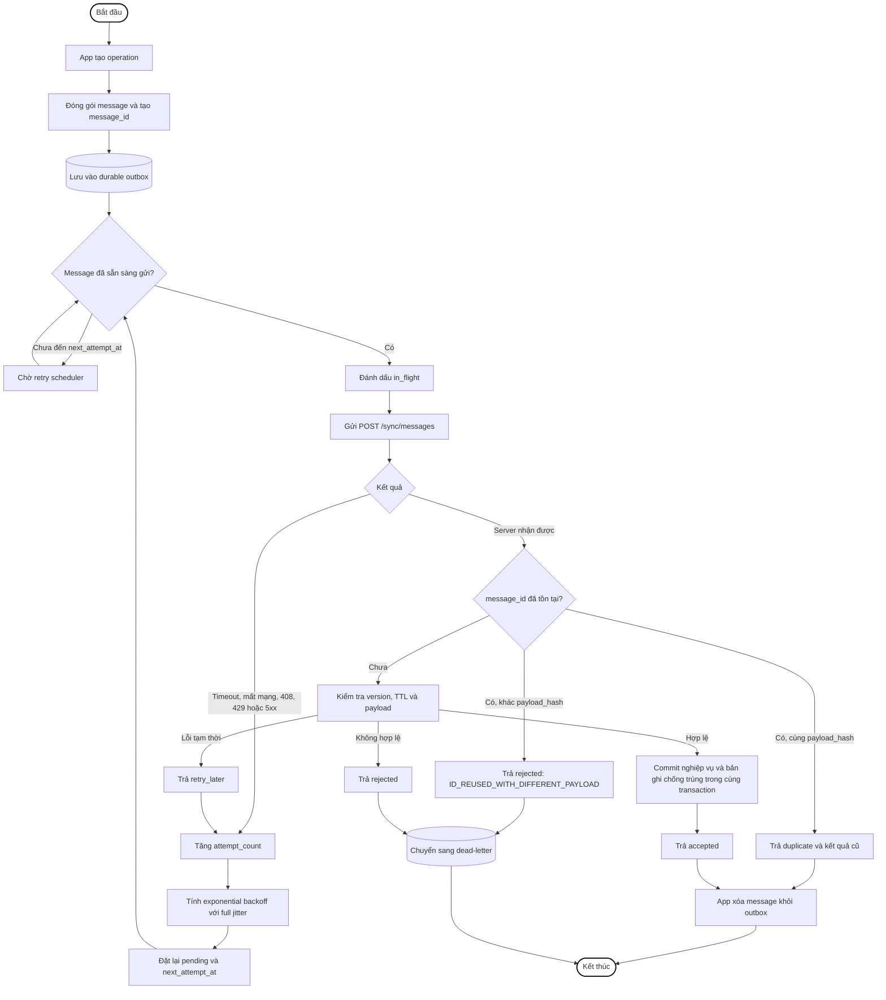

# Hợp đồng message giữa app và server

Tài liệu này là nguồn tham chiếu chung cho định dạng message giữa app và server
trong cơ chế store-and-forward. Mọi thay đổi liên quan đến request, response,
trạng thái, retry hoặc cách chống trùng phải cập nhật file này trong cùng thay đổi.

## Phiên bản contract

- Phiên bản hiện tại: `1`
- App gửi phiên bản qua header: `X-Message-Contract-Version: 1`
- Server trả `400 UNSUPPORTED_CONTRACT_VERSION` nếu không hỗ trợ phiên bản này.
- Thay đổi không tương thích phải tăng phiên bản; nếu chỉ bổ sung field không bắt
  buộc thì không cần tăng phiên bản.

## Endpoint

Endpoint JSON dùng cho message không chứa dữ liệu nhị phân:

```http
POST /sync/messages
Content-Type: application/json
X-Message-Contract-Version: 1
```

Endpoint multipart hiện có tiếp tục dùng cho báo cáo có ảnh:

```http
POST /api/reports
Content-Type: multipart/form-data

meta: JSON của RescueRecord
image: file JPEG tùy chọn
```

Giới hạn `256 KiB` chỉ áp dụng cho `/sync/messages`, không áp dụng cho request
multipart `/api/reports`. Endpoint `/api/reports` là transport chuyên biệt cho
`CREATE_RESCUE_RECORD`: field `meta` chính là `payload` của operation và
`meta.id` là khóa idempotency. Endpoint này không nhận `UPDATE_RESCUE_STATUS`.

### ACK hiện tại của `/api/reports`

Mock server trong `be/` đã triển khai endpoint này. Khi lưu thành công, server
trả HTTP `201 Created` với response:

```json
{
  "status": "ok",
  "message": "Báo cáo cứu hộ đã được tiếp nhận thành công",
  "id": "rescue-10492",
  "imageUrl": "/uploads/rescue-10492_photo.jpg",
  "imageLocalPath": "đường dẫn cục bộ trên mock server",
  "receivedAt": "2026-09-22T08:30:15.123456"
}
```

- HTTP `201` và `status: "ok"` là ACK cho toàn bộ request.
- `imageUrl` khác `null` nghĩa là mock server đã lưu ảnh.
- `imageUrl: null` nghĩa là server chỉ nhận metadata.
- App không chờ field `imageStatus` vì mock server hiện không trả field này.

## Flowchart



Nếu app bị tắt khi message đang ở trạng thái `in_flight`, lần khởi động tiếp theo
phải chuyển message đã quá timeout về `pending` để gửi lại.

## Request

```json
{
  "messages": [
    {
      "message_id": "0195f920-7a5c-7c44-a619-87d146410312",
      "client_id": "device-82f1",
      "sequence_number": 1842,
      "operation_type": "CREATE_RESCUE_RECORD",
      "created_at": "2026-09-22T08:30:12Z",
      "expires_at": "2026-09-29T08:30:12Z",
      "payload_hash": "sha256:hex-encoded-hash",
      "payload": {
        "id": "rescue-10492",
        "createdAt": "2026-09-22T08:30:12Z",
        "lat": 10.762622,
        "lng": 106.660172,
        "trappedCount": 2,
        "injuredCount": 1,
        "vulnerableGroups": ["child"],
        "description": "Nước đang dâng nhanh",
        "aiTags": [
          {"label": "high", "confidence": 0.94}
        ],
        "sendMode": "queuedOffline",
        "status": "processing"
      }
    }
  ]
}
```

### Quy tắc field

| Field | Bắt buộc | Quy tắc |
|---|---|---|
| `message_id` | Có | UUID duy nhất, không được tái sử dụng |
| `client_id` | Có | ID ổn định của client/device |
| `sequence_number` | Có | Số nguyên tăng đơn điệu theo từng `client_id`; không yêu cầu message đến tuần tự |
| `operation_type` | Có | Một trong các operation được định nghĩa bên dưới |
| `created_at` | Có | Thời gian UTC theo ISO 8601 |
| `expires_at` | Không | Thời gian UTC theo ISO 8601; bỏ field nếu message không hết hạn |
| `payload_hash` | Có | `sha256:` + SHA-256 dạng hex chữ thường của payload canonical theo RFC 8785 |
| `payload` | Có | Dữ liệu của operation, phải là JSON object |

Giới hạn ban đầu:

- Tối đa `50` message trong một request.
- Tổng request tối đa `256 KiB`.
- Server không được phụ thuộc vào thứ tự các phần tử trong mảng `messages`.

## Operation cứu hộ

Contract phiên bản `1` chỉ định nghĩa hai operation:

| `operation_type` | Chiều | Mục đích |
|---|---|---|
| `CREATE_RESCUE_RECORD` | App đến server | Tạo hoặc gửi lại một báo cáo cứu hộ; `payload.id` là ID báo cáo duy nhất |
| `UPDATE_RESCUE_STATUS` | Server hoặc client điều phối đã được xác thực | Cập nhật trạng thái nghiệp vụ của báo cáo |

Payload tối thiểu của `UPDATE_RESCUE_STATUS`:

```json
{
  "id": "rescue-10492",
  "status": "dispatched",
  "statusVersion": 2,
  "updatedAt": "2026-09-22T08:35:00Z"
}
```

Trạng thái cứu hộ chỉ gồm `processing`, `dispatched`, `resolved` và chỉ được
tiến về phía trước. `statusVersion` phải lớn hơn phiên bản server đang lưu.

Trạng thái chuyển phát cục bộ như `pending`, `in_flight`, `acked`, `sent`,
`sms_sent` và `dead_letter` không phải trạng thái cứu hộ và không được ghi vào
field `payload.status`.

## Ảnh đính kèm

Chốt dùng `/api/reports` dạng `multipart/form-data`; không nhúng ảnh dạng Base64
vào `/sync/messages` và không yêu cầu upload ảnh trước để lấy URL.

Quy tắc gửi:

1. `payload` metadata luôn được lưu vào durable outbox trước khi gửi qua
   `/sync/messages`.
2. App chỉ upload JPEG qua `/api/reports` sau khi metadata nhận `accepted` hoặc
   `duplicate`; nhờ vậy thông tin cứu hộ nhỏ được ưu tiên khi mạng yếu.
3. Nếu upload ảnh thất bại, bản ghi cục bộ vẫn ở trạng thái chưa đồng bộ hoàn
   tất và app retry ảnh sau bằng cùng `meta.id`.
4. Báo cáo không có ảnh hoàn tất ngay sau ACK metadata.
5. Gửi lại cùng `meta.id` không được tạo báo cáo mới; server cập nhật ảnh cho
   báo cáo đã có và trả lại cùng ID.
6. `meta` phải chứa `imageSha256` và `imageSizeBytes` nếu có ảnh. Server kiểm tra
   SHA-256 sau khi nhận đủ file và từ chối `IMAGE_HASH_MISMATCH` nếu không khớp.

`payload_hash` chỉ bao phủ JSON `payload`, không bao phủ byte của ảnh. Ảnh dùng
`imageSha256` riêng; khóa chống trùng nghiệp vụ của multipart vẫn là `meta.id`.

### Trạng thái triển khai của mock server

`be/` hiện đã triển khai:

- `/api/reports`: nhận multipart, kiểm tra `X-Message-Contract-Version`, kiểm tra
  `imageSha256`, lưu `image_size_bytes`, upsert theo `meta.id` và trả HTTP `201`.
- `/sync/messages`: giới hạn `50` message và `256 KiB`, kiểm tra contract version,
  canonical hash, TTL, `message_id`, `(client_id, sequence_number)` và partial ACK.
- Hai operation `CREATE_RESCUE_RECORD`, `UPDATE_RESCUE_STATUS` cùng quy tắc
  `statusVersion` và chuyển trạng thái một chiều.
- Bảng `messages_dedup` và các cột `status_version`, `image_sha256`,
  `image_size_bytes` trong SQLite.
- `reports` và `messages_dedup` được ghi trong cùng transaction khi xử lý
  `CREATE_RESCUE_RECORD` qua `/sync/messages`.

`/api/reports` trả ACK chung `status: "ok"`, không phân biệt `accepted` với
`duplicate`. App dựa vào HTTP `2xx` để xác nhận phần upload ảnh thành công.

### Trạng thái triển khai của mobile

`fe/app/` hiện đã triển khai:

- Hive durable outbox lưu `client_id`, `sequence_number`, message, số lần retry
  và thời điểm retry tiếp theo trong box `sync_outbox`.
- Batch tối đa `50` message và tự giảm batch để request không vượt `256 KiB`.
- Partial ACK: xóa khi `accepted`/`duplicate`, retry khi lỗi tạm thời, giữ
  `dead_letter` khi bị từ chối vĩnh viễn.
- Exponential backoff full jitter, phục hồi message `in_flight` sau khi app bị
  dừng, đồng bộ khi mạng trở lại và Workmanager chạy định kỳ 15 phút.
- JCS dùng package `causalontology` `4.x`; SHA-256 dùng package `crypto` `3.x`.
- Ảnh được upload riêng sau ACK metadata, kèm `imageSha256`, `imageSizeBytes`
  và `X-Message-Contract-Version: 1`.

## Chuẩn canonical cho `payload_hash`

App và server phải canonicalize `payload` theo [RFC 8785 JSON Canonicalization
Scheme](https://www.rfc-editor.org/rfc/rfc8785.html), encode kết quả bằng UTF-8,
sau đó tính SHA-256:

```text
payload_hash = "sha256:" + lowercase_hex(SHA256(JCS(payload)))
```

Các quy tắc quan trọng:

- Không phát sinh khoảng trắng giữa các JSON token.
- Sắp xếp key của mọi object theo RFC 8785; giữ nguyên thứ tự phần tử của array.
- Không cho phép key trùng, `NaN`, `Infinity` hoặc số ngoài miền I-JSON.
- Giữ nguyên chuỗi Unicode, không tự động Unicode-normalize trước khi hash.
- Server phải tự canonicalize `payload` nhận được để kiểm tra hash; không tin
  chuỗi hash do app gửi lên.

Không dùng riêng `sort_keys=True` làm chuẩn vì cách serialize số thực và Unicode
có thể khác nhau giữa Dart và Python.

## Quy tắc `sequence_number`

- App cấp số tăng đơn điệu theo từng `client_id`; số mới và outbox message được
  ghi chung bằng một thao tác Hive `putAll` trước khi thực hiện HTTP.
- Server chấp nhận gap và message đến sai thứ tự; không trả `SEQUENCE_GAP`.
- Message đến muộn vẫn được xử lý nếu `message_id` chưa tồn tại.
- Cặp `(client_id, sequence_number)` không được tái sử dụng. Nếu cùng cặp này
  xuất hiện với `message_id` khác, server trả `SEQUENCE_REUSED` và không retry.
- `sequence_number` phục vụ quan sát, phát hiện mất message và sắp xếp; chống
  trùng vẫn dựa trên `message_id`.
- Nếu app bị cài lại và không khôi phục được bộ đếm, app phải tạo `client_id` mới.

## Response

Server trả kết quả riêng cho từng message:

```json
{
  "results": [
    {
      "message_id": "0195f920-7a5c-7c44-a619-87d146410312",
      "status": "accepted",
      "retryable": false,
      "code": null,
      "result": {
        "measurement_id": "m-10492"
      }
    }
  ]
}
```

### Trạng thái

| `status` | Ý nghĩa | App xử lý |
|---|---|---|
| `accepted` | Server đã commit operation | Xóa message khỏi outbox |
| `duplicate` | Message đã được commit trước đó | Xóa message khỏi outbox |
| `rejected` | Message không hợp lệ hoặc lỗi nghiệp vụ | Không retry nếu `retryable=false` |
| `retry_later` | Server tạm thời chưa xử lý được | Retry theo backoff |

`code` là mã lỗi máy có thể đọc được, ví dụ `INVALID_PAYLOAD`, `EXPIRED`,
`SEQUENCE_REUSED`, `IMAGE_HASH_MISMATCH`, `ID_REUSED_WITH_DIFFERENT_PAYLOAD`
hoặc `SERVER_BUSY`.

## Quy tắc chuyển phát

1. App phải ghi message vào durable outbox trước khi gửi.
2. App có thể gửi lại cùng message nếu timeout hoặc mất ACK.
3. Mỗi lần gửi lại phải giữ nguyên `message_id`, `payload` và `payload_hash`.
4. App chỉ xóa message khi nhận `accepted` hoặc `duplicate`.
5. Server phải xử lý theo `message_id` một cách idempotent.
6. Server phải commit kết quả nghiệp vụ và bản ghi chống trùng trong cùng transaction.
7. Cùng `message_id` nhưng khác `payload_hash` phải bị từ chối.
8. HTTP timeout, `408`, `429` và `5xx` là lỗi có thể retry; lỗi `4xx` khác
   không retry, trừ khi kết quả từng message ghi rõ `retryable=true`.

## Retry baseline

App dùng exponential backoff với full jitter:

```text
delay = random(0, min(5 minutes, 1 second * 2^attempt_count))
```

Không giới hạn số lần retry cho message chưa hết hạn. Message hết hạn hoặc bị
`rejected` vĩnh viễn được chuyển sang dead-letter để kiểm tra, không tự động xóa.

## Các công trình baseline

### Baseline trực tiếp

| Công trình | Ý tưởng chính | Thành phần áp dụng trong contract |
|---|---|---|
| [Disconnected Operation in the Coda File System (Kistler và Satyanarayanan, 1992)](https://www.cs.cmu.edu/~coda/docs-coda.html) | Cho phép client tiếp tục làm việc khi mất kết nối, ghi nhận thay đổi cục bộ và đồng bộ lại khi kết nối phục hồi | Durable outbox, khôi phục sau khi app khởi động lại và đồng bộ sau thời gian offline |
| [The Bayou Architecture: Support for Data Sharing among Mobile Users (Demers và cộng sự, 1994)](https://citeseerx.ist.psu.edu/document?doi=4c21828885997dc52083fd8414253feb5589e261&repid=rep1&type=pdf) | Ghi dữ liệu khi mất kết nối, eventual consistency và phát hiện/giải quyết xung đột theo ứng dụng | `operation_type`, `sequence_number`, version dữ liệu và xử lý conflict ở tầng nghiệp vụ |
| [Delay-Tolerant Networking Architecture, RFC 4838 (Cerf và cộng sự, 2007)](https://www.rfc-editor.org/info/rfc4838/) | Lưu trữ bền vững và chuyển tiếp message khi chưa có đường truyền; message có thời hạn và độ ưu tiên | Store-and-forward, `expires_at`, durable queue và giảm số lần trao đổi hai chiều |
| [Dynamo: Amazon's Highly Available Key-value Store (DeCandia và cộng sự, 2007)](https://www.amazon.science/publications/dynamo-amazons-highly-available-key-value-store) | Ưu tiên khả dụng, versioning, eventual consistency và giải quyết nhiều phiên bản dữ liệu | Server luôn có thể nhận write, phát hiện xung đột và reconcile khi nhiều client cùng cập nhật |

### Baseline mở rộng và chuẩn đối chiếu

| Công trình/chuẩn | Dùng để đối chiếu | Phạm vi áp dụng |
|---|---|---|
| [Epidemic Routing for Partially-Connected Ad Hoc Networks (Vahdat và Becker, 2000)](https://cseweb.ucsd.edu/~vahdat/papers/epidemic.pdf) | Delivery ratio, delivery delay và chi phí tài nguyên trong mạng bị phân mảnh | Chỉ dùng làm baseline nếu message được chuyển qua nhiều thiết bị trung gian; không cần cho mô hình app gửi trực tiếp lên server |
| [MQTT 5.0, mục QoS](https://docs.oasis-open.org/mqtt/mqtt/v5.0/mqtt-v5.0.html) | So sánh `at-most-once`, `at-least-once`, ACK và chi phí của `exactly-once` | Contract hiện tại chọn at-least-once kết hợp server idempotent để đạt effectively-once ở tầng nghiệp vụ |
| [RFC 6298: Computing TCP's Retransmission Timer](https://www.rfc-editor.org/info/rfc6298/) | Nguyên tắc tăng thời gian chờ sau mỗi lần truyền thất bại | Cơ sở cho exponential backoff; contract bổ sung full jitter để tránh nhiều client retry cùng lúc |
| [RFC 8785: JSON Canonicalization Scheme](https://www.rfc-editor.org/rfc/rfc8785.html) | Chuẩn hóa JSON thành biểu diễn byte ổn định trước khi hash | Cơ sở chung để Dart và Python tính cùng `payload_hash` |

### Baseline thực nghiệm đề xuất

| Mã | Cơ chế | Mục đích so sánh |
|---|---|---|
| `B0` | Gửi một lần, không lưu cục bộ | Mốc thấp nhất về delivery ratio khi mạng yếu |
| `B1` | Retry trong bộ nhớ | Đo ảnh hưởng khi app bị tắt hoặc tiến trình bị kill |
| `B2` | Durable outbox + exponential backoff | Đo lợi ích của Coda/DTN-style store-and-forward |
| `B3` | `B2` + server deduplication theo `message_id` | Đo duplicate effect khi ACK bị mất |
| `B4` | `B3` + batch và adaptive retry | Phương pháp đề xuất để đánh giá độ trễ, băng thông và năng lượng |

Các chỉ số chính gồm delivery ratio, duplicate effect, độ trễ P50/P95, thời
gian xả hết queue sau khi có mạng, số byte truyền, số request và dung lượng
outbox lớn nhất. Với kiến trúc app-server hiện tại, `B0` đến `B3` là nhóm
baseline bắt buộc; `B4` là ứng viên cho phần cải tiến của nghiên cứu.

## Checklist khi thay đổi

Khi sửa cơ chế kết nối, request hoặc response:

- Cập nhật file này trong cùng commit/pull request.
- Cập nhật app serializer, outbox và ACK handler nếu bị ảnh hưởng.
- Cập nhật server validator, deduplication và response nếu bị ảnh hưởng.
- Thêm hoặc cập nhật contract test cho request/response mẫu.
- Ghi thay đổi vào lịch sử bên dưới.

## Lịch sử thay đổi

| Phiên bản | Ngày | Thay đổi |
|---|---|---|
| 1 | 2026-09-22 | Chốt luồng ảnh multipart, ACK thực tế của mock server, operation cứu hộ, canonical hash RFC 8785 và sequence cho phép gap. |
| 1 | 2026-09-22 | Triển khai Hive outbox, batch/partial ACK, full-jitter retry, Workmanager, JCS trên mobile và transaction nguyên tử trên server; không đổi wire contract. |
