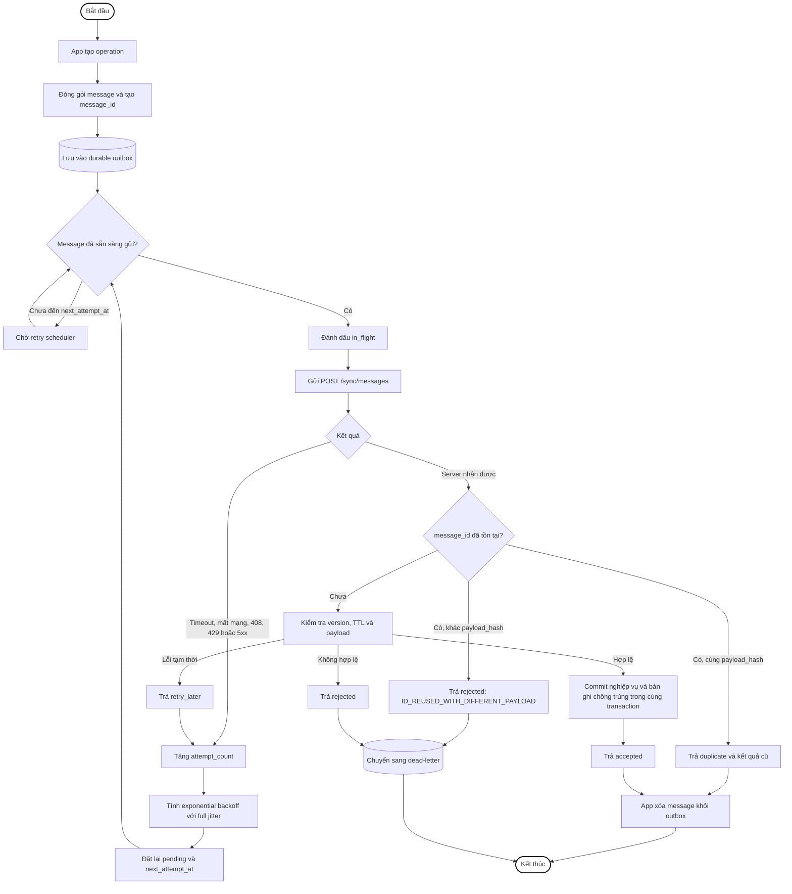

# Hợp đồng message giữa app và server

Tài liệu này là nguồn tham chiếu chung cho định dạng message giữa app và server
trong cơ chế store-and-forward. Mọi thay đổi liên quan đến request, response,
trạng thái, retry hoặc cách chống trùng phải cập nhật file này trong cùng thay đổi.

## Phiên bản contract

- Phiên bản hiện tại: `1`
- App gửi phiên bản qua header: `X-Message-Contract-Version: 1`
- Server trả `400 UNSUPPORTED_CONTRACT_VERSION` nếu không hỗ trợ phiên bản này.
- Thay đổi không tương thích phải tăng phiên bản; nếu chỉ bổ sung field không bắt
  buộc thì không cần tăng phiên bản.

## Endpoint

Endpoint JSON dùng cho message không chứa dữ liệu nhị phân:

```http
POST /sync/messages
Content-Type: application/json
X-Message-Contract-Version: 1
```

Endpoint multipart hiện có tiếp tục dùng cho báo cáo có ảnh:

```http
POST /api/reports
Content-Type: multipart/form-data

meta: JSON của RescueRecord
image: file JPEG tùy chọn
```

Giới hạn `256 KiB` chỉ áp dụng cho `/sync/messages`, không áp dụng cho request
multipart `/api/reports`. Endpoint `/api/reports` là transport chuyên biệt cho
`CREATE_RESCUE_RECORD`: field `meta` chính là `payload` của operation và
`meta.id` là khóa idempotency. Endpoint này không nhận `UPDATE_RESCUE_STATUS`.

Quy tắc của `/api/reports` (server kiểm tra trước khi ghi):

- `meta` phải là JSON object hợp lệ theo [quy tắc payload](#quy-tắc-payload-create_rescue_record);
  thiếu `id` hoặc sai kiểu trả `400` với `detail: {"code": "INVALID_PAYLOAD", "error": "..."}`.
- Ảnh tối đa `15 MB` (`RESCUE_MAX_IMAGE_MB`), vượt thì `413 IMAGE_TOO_LARGE`. Định dạng
  xác định theo byte đầu file, không theo tên file hay `Content-Type`: JPEG (khuyến
  nghị), PNG hoặc WebP; khác thì `415 UNSUPPORTED_IMAGE`.
- Tên file ảnh do server đặt (`<id>_<12 hex SHA-256>.<ext>`); tên file client gửi bị bỏ qua.
- Gửi lại cùng `meta.id` **không ghi đè** báo cáo: server chỉ điền trường còn trống và
  chỉ gắn ảnh khi báo cáo chưa có ảnh (ảnh đầu tiên được giữ, response trả `imageUrl`
  của ảnh đó). Chi tiết quy tắc gộp: `docs/contact_db.md` mục 1.1.

### ACK hiện tại của `/api/reports`

Mock server trong `be/` đã triển khai endpoint này. Khi lưu thành công, server
trả HTTP `201 Created` với response:

```json
{
  "status": "ok",
  "message": "Báo cáo cứu hộ đã được tiếp nhận thành công",
  "id": "rescue-10492",
  "imageUrl": "/uploads/rescue-10492_3f9a0c1d2e4b.jpg",
  "receivedAt": "2026-09-22T08:30:15Z"
}
```

- HTTP `201` và `status: "ok"` là ACK cho toàn bộ request.
- `imageUrl` khác `null` nghĩa là báo cáo đã có ảnh trên server (có thể là ảnh
  của lần gửi trước với cùng `meta.id`).
- `receivedAt` là lần đầu server nhận báo cáo này. Response không còn trả
  `imageLocalPath` (đường dẫn trên máy chủ).
- `imageUrl: null` nghĩa là server chỉ nhận metadata.
- App không chờ field `imageStatus` vì mock server hiện không trả field này.

## Flowchart


```mermaid
flowchart TB
    START([Bắt đầu]) --> A[App tạo operation]
    A --> B[Đóng gói message và tạo message_id]
    B --> C[(Lưu vào durable outbox)]
    C --> D{Message đã sẵn sàng gửi?}
    D -- Chưa đến next_attempt_at --> E[Chờ retry scheduler]
    E --> D
    D -- Có --> F[Đánh dấu in_flight]
    F --> G[Gửi POST /sync/messages]
    G --> H{Kết quả}

    H -- Timeout, mất mạng, 408, 429 hoặc 5xx --> I[Tăng attempt_count]
    I --> J[Tính exponential backoff với full jitter]
    J --> K[Đặt lại pending và next_attempt_at]
    K --> D

    H -- Server nhận được --> L{message_id đã tồn tại?}
    L -- Có, cùng payload_hash --> M[Trả duplicate và kết quả cũ]
    L -- Có, khác payload_hash --> N[Trả rejected: ID_REUSED_WITH_DIFFERENT_PAYLOAD]
    L -- Chưa --> O[Kiểm tra version, TTL và payload]
    O -- Không hợp lệ --> P[Trả rejected]
    O -- Lỗi tạm thời --> Q[Trả retry_later]
    O -- Hợp lệ --> R[Commit nghiệp vụ và bản ghi chống trùng trong cùng transaction]
    R --> S[Trả accepted]

    M --> T[App xóa message khỏi outbox]
    S --> T
    Q --> I
    N --> U[(Chuyển sang dead-letter)]
    P --> U
    T --> END([Kết thúc])
    U --> END

    classDef terminal fill:#ffffff,stroke:#111111,stroke-width:2px
    class START,END terminal
```

Nếu app bị tắt khi message đang ở trạng thái `in_flight`, lần khởi động tiếp theo
phải chuyển message đã quá timeout về `pending` để gửi lại.

## Request

```json
{
  "messages": [
    {
      "message_id": "0195f920-7a5c-7c44-a619-87d146410312",
      "client_id": "device-82f1",
      "sequence_number": 1842,
      "operation_type": "CREATE_RESCUE_RECORD",
      "created_at": "2026-09-22T08:30:12Z",
      "expires_at": "2026-09-29T08:30:12Z",
      "payload_hash": "sha256:hex-encoded-hash",
      "payload": {
        "id": "rescue-10492",
        "createdAt": "2026-09-22T08:30:12Z",
        "lat": 10.762622,
        "lng": 106.660172,
        "trappedCount": 2,
        "injuredCount": 1,
        "vulnerableGroups": ["child"],
        "description": "Nước đang dâng nhanh",
        "aiTags": [
          {"label": "high", "confidence": 0.94}
        ],
        "urgency_features": {
          "cannot_move": true,
          "severe_condition": true,
          "severe_signs": ["unresponsive", "heavy_bleeding"]
        },
        "sendMode": "queuedOffline",
        "status": "processing"
      }
    }
  ]
}
```

### Quy tắc field

| Field | Bắt buộc | Quy tắc |
|---|---|---|
| `message_id` | Có | UUID duy nhất, không được tái sử dụng |
| `client_id` | Có | ID ổn định của client/device |
| `sequence_number` | Có | Số nguyên tăng đơn điệu theo từng `client_id`; không yêu cầu message đến tuần tự |
| `operation_type` | Có | Một trong các operation được định nghĩa bên dưới |
| `created_at` | Có | Thời gian UTC theo ISO 8601 |
| `expires_at` | Không | Thời gian UTC theo ISO 8601; bỏ field nếu message không hết hạn |
| `payload_hash` | Có | `sha256:` + SHA-256 dạng hex chữ thường của payload canonical theo RFC 8785 |
| `payload` | Có | Dữ liệu của operation, phải là JSON object |

### Field tình trạng khẩn cấp

`CREATE_RESCUE_RECORD.payload` có thể chứa `urgency_features`:

| Field | Kiểu | Quy tắc |
|---|---|---|
| `cannot_move` | Boolean | Có người không thể tự di chuyển |
| `severe_condition` | Boolean | `true` khi `severe_signs` có ít nhất một phần tử |
| `severe_signs` | Array String | Danh sách mã dấu hiệu nghiêm trọng |

Mã `severe_signs` app hiện dùng trùng với cột dataset:
`unresponsive`, `respiratory_distress_or_cyanosis`, `heavy_bleeding`,
`active_convulsions`, `high_risk_trauma`. Bản ghi cũ có các mã
`respiratory_distress`, `seizure`, `major_trauma` vẫn được app đọc và đổi sang
mã mới trước khi gửi; message đã nằm trong outbox cũ có thể vẫn chứa mã cũ.

App đồng thời gửi các alias nghiên cứu `L_i`, `T_i`, `N_i`, `injury_count`,
`E_i`, `vulnerability_flags`, `V_i`, `note` và `image_attached`. Đây là field
bổ sung, server lưu nguyên trạng trong `raw_payload`; các field nghiệp vụ hiện
có (`lat`, `lng`, `trappedCount`, ...) vẫn là nguồn dùng để ghi các cột chuẩn.

### Mô hình Logistic Regression cho `E_i`

Gói baseline v5 tại `fe/model/urgency_ei/` dùng đúng năm mã `severe_signs` nêu
trên. `cannot_move` và `injured_count` chỉ là thông tin ngữ cảnh, không phải
feature của model này. `severe_condition` là field dẫn xuất, bằng phép OR của
năm dấu hiệu.

`data/urgency_training_SOURCE_FINAL.csv` gồm 32 tổ hợp nhị phân; nhãn
`urgency_label` bằng 1 nếu có ít nhất một dấu hiệu. Script
`scripts/train_urgency_logistic.py` xuất
`model/urgency_logistic_SOURCE_FINAL.json` với thứ tự feature, intercept, hệ số,
ngưỡng `0.5` và hash dataset. Đây là dữ liệu tổng hợp theo quy tắc, chưa có nhãn
ca thực tế do chuyên gia xác nhận; độ khớp trên 32 dòng train không phải test
accuracy độc lập. `E_i` là điểm bằng chứng tham khảo, không phải xác suất tử vong
hay quyết định cứu hộ. App nạp `assets/models/urgency_logistic.json`, tính
`E_i` từ năm dấu hiệu và lưu điểm cùng bản ghi để đồng bộ offline; nếu asset
không nạp được thì gửi `E_i: null`.

Message thiếu field bắt buộc, sai kiểu, hoặc không phải JSON object bị `rejected`
`INVALID_PAYLOAD` riêng lẻ; các message khác trong batch vẫn được xử lý.

### Quy tắc payload `CREATE_RESCUE_RECORD`

Áp dụng cho `payload` của `/sync/messages` và `meta` của `/api/reports`. Vi phạm bị
từ chối `INVALID_PAYLOAD` (không retry) thay vì gây lỗi `5xx` làm app gửi lại mãi.

| Field | Quy tắc |
|---|---|
| `id` | Bắt buộc; chuỗi 1-128 ký tự `[A-Za-z0-9][A-Za-z0-9._:-]*` |
| `lat`, `lng` | Cùng là `null`/vắng, hoặc cùng là số hữu hạn trong `[-90, 90]` / `[-180, 180]` |
| `trappedCount`, `injuredCount` | Số nguyên `0`-`10000` hoặc vắng |
| `vulnerableGroups` | Mảng tối đa 20 chuỗi (mỗi chuỗi ≤ 50 ký tự) |
| `description` | Chuỗi ≤ 2000 ký tự |
| `aiTags` | Mảng tối đa 20 object `{label?: chuỗi, confidence?: số}` |
| `createdAt` | Chuỗi ISO 8601 (≤ 64 ký tự) hoặc epoch ms (số nguyên) |
| `sendMode`, `imageSha256` | Chuỗi ngắn |
| `status` | Bị bỏ qua: báo cáo mới luôn bắt đầu ở `processing` |

Giới hạn ban đầu:

- Tối đa `50` message trong một request.
- Tổng request tối đa `256 KiB`.
- Server không được phụ thuộc vào thứ tự các phần tử trong mảng `messages`.

## Operation cứu hộ

Contract phiên bản `1` chỉ định nghĩa hai operation:

| `operation_type` | Chiều | Mục đích |
|---|---|---|
| `CREATE_RESCUE_RECORD` | App đến server | Tạo hoặc gửi lại một báo cáo cứu hộ; `payload.id` là ID báo cáo duy nhất |
| `UPDATE_RESCUE_STATUS` | Điều phối viên đã đăng nhập dashboard | Cập nhật trạng thái nghiệp vụ của báo cáo |

`UPDATE_RESCUE_STATUS` qua `/sync/messages` chỉ được xử lý khi request mang phiên
đăng nhập dashboard (cookie `rescue_session` hoặc `Authorization: Bearer <token>`);
người thao tác ghi vào nhật ký là tên điều phối viên của phiên. Không có phiên thì
message bị `rejected` với `code: "UNAUTHENTICATED"`, `retryable: false`, và không
được ghi vào bảng chống trùng (gửi lại sau khi đăng nhập vẫn được xử lý). App
không gửi operation này.

Payload tối thiểu của `UPDATE_RESCUE_STATUS`:

```json
{
  "id": "rescue-10492",
  "status": "dispatched",
  "statusVersion": 2,
  "updatedAt": "2026-09-22T08:35:00Z"
}
```

Trạng thái cứu hộ gồm `processing`, `dispatched`, `resolved` và `cancelled`, chỉ
được tiến về phía trước:

```text
processing -> dispatched -> resolved
     \              \
      +--------------+--> cancelled   (điều phối viên đóng báo cáo)
```

- `resolved` và `cancelled` là **trạng thái kết thúc**: không chuyển sang trạng
  thái nào khác, kể cả giữa hai trạng thái này.
- `cancelled` kèm `reason` (tùy chọn qua `/sync/messages`, bắt buộc từ dashboard):
  `duplicate`, `false_alarm`, `self_rescued`, `no_contact`, `other`. Lý do lạ bị từ
  chối `INVALID_PAYLOAD`.
- `statusVersion` phải lớn hơn phiên bản server đang lưu.

Trạng thái chuyển phát cục bộ như `pending`, `in_flight`, `acked`, `sent`,
`sms_sent` và `dead_letter` không phải trạng thái cứu hộ và không được ghi vào
field `payload.status`.

## Ảnh đính kèm

Chốt dùng `/api/reports` dạng `multipart/form-data`; không nhúng ảnh dạng Base64
vào `/sync/messages` và không yêu cầu upload ảnh trước để lấy URL.

Quy tắc gửi:

1. `payload` metadata luôn được lưu vào durable outbox trước khi gửi qua
   `/sync/messages`.
2. App chỉ upload JPEG qua `/api/reports` sau khi metadata nhận `accepted` hoặc
   `duplicate`; nhờ vậy thông tin cứu hộ nhỏ được ưu tiên khi mạng yếu.
3. Nếu upload ảnh thất bại do mạng, `5xx`, `408`, `429` hoặc `IMAGE_HASH_MISMATCH`,
   bản ghi cục bộ vẫn ở trạng thái chưa đồng bộ hoàn tất và app retry ảnh sau bằng
   cùng `meta.id`. Lỗi `4xx` khác là vĩnh viễn: `413` thì app nén ảnh và gửi lại một
   lần; còn lại app bỏ ảnh (metadata đã có ACK) để bản ghi không kẹt trong hàng đợi.
   Ảnh định dạng server không nhận (vd. HEIC) được app chuyển sang JPEG trước khi gửi.
4. Báo cáo không có ảnh hoàn tất ngay sau ACK metadata.
5. Gửi lại cùng `meta.id` không được tạo báo cáo mới; server gắn ảnh nếu báo cáo
   chưa có ảnh (ảnh đầu tiên được giữ) và trả lại cùng ID.
6. `meta` phải chứa `imageSha256` và `imageSizeBytes` nếu có ảnh. Server kiểm tra
   SHA-256 sau khi nhận đủ file và từ chối `IMAGE_HASH_MISMATCH` nếu không khớp.

`payload_hash` chỉ bao phủ JSON `payload`, không bao phủ byte của ảnh. Ảnh dùng
`imageSha256` riêng; khóa chống trùng nghiệp vụ của multipart vẫn là `meta.id`.

### Trạng thái triển khai của mock server

`be/` hiện đã triển khai:

- `/api/reports`: nhận multipart, kiểm tra `X-Message-Contract-Version`, `meta`,
  định dạng/dung lượng ảnh và `imageSha256`, lưu `image_size_bytes`, gộp theo
  `meta.id` (không ghi đè) và trả HTTP `201`.
- `/sync/messages`: giới hạn `50` message và `256 KiB`, kiểm tra contract version,
  canonical hash, TTL, `message_id`, `(client_id, sequence_number)`, payload và
  partial ACK; mỗi message một transaction.
- Hai operation `CREATE_RESCUE_RECORD`, `UPDATE_RESCUE_STATUS` cùng quy tắc
  `statusVersion` và chuyển trạng thái một chiều.
- Bảng `messages_dedup` và các cột `status_version`, `image_sha256`,
  `image_size_bytes` trong SQLite.
- `reports` và `messages_dedup` được ghi trong cùng transaction khi xử lý
  `CREATE_RESCUE_RECORD` qua `/sync/messages`.

`/api/reports` trả ACK chung `status: "ok"`, không phân biệt `accepted` với
`duplicate`. App dựa vào HTTP `2xx` để xác nhận phần upload ảnh thành công.

### Endpoint dành cho dashboard điều phối

Các endpoint dưới đây phục vụ website quản lý, không thuộc luồng store-and-forward
của app và không cần header `X-Message-Contract-Version`. **Tất cả cần đăng nhập**
(trả `401 UNAUTHENTICATED` nếu chưa đăng nhập); endpoint của app (`/probe`,
`/sync/messages`, `POST /api/reports`, `GET /api/reports/status`) không cần đăng nhập
(riêng `UPDATE_RESCUE_STATUS` qua `/sync/messages` cần phiên, xem trên).

Mỗi điều phối viên có **tài khoản riêng** (bảng `operators`): tên đăng nhập, tên hiển
thị (ghi vào nhật ký thao tác), mật khẩu băm PBKDF2-SHA256 và vai trò `admin` hoặc
`operator`. Khi DB chưa có tài khoản, server tạo tài khoản quản trị từ
`RESCUE_ADMIN_USERNAME` / `RESCUE_ADMIN_PASSWORD` (mặc định `admin` / `cuuho2026`; biến cũ
`RESCUE_DASHBOARD_PASSWORD` vẫn được dùng làm mật khẩu mặc định). Tài khoản do quản trị
viên tạo hoặc đặt lại mật khẩu có `mustChangePassword: true`: dashboard buộc đổi mật khẩu
trước khi dùng. Chỉ `admin` được quản lý tài khoản, tải sao lưu và xóa dữ liệu demo
(`403 FORBIDDEN` với `operator`). Khóa tài khoản hoặc đặt lại mật khẩu làm mọi phiên của
người đó mất hiệu lực.

Chặn dò mật khẩu: sai 5 lần cho một tên đăng nhập, hoặc 20 lần từ một IP, trong 5 phút
thì `429 TOO_MANY_ATTEMPTS`. IP lấy từ kết nối TCP; `X-Forwarded-For` chỉ được đọc khi
kết nối đến từ proxy khai báo trong `RESCUE_TRUSTED_PROXIES` (docker compose: `dashboard,fe`).

| Endpoint | Mục đích |
|---|---|
| `POST /api/auth/login` `{"username", "password"}` | Tạo phiên; đặt cookie HttpOnly `rescue_session` và trả `token` (dùng `Authorization: Bearer` cho script) kèm `operator` (tên hiển thị), `username`, `role`, `operatorId`, `mustChangePassword`. Sai → `401 INVALID_CREDENTIALS` |
| `POST /api/auth/password` `{"currentPassword", "newPassword"}` | Đổi mật khẩu của mình (≥ 8 ký tự); đăng xuất các phiên khác của tài khoản |
| `GET/POST /api/operators`, `PATCH /api/operators/{id}` `{"displayName"?, "role"?, "active"?, "password"?}` | Quản trị viên xem, tạo, sửa, khóa tài khoản hoặc đặt lại mật khẩu. Mã lỗi: `OPERATOR_TAKEN` (409), `OPERATOR_NOT_FOUND` (404), `LAST_ADMIN` (409, phải còn một quản trị viên hoạt động) |
| `POST /api/auth/logout`, `GET /api/auth/me` | Hủy phiên; phiên hiện tại (`{"authenticated": false}` khi chưa đăng nhập) và cấu hình dashboard |
| `GET /api/reports` | Lọc `status`, `q`, `since`/`until`, `hasLocation`, `teamId`, `sendMode`, `label`, `vulnerable`, `source` (`app`/`sms`/`hotline`/`synthetic`), `ids`; `sort`; phân trang `page`/`pageSize` (`limit` là tên cũ). Không giới hạn tổng số báo cáo |
| `POST /api/reports/manual` `{"description", "contactPhone"?, "lat"?, "lng"?, "trappedCount"?, "injuredCount"?, "vulnerableGroups"?}` | Điều phối viên nhập báo cáo nhận qua điện thoại/tổng đài: id `hotline-<ms>-<6 hex>`, `sendMode: "hotline"`, `payload.source: "hotline"`, vị trí (nếu có) là `manual`. Trả `201` kèm báo cáo |
| `GET /api/reports/changes?since=&epoch=` | Báo cáo thay đổi sau mốc `cursor`; `reset: true` khi dữ liệu bị xóa toàn bộ (`epoch` đổi) |
| `GET /api/clusters` | Phân cụm các báo cáo chưa kết thúc bằng product `C_ij` + Louvain (cấu hình đã chọn trong bài báo), cụm theo điểm ưu tiên giảm dần kèm trọng tâm và `E`, `F`, `N`, `V`. `clusterKey` (id nhỏ nhất trong cụm) ổn định hơn `clusterId`. Báo cáo thiếu vị trí/thời gian nằm trong `review`. Hỗ trợ `ETag`/`If-None-Match`. Chỉ tính lại khi có báo cáo mới/gộp, đổi trạng thái hoặc vị trí; khi dữ liệu lớn làm một lần tính chậm hơn `RESCUE_CLUSTER_SYNC_BUDGET_S`, trả kết quả gần nhất kèm `"stale": true` và tính lại ở luồng nền. `computedAt` là thời điểm tính |
| `PATCH /api/reports/{id}/status` `{"status", "statusVersion", "note"?, "reason"?, "teamId"?}` | Dùng **cùng hàm kiểm tra** với `UPDATE_RESCUE_STATUS` (`storage.apply_status_update`) |
| `POST /api/reports/bulk-status` `{"items": [{"id", "statusVersion"}], "status", ...}` | Đổi trạng thái đúng danh sách đã xác nhận; kết quả theo từng báo cáo |
| `PUT /api/reports/{id}/team`, `POST /api/reports/{id}/notes`, `PUT /api/reports/{id}/location` | Giao đội, ghi chú nội bộ, nhập vị trí thủ công (`locationSource: "manual"`) |
| `GET /api/reports/{id}/history` | Nhật ký thao tác (bảng `report_events`) |
| `GET/POST /api/teams`, `PATCH /api/teams/{id}` | Quản lý đội cứu hộ |
| `GET /api/stats`, `GET /api/export?format=csv\|geojson` | Chỉ số vận hành, xuất dữ liệu theo bộ lọc |
| `GET /api/admin/backup[?images=1]` | (admin) Tải bản sao lưu SQLite nhất quán; `images=1` trả ZIP gồm `data/<db>` và `uploads/` |
| `DELETE /api/reports` | (admin) Xóa toàn bộ báo cáo và nhật ký; chỉ khi `RESCUE_ALLOW_WIPE=1`, ngược lại `403 WIPE_DISABLED` |

Mã lỗi đổi trạng thái giữ nguyên (`INVALID_PAYLOAD` → 400, `REPORT_NOT_FOUND` → 404,
`INVALID_STATUS_VERSION`/`INVALID_STATUS_TRANSITION` → 409). Mã riêng của dashboard:
`TEAM_NOT_FOUND` (404), `TEAM_INACTIVE`, `TEAM_NAME_TAKEN`, `REPORT_CLOSED` (409).
Ảnh trong `/uploads/` cũng cần đăng nhập và được trả kèm `X-Content-Type-Options: nosniff`
và `Content-Security-Policy: ...; sandbox`. Báo cáo có `contactPhone` (SMS, tổng đài)
khi trả cho dashboard.

### SMS gateway

App gửi SMS dự phòng dạng
`SOS|id:<id>|pos:<lat>,<lng>|trapped:<n>|injured:<n>|vuln:<a,b>|note:<mô tả>` (`pos:unknown`
khi không có GPS; `note` luôn đứng cuối). Một điện thoại/dịch vụ SMS gateway chuyển
tiếp tin tới server:

```http
POST /api/sms/inbound
X-Gateway-Token: <RESCUE_SMS_GATEWAY_TOKEN>      (hoặc ?token=...)
Content-Type: application/json

{"from": "+84900000001", "text": "SOS|id:sos-...|pos:16.05,108.2|trapped:3|injured:1|note:...", "receivedAt": "2026-09-27T08:30:00Z"}
```

- Chưa đặt `RESCUE_SMS_GATEWAY_TOKEN`: `403 SMS_GATEWAY_DISABLED`; sai token: `401`.
- Nhận cả tên field `phoneNumber`/`sender`, `message`/`body`, dạng lồng
  `{"payload": {...}}` và form (`From`, `Body`).
- Tin đúng định dạng dùng **đúng id của app**: khi app có mạng và đồng bộ
  `CREATE_RESCUE_RECORD`, hai bản gộp thành một báo cáo (điền `createdAt`, `aiTags`...).
  Tin tự do thành báo cáo `sms-<16 hex>` không vị trí, vào hàng cần xác minh.
- Idempotent: gateway gửi lại cùng tin không tạo báo cáo mới. Trả `201` khi tạo mới,
  `200` khi gộp: `{"status": "ok", "id": "...", "created": true|false}`.
- Báo cáo có `sendMode: "smsFallback"`, `payload.source: "sms"`, `contactPhone` là số gửi.

### App lấy trạng thái điều phối

```http
GET /api/reports/status?ids=post-1790472931479,sos-1790472922834
```

```json
{"reports": [{"id": "post-1790472931479", "status": "dispatched", "statusVersion": 2}]}
```

- Tối đa `100` id mỗi request (id phân tách bằng dấu phẩy); id server không biết
  không có trong kết quả. Không cần header `X-Message-Contract-Version`.
- App hỏi mỗi `15 s` khi đang mở, ngay khi có mạng trở lại, sau mỗi lần đồng bộ
  outbox và trong tác vụ Workmanager 15 phút; chỉ hỏi các báo cáo đã đồng bộ và
  chưa kết thúc (`resolved`/`cancelled`).
- App chỉ nhận trạng thái **tiến lên** (`processing → dispatched → resolved`, hoặc
  `cancelled` từ trạng thái chưa kết thúc), bỏ qua trạng thái lùi hoặc lạ. App bản
  cũ không biết `cancelled` sẽ bỏ qua nó (giữ trạng thái đang hiển thị).

### Trạng thái triển khai của mobile

`fe/app/` hiện đã triển khai:

- Hive durable outbox lưu `client_id`, `sequence_number`, message, số lần retry
  và thời điểm retry tiếp theo trong box `sync_outbox`.
- Batch tối đa `50` message và tự giảm batch để request không vượt `256 KiB`.
- Partial ACK: xóa khi `accepted`/`duplicate`, retry khi lỗi tạm thời, giữ
  `dead_letter` khi bị từ chối vĩnh viễn.
- Exponential backoff full jitter, phục hồi message `in_flight` sau khi app bị
  dừng, đồng bộ khi mạng trở lại và Workmanager chạy định kỳ 15 phút.
- JCS dùng package `causalontology` `4.x`; SHA-256 dùng package `crypto` `3.x`.
- Ảnh được upload riêng sau ACK metadata, kèm `imageSha256`, `imageSizeBytes`
  và `X-Message-Contract-Version: 1`. Lỗi upload được phân loại
  (`isPermanentUploadFailure`, `deliverImage` trong `sender_remote_datasource.dart`):
  lỗi tạm thì thử lại, `413` thì nén và gửi lại một lần, `4xx` vĩnh viễn thì bỏ ảnh;
  ảnh HEIC/định dạng lạ được chuyển sang JPEG trước khi gửi ảnh gốc.
- Gửi thích ứng: trước khi gửi bài có ảnh, app tải `GET /probe` (64 KB) để đo
  throughput (kbit/s) rồi chọn `payload.sendMode` bằng `chooseMode`
  (`lib/domain/entities/send_mode.dart`, ngưỡng trong `lib/config.dart`):
  `fullImage` (ảnh gốc), `compressedImage` (JPEG chất lượng 60, cạnh ≤ 1024),
  `textOnly` (không upload ảnh). Bài không có ảnh và SOS không đo, gửi `textOnly`.
  Bản ghi xếp hàng khi offline được chọn lại chế độ ảnh theo mạng lúc đồng bộ.
- Không có data (mất kết nối hoặc không tới được `/probe`): Android gửi SMS tới
  `EMERGENCY_PHONE` (`--dart-define`) qua kênh `rescue/sms`, ghi
  `sendMode: smsFallback`, và vẫn xếp bản ghi vào outbox. Web/desktop, số tổng đài
  chưa cấu hình hoặc không có quyền SMS thì ghi `queuedOffline`. Kênh SMS trả thành
  công khi Android nhận gửi, chưa có xác nhận tin đã tới tổng đài.
- `lat`/`lng` là `null` khi thiết bị không có GPS; server đưa báo cáo vào hàng cần
  xem xét thủ công. App không gửi tọa độ mặc định.
- ID báo cáo dạng `sos-<epoch ms>-<12 hex ngẫu nhiên>` / `post-...`
  (`lib/domain/entities/record_id.dart`): hai máy gửi cùng mili-giây không trùng
  ID (server gộp theo ID), và người ngoài không đoán được ID của báo cáo khác.

## Chuẩn canonical cho `payload_hash`

App và server phải canonicalize `payload` theo [RFC 8785 JSON Canonicalization
Scheme](https://www.rfc-editor.org/rfc/rfc8785.html), encode kết quả bằng UTF-8,
sau đó tính SHA-256:

```text
payload_hash = "sha256:" + lowercase_hex(SHA256(JCS(payload)))
```

Các quy tắc quan trọng:

- Không phát sinh khoảng trắng giữa các JSON token.
- Sắp xếp key của mọi object theo RFC 8785; giữ nguyên thứ tự phần tử của array.
- Không cho phép key trùng, `NaN`, `Infinity` hoặc số ngoài miền I-JSON.
- Giữ nguyên chuỗi Unicode, không tự động Unicode-normalize trước khi hash.
- Server phải tự canonicalize `payload` nhận được để kiểm tra hash; không tin
  chuỗi hash do app gửi lên.

Không dùng riêng `sort_keys=True` làm chuẩn vì cách serialize số thực và Unicode
có thể khác nhau giữa Dart và Python.

## Quy tắc `sequence_number`

- App cấp số tăng đơn điệu theo từng `client_id`; số mới và outbox message được
  ghi chung bằng một thao tác Hive `putAll` trước khi thực hiện HTTP.
- Server chấp nhận gap và message đến sai thứ tự; không trả `SEQUENCE_GAP`.
- Message đến muộn vẫn được xử lý nếu `message_id` chưa tồn tại.
- Cặp `(client_id, sequence_number)` không được tái sử dụng. Nếu cùng cặp này
  xuất hiện với `message_id` khác, server trả `SEQUENCE_REUSED` và không retry.
- `sequence_number` phục vụ quan sát, phát hiện mất message và sắp xếp; chống
  trùng vẫn dựa trên `message_id`.
- Nếu app bị cài lại và không khôi phục được bộ đếm, app phải tạo `client_id` mới.

## Response

Server trả kết quả riêng cho từng message:

```json
{
  "results": [
    {
      "message_id": "0195f920-7a5c-7c44-a619-87d146410312",
      "status": "accepted",
      "retryable": false,
      "code": null,
      "result": {
        "measurement_id": "m-10492"
      }
    }
  ]
}
```

### Trạng thái

| `status` | Ý nghĩa | App xử lý |
|---|---|---|
| `accepted` | Server đã commit operation | Xóa message khỏi outbox |
| `duplicate` | Message đã được commit trước đó | Xóa message khỏi outbox |
| `rejected` | Message không hợp lệ hoặc lỗi nghiệp vụ | Không retry nếu `retryable=false` |
| `retry_later` | Server tạm thời chưa xử lý được | Retry theo backoff |

`code` là mã lỗi máy có thể đọc được, ví dụ `INVALID_PAYLOAD`, `EXPIRED`,
`SEQUENCE_REUSED`, `IMAGE_HASH_MISMATCH`, `ID_REUSED_WITH_DIFFERENT_PAYLOAD`,
`UNAUTHENTICATED` (đổi trạng thái không có phiên điều phối) hoặc `SERVER_ERROR`
(lỗi bất ngờ khi xử lý riêng message đó; `status: "retry_later"`, `retryable: true`).

## Quy tắc chuyển phát

1. App phải ghi message vào durable outbox trước khi gửi.
2. App có thể gửi lại cùng message nếu timeout hoặc mất ACK.
3. Mỗi lần gửi lại phải giữ nguyên `message_id`, `payload` và `payload_hash`.
4. App chỉ xóa message khi nhận `accepted` hoặc `duplicate`.
5. Server phải xử lý theo `message_id` một cách idempotent.
6. Server phải commit kết quả nghiệp vụ và bản ghi chống trùng trong cùng transaction.
7. Cùng `message_id` nhưng khác `payload_hash` phải bị từ chối.
8. HTTP timeout, `408`, `429` và `5xx` là lỗi có thể retry; lỗi `4xx` khác
   không retry, trừ khi kết quả từng message ghi rõ `retryable=true`.

## Retry baseline

App dùng exponential backoff với full jitter:

```text
delay = random(0, min(5 minutes, 1 second * 2^attempt_count))
```

Không giới hạn số lần retry cho message chưa hết hạn. Message hết hạn hoặc bị
`rejected` vĩnh viễn được chuyển sang dead-letter để kiểm tra, không tự động xóa.

## Các công trình baseline

### Baseline trực tiếp

| Công trình | Ý tưởng chính | Thành phần áp dụng trong contract |
|---|---|---|
| [Disconnected Operation in the Coda File System (Kistler và Satyanarayanan, 1992)](https://www.cs.cmu.edu/~coda/docs-coda.html) | Cho phép client tiếp tục làm việc khi mất kết nối, ghi nhận thay đổi cục bộ và đồng bộ lại khi kết nối phục hồi | Durable outbox, khôi phục sau khi app khởi động lại và đồng bộ sau thời gian offline |
| [The Bayou Architecture: Support for Data Sharing among Mobile Users (Demers và cộng sự, 1994)](https://citeseerx.ist.psu.edu/document?doi=4c21828885997dc52083fd8414253feb5589e261&repid=rep1&type=pdf) | Ghi dữ liệu khi mất kết nối, eventual consistency và phát hiện/giải quyết xung đột theo ứng dụng | `operation_type`, `sequence_number`, version dữ liệu và xử lý conflict ở tầng nghiệp vụ |
| [Delay-Tolerant Networking Architecture, RFC 4838 (Cerf và cộng sự, 2007)](https://www.rfc-editor.org/info/rfc4838/) | Lưu trữ bền vững và chuyển tiếp message khi chưa có đường truyền; message có thời hạn và độ ưu tiên | Store-and-forward, `expires_at`, durable queue và giảm số lần trao đổi hai chiều |
| [Dynamo: Amazon's Highly Available Key-value Store (DeCandia và cộng sự, 2007)](https://www.amazon.science/publications/dynamo-amazons-highly-available-key-value-store) | Ưu tiên khả dụng, versioning, eventual consistency và giải quyết nhiều phiên bản dữ liệu | Server luôn có thể nhận write, phát hiện xung đột và reconcile khi nhiều client cùng cập nhật |

### Baseline mở rộng và chuẩn đối chiếu

| Công trình/chuẩn | Dùng để đối chiếu | Phạm vi áp dụng |
|---|---|---|
| [Epidemic Routing for Partially-Connected Ad Hoc Networks (Vahdat và Becker, 2000)](https://cseweb.ucsd.edu/~vahdat/papers/epidemic.pdf) | Delivery ratio, delivery delay và chi phí tài nguyên trong mạng bị phân mảnh | Chỉ dùng làm baseline nếu message được chuyển qua nhiều thiết bị trung gian; không cần cho mô hình app gửi trực tiếp lên server |
| [MQTT 5.0, mục QoS](https://docs.oasis-open.org/mqtt/mqtt/v5.0/mqtt-v5.0.html) | So sánh `at-most-once`, `at-least-once`, ACK và chi phí của `exactly-once` | Contract hiện tại chọn at-least-once kết hợp server idempotent để đạt effectively-once ở tầng nghiệp vụ |
| [RFC 6298: Computing TCP's Retransmission Timer](https://www.rfc-editor.org/info/rfc6298/) | Nguyên tắc tăng thời gian chờ sau mỗi lần truyền thất bại | Cơ sở cho exponential backoff; contract bổ sung full jitter để tránh nhiều client retry cùng lúc |
| [RFC 8785: JSON Canonicalization Scheme](https://www.rfc-editor.org/rfc/rfc8785.html) | Chuẩn hóa JSON thành biểu diễn byte ổn định trước khi hash | Cơ sở chung để Dart và Python tính cùng `payload_hash` |

### Baseline thực nghiệm đề xuất

| Mã | Cơ chế | Mục đích so sánh |
|---|---|---|
| `B0` | Gửi một lần, không lưu cục bộ | Mốc thấp nhất về delivery ratio khi mạng yếu |
| `B1` | Retry trong bộ nhớ | Đo ảnh hưởng khi app bị tắt hoặc tiến trình bị kill |
| `B2` | Durable outbox + exponential backoff | Đo lợi ích của Coda/DTN-style store-and-forward |
| `B3` | `B2` + server deduplication theo `message_id` | Đo duplicate effect khi ACK bị mất |
| `B4` | `B3` + batch và adaptive retry | Phương pháp đề xuất để đánh giá độ trễ, băng thông và năng lượng |

Các chỉ số chính gồm delivery ratio, duplicate effect, độ trễ P50/P95, thời
gian xả hết queue sau khi có mạng, số byte truyền, số request và dung lượng
outbox lớn nhất. Với kiến trúc app-server hiện tại, `B0` đến `B3` là nhóm
baseline bắt buộc; `B4` là ứng viên cho phần cải tiến của nghiên cứu.

## Checklist khi thay đổi

Khi sửa cơ chế kết nối, request hoặc response:

- Cập nhật file này trong cùng commit/pull request.
- Cập nhật app serializer, outbox và ACK handler nếu bị ảnh hưởng.
- Cập nhật server validator, deduplication và response nếu bị ảnh hưởng.
- Thêm hoặc cập nhật contract test cho request/response mẫu.
- Ghi thay đổi vào lịch sử bên dưới.

## Lịch sử thay đổi

| Phiên bản | Ngày | Thay đổi |
|---|---|---|
| 1 | 2026-09-22 | Chốt luồng ảnh multipart, ACK thực tế của mock server, operation cứu hộ, canonical hash RFC 8785 và sequence cho phép gap. |
| 1 | 2026-09-22 | Triển khai Hive outbox, batch/partial ACK, full-jitter retry, Workmanager, JCS trên mobile và transaction nguyên tử trên server; không đổi wire contract. |
| 1 | 2026-09-24 | Thêm `GET /api/clusters` và `PATCH /api/reports/{id}/status` cho dashboard; tách quy tắc chuyển trạng thái thành hàm dùng chung; không đổi wire contract của app. |
| 1 | 2026-09-27 | Bổ sung `urgency_features` và các alias payload nghiên cứu cho tình trạng khẩn cấp; thay đổi tương thích ngược. |
| 1 | 2026-09-27 | Chốt schema dataset và artifact Logistic Regression dùng để tính `E_i`; chưa thay đổi wire contract. |
| 1 | 2026-09-27 | Mở rộng dataset với năm dấu hiệu, thêm compact/detailed baseline và chia train/validation/test theo `scenario_id`. |
| 1 | 2026-09-27 | Thêm `GET /api/reports/status` cho app theo dõi trạng thái điều phối; mô tả gửi thích ứng (`sendMode`), SMS dự phòng và `lat`/`lng` null trên mobile. Không đổi wire contract của `/sync/messages` và `/api/reports`. |
| 1 | 2026-09-27 | `meta.createdAt` của `/api/reports` gửi dạng UTC như `payload.createdAt`; khi upsert theo `meta.id`, server giữ `createdAt` của lần nhận đầu tiên. Không đổi wire contract. |
| 1 | 2026-09-27 | Dashboard quản lý: thêm trạng thái kết thúc `cancelled` (kèm `reason`) cho `UPDATE_RESCUE_STATUS` và dashboard; app coi `cancelled` là trạng thái kết thúc. Endpoint dashboard cần đăng nhập; thêm lọc/phân trang, luồng thay đổi, thao tác hàng loạt, đội, ghi chú, vị trí thủ công, nhật ký, thống kê, xuất dữ liệu, sao lưu. Không đổi `/sync/messages` và `/api/reports` POST của app, không đổi phiên bản contract (app cũ bỏ qua trạng thái lạ). |
| 1 | 2026-09-27 | Siết tiếp nhận, không tăng phiên bản (app hiện tại không bị ảnh hưởng): `UPDATE_RESCUE_STATUS` qua `/sync/messages` cần phiên điều phối (`UNAUTHENTICATED`); kiểm tra payload `CREATE_RESCUE_RECORD`/`meta` (`INVALID_PAYLOAD` thay vì `5xx`), bỏ `payload.status` khi tạo; mỗi message một transaction (`retry_later`/`SERVER_ERROR` cho riêng message lỗi); gửi lại cùng id chỉ bổ sung trường trống, giữ ảnh đầu tiên; ảnh JPEG/PNG/WebP ≤ 15 MB, tên file do server đặt; ACK `/api/reports` bỏ `imageLocalPath`. Thêm `POST /api/sms/inbound` (SMS gateway), `POST /api/reports/manual` (tổng đài), `stale`/`computedAt` cho `/api/clusters`. App sinh ID có hậu tố ngẫu nhiên. |
| 1 | 2026-09-27 | Tài khoản riêng cho điều phối viên thay mật khẩu chung (`POST /api/auth/login` nhận `username`), vai trò `admin`/`operator`, đổi/đặt lại mật khẩu, `/api/operators`; chặn dò mật khẩu theo tài khoản và IP, chỉ tin `X-Forwarded-For` từ proxy khai báo. Sao lưu kèm ảnh (`/api/admin/backup?images=1`), `GET /healthz`. App: không retry mãi ảnh bị từ chối vĩnh viễn (`4xx`), nén lại khi `413`, chuyển HEIC sang JPEG. Không đổi wire contract `/sync/messages`. |
