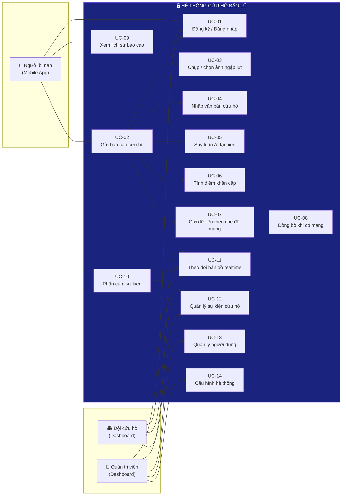
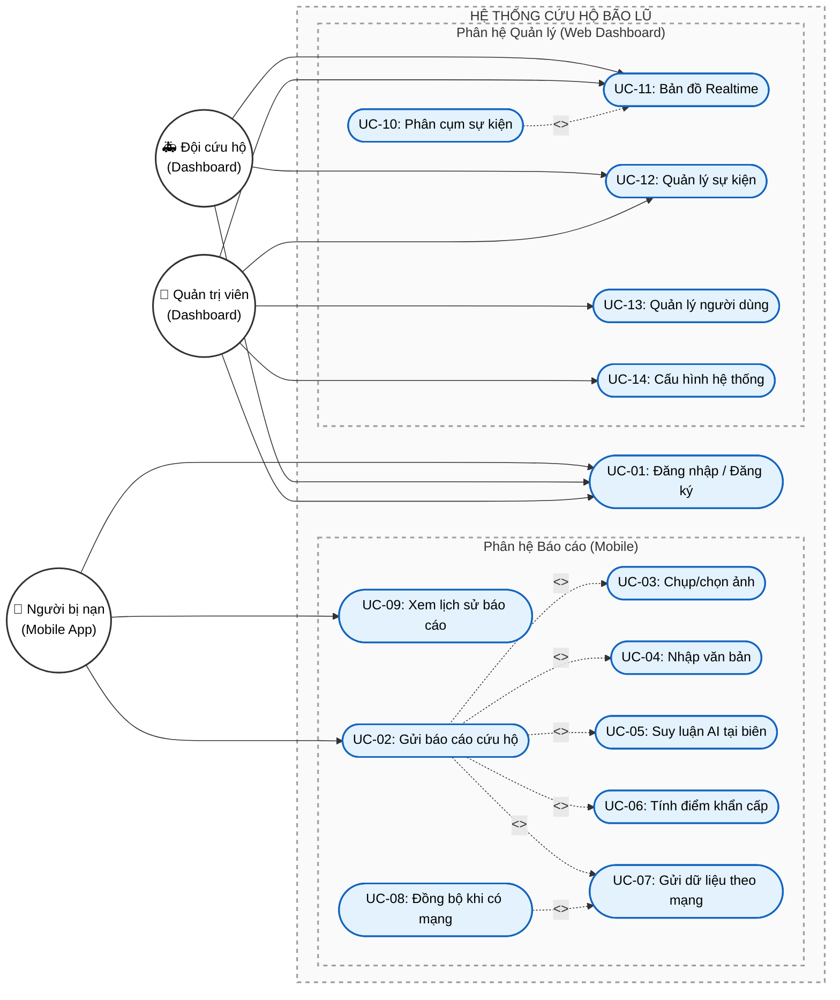
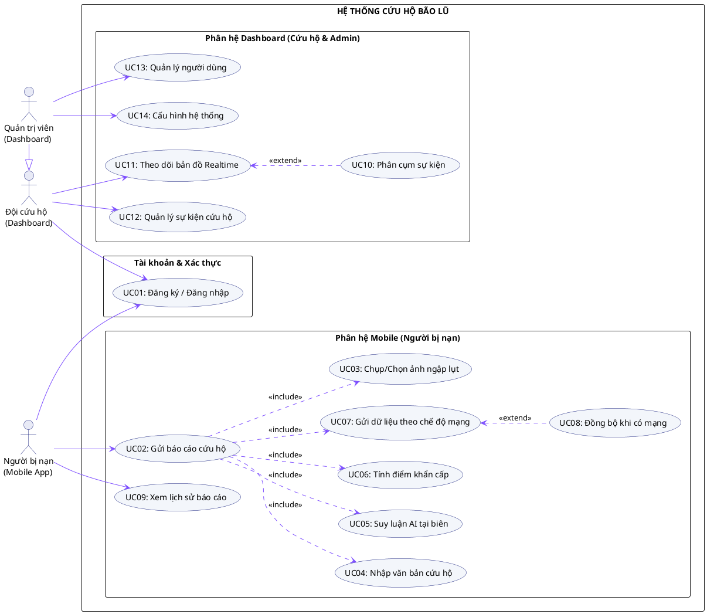

# ĐẶC TẢ USE CASE HỆ THỐNG — REVIEW 2

**Dự án:** Hệ thống phân tích đa phương thức và phân cụm sự kiện cứu hộ bão lũ dựa trên Edge AI  
**Tham chiếu:** [Đặc tả v2](./Review_2_Spec.md) · [Module](./Review_2_Modules.md)

---

## 1. Tác nhân hệ thống (Actors)

| Tác nhân                              | Loại     | Nền tảng       | Mô tả                                                 |
| ------------------------------------- | -------- | -------------- | ----------------------------------------------------- |
| Người bị nạn (Victim)                 | Primary  | Mobile App     | Người dân trong vùng thiên tai, gửi thông tin cầu cứu |
| Đội cứu hộ (Rescue Team)              | Primary  | Dashboard Web  | Lực lượng chức năng giám sát và điều phối cứu hộ      |
| Quản trị viên (Admin)                 | Primary  | Dashboard Web  | Quản lý cấu hình hệ thống, người dùng                 |
| Hệ thống AI tại biên (Edge AI)        | System   | Mobile App     | Tự động suy luận phân loại ảnh và văn bản             |
| Hệ thống phân cụm (Clustering Engine) | System   | Backend Server | Tự động gom nhóm sự kiện theo không gian-thời gian    |
| Dịch vụ GPS                           | External | Mobile OS      | Cung cấp tọa độ vị trí                                |
| Dịch vụ mạng                          | External | Mobile OS      | Cung cấp trạng thái kết nối Internet                  |

### Mối quan hệ giữa các tác nhân

- **Đội cứu hộ** kế thừa (generalization) từ **Quản trị viên** ở các chức năng xem bản đồ, quản lý sự kiện.
- **Edge AI** và **Clustering Engine** là tác nhân hệ thống — được kích hoạt tự động bởi các use case chính.

---

## 2. Sơ đồ Use Case tổng thể (Mermaid)







---

## 3. Mối quan hệ giữa các Use Case

### 3.1 Quan hệ Include (<<include>>)

| Use Case gốc             | Bao gồm                            | Lý do                             |
| ------------------------ | ---------------------------------- | --------------------------------- |
| UC-02 Gửi báo cáo cứu hộ | UC-03 Chụp/chọn ảnh                | Bắt buộc có ảnh trong mỗi báo cáo |
| UC-02 Gửi báo cáo cứu hộ | UC-04 Nhập văn bản                 | Bắt buộc có mô tả văn bản         |
| UC-02 Gửi báo cáo cứu hộ | UC-05 Suy luận AI tại biên         | Tự động chạy AI phân loại         |
| UC-02 Gửi báo cáo cứu hộ | UC-06 Tính điểm khẩn cấp           | Tự động tính score tổng hợp       |
| UC-02 Gửi báo cáo cứu hộ | UC-07 Gửi dữ liệu theo chế độ mạng | Bắt buộc gửi dữ liệu lên server   |

### 3.2 Quan hệ Extend (<<extend>>)

| Use Case gốc                       | Mở rộng bởi               | Điều kiện kích hoạt                                |
| ---------------------------------- | ------------------------- | -------------------------------------------------- |
| UC-07 Gửi dữ liệu theo chế độ mạng | UC-08 Đồng bộ khi có mạng | Khi mạng yếu/offline → lưu hàng đợi → sync lại sau |

### 3.3 Quan hệ Generalization

| Tác nhân con  | Kế thừa từ | Chức năng kế thừa                          |
| ------------- | ---------- | ------------------------------------------ |
| Quản trị viên | Đội cứu hộ | UC-11, UC-12 (xem bản đồ, quản lý sự kiện) |

---

## 4. Đặc tả chi tiết từng Use Case

### UC-01: Đăng ký / Đăng nhập

| Thuộc tính            | Mô tả                                                                                                                            |
| --------------------- | -------------------------------------------------------------------------------------------------------------------------------- |
| **Tác nhân**          | Người bị nạn, Đội cứu hộ, Quản trị viên                                                                                          |
| **Mô tả**             | Xác thực người dùng để sử dụng hệ thống                                                                                          |
| **Tiền điều kiện**    | Ứng dụng đã cài đặt (mobile) hoặc truy cập web (dashboard)                                                                       |
| **Luồng chính**       | 1. Người dùng nhập thông tin (tên, SĐT/email, mật khẩu). 2. Hệ thống xác thực và cấp JWT token. 3. Lưu token vào secure storage. |
| **Luồng thay thế**    | Đăng nhập lại nếu token hết hạn                                                                                                  |
| **Hậu điều kiện**     | Người dùng được xác thực, có quyền truy cập chức năng tương ứng                                                                  |
| **Yêu cầu liên quan** | FR-13                                                                                                                            |

---

### UC-02: Gửi báo cáo cứu hộ

| Thuộc tính            | Mô tả                                                                                                                                                                                                                                                           |
| --------------------- | --------------------------------------------------------------------------------------------------------------------------------------------------------------------------------------------------------------------------------------------------------------- |
| **Tác nhân**          | Người bị nạn                                                                                                                                                                                                                                                    |
| **Mô tả**             | Gửi thông tin cứu hộ gồm ảnh + văn bản + GPS, hệ thống tự động phân loại và tính điểm khẩn cấp                                                                                                                                                                  |
| **Tiền điều kiện**    | Đã đăng nhập, có quyền GPS                                                                                                                                                                                                                                      |
| **Luồng chính**       | 1. Chụp/chọn ảnh vùng ngập (→ UC-03). 2. Nhập mô tả tình trạng (→ UC-04). 3. Hệ thống lấy GPS tự động. 4. AI phân loại ảnh + văn bản (→ UC-05). 5. Tính điểm khẩn cấp (→ UC-06). 6. Gửi dữ liệu theo chế độ mạng (→ UC-07). 7. Hiển thị kết quả gửi thành công. |
| **Luồng ngoại lệ**    | Không có GPS → yêu cầu bật GPS. Ảnh quá tối → cảnh báo chất lượng ảnh.                                                                                                                                                                                          |
| **Hậu điều kiện**     | Báo cáo được lưu cục bộ + gửi lên server (hoặc vào hàng đợi)                                                                                                                                                                                                    |
| **Yêu cầu liên quan** | FR-01 → FR-08                                                                                                                                                                                                                                                   |

---

### UC-03: Chụp / chọn ảnh ngập lụt

| Thuộc tính            | Mô tả                                                                                                     |
| --------------------- | --------------------------------------------------------------------------------------------------------- |
| **Tác nhân**          | Người bị nạn                                                                                              |
| **Mô tả**             | Thu thập ảnh từ camera hoặc thư viện, nén trước khi xử lý                                                 |
| **Tiền điều kiện**    | Quyền truy cập camera/thư viện                                                                            |
| **Luồng chính**       | 1. Chọn nguồn ảnh (camera/thư viện). 2. Chụp hoặc chọn ảnh. 3. Nén ảnh. 4. Trả về ảnh đã xử lý cho UC-02. |
| **Hậu điều kiện**     | Ảnh sẵn sàng cho pipeline AI                                                                              |
| **Yêu cầu liên quan** | FR-01                                                                                                     |

---

### UC-04: Nhập văn bản cứu hộ

| Thuộc tính            | Mô tả                                                                                                                                          |
| --------------------- | ---------------------------------------------------------------------------------------------------------------------------------------------- |
| **Tác nhân**          | Người bị nạn                                                                                                                                   |
| **Mô tả**             | Nhập mô tả tình trạng bằng tiếng Việt, hệ thống tiền xử lý                                                                                     |
| **Tiền điều kiện**    | Đang trong luồng tạo báo cáo                                                                                                                   |
| **Luồng chính**       | 1. Nhập văn bản mô tả. 2. Chuẩn hóa Unicode (NFC). 3. Xử lý teencode, viết tắt. 4. Tokenization tiếng Việt. 5. Trả về text đã xử lý cho UC-02. |
| **Xử lý đặc biệt**    | Viết tắt ("ko" → "không"), viết sai chính tả, thiếu ký tự (ngữ cảnh khẩn cấp)                                                                  |
| **Yêu cầu liên quan** | FR-02                                                                                                                                          |

---

### UC-05: Suy luận AI tại biên (On-device Inference)

| Thuộc tính            | Mô tả                                                                                                                                                                                                                                  |
| --------------------- | -------------------------------------------------------------------------------------------------------------------------------------------------------------------------------------------------------------------------------------- |
| **Tác nhân**          | Hệ thống AI (tự động)                                                                                                                                                                                                                  |
| **Mô tả**             | Chạy 2 pipeline AI song song trên thiết bị, không cần Internet                                                                                                                                                                         |
| **Tiền điều kiện**    | Model TFLite + ONNX đã tải trên thiết bị                                                                                                                                                                                               |
| **Luồng chính**       | **Song song:** (a) Ảnh → resize 224×224 → normalize → MobileNetV3 (TFLite) → nhãn `none\|low\|high` + confidence. (b) Text → tokenize → DistilBERT (ONNX) → nhãn `urgent_rescue\|need_supplies\|safe_update\|irrelevant` + confidence. |
| **Hậu điều kiện**     | Có kết quả phân loại ảnh + văn bản                                                                                                                                                                                                     |
| **Chỉ tiêu**          | Ảnh: <100ms, ≥85% accuracy. Văn bản: <200ms, ≥80% F1.                                                                                                                                                                                  |
| **Yêu cầu liên quan** | FR-03, FR-04, NFR-01, NFR-02, NFR-06, NFR-07                                                                                                                                                                                           |

---

### UC-06: Tính điểm khẩn cấp

| Thuộc tính            | Mô tả                                                                                         |
| --------------------- | --------------------------------------------------------------------------------------------- |
| **Tác nhân**          | Hệ thống (tự động)                                                                            |
| **Mô tả**             | Kết hợp kết quả AI + ngữ cảnh để tính điểm ưu tiên                                            |
| **Công thức**         | `s = 0.4 × v_image + 0.4 × v_text + 0.2 × c`                                                  |
| **Input**             | `v_image` (điểm mức ngập), `v_text` (điểm văn bản), `c` (ngữ cảnh: thời gian, mật độ lân cận) |
| **Output**            | `urgency_score ∈ [0,1]` → Đỏ (>0.7) / Vàng (0.4–0.7) / Xanh (<0.4)                            |
| **Yêu cầu liên quan** | FR-05                                                                                         |

---

### UC-07: Gửi dữ liệu theo chế độ mạng

| Thuộc tính                            | Mô tả                                                                                                                                                                                                                                            |
| ------------------------------------- | ------------------------------------------------------------------------------------------------------------------------------------------------------------------------------------------------------------------------------------------------ |
| **Tác nhân**                          | Người bị nạn (trigger), Dịch vụ mạng (kiểm tra)                                                                                                                                                                                                  |
| **Mô tả**                             | Tự động chọn chế độ gửi dựa trên chất lượng mạng                                                                                                                                                                                                 |
| **Tiền điều kiện**                    | Có dữ liệu báo cáo + điểm khẩn cấp đã tính                                                                                                                                                                                                       |
| **Luồng chính (mạng tốt >1 Mbps)**    | 1. Kiểm tra băng thông. 2. Gửi full payload (~2–5 MB): ảnh + text + GPS + AI results. 3. `POST /api/rescue-events`. 4. Nhận 201 Created. 5. Đánh dấu "đã đồng bộ".                                                                               |
| **Luồng thay thế (mạng yếu/offline)** | 1. Kiểm tra băng thông < 1 Mbps hoặc offline. 2. Lưu đầy đủ vào hàng đợi cục bộ (SQLite/Hive). 3. Gửi metadata JSON gọn nhẹ (~2–5 KB): `POST /api/rescue-events/compact`. 4. Đánh dấu "chờ đồng bộ media". 5. Kích hoạt UC-08 khi mạng phục hồi. |
| **Hậu điều kiện**                     | Dữ liệu được gửi hoặc lưu hàng đợi                                                                                                                                                                                                               |
| **Yêu cầu liên quan**                 | FR-06, FR-07, NFR-03, NFR-04                                                                                                                                                                                                                     |

---

### UC-08: Đồng bộ khi có mạng

| Thuộc tính            | Mô tả                                                                                                                                                                                                                          |
| --------------------- | ------------------------------------------------------------------------------------------------------------------------------------------------------------------------------------------------------------------------------ |
| **Tác nhân**          | Hệ thống (tự động), Dịch vụ mạng                                                                                                                                                                                               |
| **Mô tả**             | Tự động đẩy dữ liệu từ hàng đợi cục bộ lên server khi mạng phục hồi                                                                                                                                                            |
| **Tiền điều kiện**    | Có dữ liệu trong hàng đợi offline, mạng đã phục hồi                                                                                                                                                                            |
| **Luồng chính**       | 1. Dịch vụ mạng phát sự kiện "connected". 2. Lấy danh sách pending từ hàng đợi. 3. Upload ảnh bổ sung: `PUT /api/rescue-events/{id}/media`. 4. Retry với exponential backoff nếu lỗi. 5. Đánh dấu "đã đồng bộ" khi thành công. |
| **Luồng ngoại lệ**    | Retry thất bại 3 lần → đánh dấu "failed", thử lại lần sau                                                                                                                                                                      |
| **Chỉ tiêu**          | Tỷ lệ đồng bộ thành công ≥ 95%                                                                                                                                                                                                 |
| **Yêu cầu liên quan** | FR-08, NFR-05                                                                                                                                                                                                                  |

---

### UC-09: Xem lịch sử báo cáo

| Thuộc tính            | Mô tả                                                                                                                          |
| --------------------- | ------------------------------------------------------------------------------------------------------------------------------ |
| **Tác nhân**          | Người bị nạn                                                                                                                   |
| **Mô tả**             | Xem danh sách các báo cáo đã gửi và trạng thái đồng bộ                                                                         |
| **Luồng chính**       | 1. Mở màn hình lịch sử. 2. Hiển thị danh sách báo cáo (thời gian, mức ưu tiên, trạng thái sync). 3. Xem chi tiết từng báo cáo. |
| **Yêu cầu liên quan** | FR-14                                                                                                                          |

---

### UC-10: Phân cụm sự kiện

| Thuộc tính            | Mô tả                                                                                                                                                                                                                                                                                       |
| --------------------- | ------------------------------------------------------------------------------------------------------------------------------------------------------------------------------------------------------------------------------------------------------------------------------------------- |
| **Tác nhân**          | Clustering Engine (tự động)                                                                                                                                                                                                                                                                 |
| **Mô tả**             | Gom nhóm báo cáo gần nhau để tránh trùng lặp điều phối                                                                                                                                                                                                                                      |
| **Tiền điều kiện**    | Có báo cáo mới được nhận trên server                                                                                                                                                                                                                                                        |
| **Luồng chính**       | 1. Backend nhận báo cáo → INSERT vào DB. 2. Kích hoạt phân cụm. 3. Truy vấn PostGIS: `ST_DWithin(point, 500m)` + `time < 2h`. 4. Chạy DBSCAN (ε=500m, min_samples=2). 5. Gán `cluster_id` cho các báo cáo. 6. Tính `priority = max(urgency_score)` cho cụm. 7. Push cập nhật qua WebSocket. |
| **Tham số**           | ε = 500m, min_samples = 2, time_window = 2h                                                                                                                                                                                                                                                 |
| **Hậu điều kiện**     | Cụm được tạo/cập nhật, Dashboard nhận thông báo                                                                                                                                                                                                                                             |
| **Yêu cầu liên quan** | FR-10                                                                                                                                                                                                                                                                                       |

---

### UC-11: Theo dõi bản đồ realtime

| Thuộc tính            | Mô tả                                                                                                                                                                              |
| --------------------- | ---------------------------------------------------------------------------------------------------------------------------------------------------------------------------------- |
| **Tác nhân**          | Đội cứu hộ, Quản trị viên                                                                                                                                                          |
| **Mô tả**             | Xem bản đồ cập nhật thời gian thực với các sự kiện/cụm cứu hộ                                                                                                                      |
| **Tiền điều kiện**    | Đã đăng nhập Dashboard                                                                                                                                                             |
| **Luồng chính**       | 1. Mở Dashboard → kết nối WebSocket. 2. Hiển thị bản đồ (Leaflet.js) với marker theo mã màu. 3. Nhận cập nhật realtime mỗi 2–5 giây. 4. Click marker → popup chi tiết cụm/sự kiện. |
| **Mã màu**            | 🔴 Đỏ (s>0.7) · 🟡 Vàng (0.4–0.7) · 🟢 Xanh (<0.4)                                                                                                                                    |
| **Yêu cầu liên quan** | FR-11, FR-12, NFR-03                                                                                                                                                               |

---

### UC-12: Quản lý sự kiện cứu hộ

| Thuộc tính            | Mô tả                                                                                                                                                                                                                         |
| --------------------- | ----------------------------------------------------------------------------------------------------------------------------------------------------------------------------------------------------------------------------- |
| **Tác nhân**          | Đội cứu hộ, Quản trị viên                                                                                                                                                                                                     |
| **Mô tả**             | Xem, lọc, quản lý danh sách sự kiện và cụm cứu hộ                                                                                                                                                                             |
| **Luồng chính**       | 1. Xem bảng danh sách sự kiện. 2. Lọc theo mức ưu tiên (đỏ/vàng/xanh). 3. Lọc theo cụm, thời gian, khu vực. 4. Xem chi tiết từng sự kiện (ảnh, văn bản, GPS, score). 5. Xem thông tin cụm (số báo cáo, tâm cụm, mức ưu tiên). |
| **Yêu cầu liên quan** | FR-12                                                                                                                                                                                                                         |

---

### UC-13: Quản lý người dùng

| Thuộc tính            | Mô tả                                                                                                 |
| --------------------- | ----------------------------------------------------------------------------------------------------- |
| **Tác nhân**          | Quản trị viên                                                                                         |
| **Mô tả**             | Quản lý tài khoản người dùng hệ thống                                                                 |
| **Luồng chính**       | 1. Xem danh sách người dùng. 2. Phân quyền (victim / rescue_team / admin). 3. Khóa/mở khóa tài khoản. |
| **Yêu cầu liên quan** | FR-13                                                                                                 |

---

### UC-14: Cấu hình hệ thống

| Thuộc tính                  | Mô tả                                                                                                                                                      |
| --------------------------- | ---------------------------------------------------------------------------------------------------------------------------------------------------------- |
| **Tác nhân**                | Quản trị viên                                                                                                                                              |
| **Mô tả**                   | Điều chỉnh tham số hệ thống phục vụ thử nghiệm                                                                                                             |
| **Tham số có thể cấu hình** | Ngưỡng băng thông (default: 1 Mbps), tham số DBSCAN (ε, min_samples), trọng số công thức score (w_image, w_text, w_context), ngưỡng mức ưu tiên (0.4, 0.7) |

---

## 5. Ma trận Use Case – Yêu cầu chức năng

|       | FR-01 | FR-02 | FR-03 | FR-04 | FR-05 | FR-06 | FR-07 | FR-08 | FR-09 | FR-10 | FR-11 | FR-12 | FR-13 | FR-14 |
| ----- | :---: | :---: | :---: | :---: | :---: | :---: | :---: | :---: | :---: | :---: | :---: | :---: | :---: | :---: |
| UC-01 |       |       |       |       |       |       |       |       |       |       |       |       |   ✔   |       |
| UC-02 |   ✔   |   ✔   |   ✔   |   ✔   |   ✔   |   ✔   |   ✔   |       |   ✔   |       |       |       |       |       |
| UC-03 |   ✔   |       |       |       |       |       |       |       |       |       |       |       |       |       |
| UC-04 |       |   ✔   |       |       |       |       |       |       |       |       |       |       |       |       |
| UC-05 |       |       |   ✔   |   ✔   |       |       |       |       |       |       |       |       |       |       |
| UC-06 |       |       |       |       |   ✔   |       |       |       |       |       |       |       |       |       |
| UC-07 |       |       |       |       |       |   ✔   |   ✔   |       |   ✔   |       |       |       |       |       |
| UC-08 |       |       |       |       |       |       |       |   ✔   |   ✔   |       |       |       |       |       |
| UC-09 |       |       |       |       |       |       |       |       |       |       |       |       |       |   ✔   |
| UC-10 |       |       |       |       |       |       |       |       |       |   ✔   |       |       |       |       |
| UC-11 |       |       |       |       |       |       |       |       |       |       |   ✔   |   ✔   |       |       |
| UC-12 |       |       |       |       |       |       |       |       |       |       |       |   ✔   |       |       |
| UC-13 |       |       |       |       |       |       |       |       |       |       |       |       |   ✔   |       |

---

## 6. Tổng hợp mối quan hệ hệ thống

### 6.1 Tác nhân ↔ Hệ thống

| Tác nhân                     | Tương tác                             | Giao thức                |
| ---------------------------- | ------------------------------------- | ------------------------ |
| Người bị nạn ↔ Mobile App    | Nhập liệu, xem kết quả                | UI trực tiếp             |
| Mobile App ↔ Edge AI         | Gửi ảnh/text, nhận kết quả phân loại  | In-process (TFLite/ONNX) |
| Mobile App ↔ Backend         | Gửi báo cáo, đồng bộ media            | REST API (HTTP/HTTPS)    |
| Backend ↔ Clustering Engine  | Kích hoạt phân cụm khi có dữ liệu mới | In-process               |
| Backend ↔ PostgreSQL/PostGIS | CRUD dữ liệu, truy vấn không gian     | SQL                      |
| Backend ↔ Dashboard          | Đẩy cập nhật realtime                 | WebSocket                |
| Đội cứu hộ ↔ Dashboard       | Xem bản đồ, quản lý sự kiện           | Web UI                   |

### 6.2 Thành phần ↔ Thành phần

```
Mobile App ──REST──► Backend API ──SQL──► PostgreSQL + PostGIS
    │                    │                       │
    │ (TFLite/ONNX)      │ (DBSCAN)              │
    ▼                    ▼                       │
  Edge AI          Clustering Engine             │
                                                 │
                   WebSocket Server ◄────────────┘
                         │
                         ▼
                    Dashboard Web (Leaflet.js)
```
