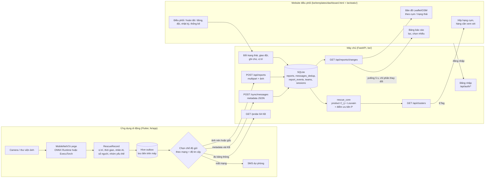
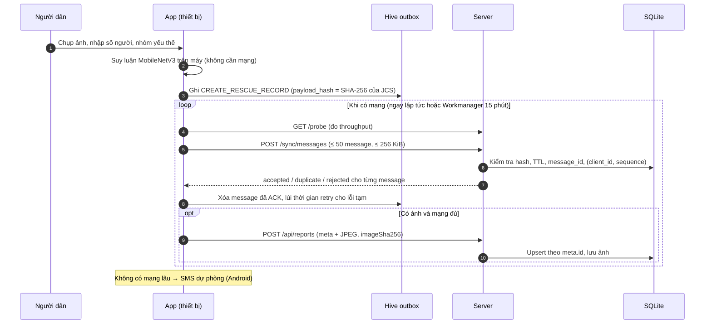
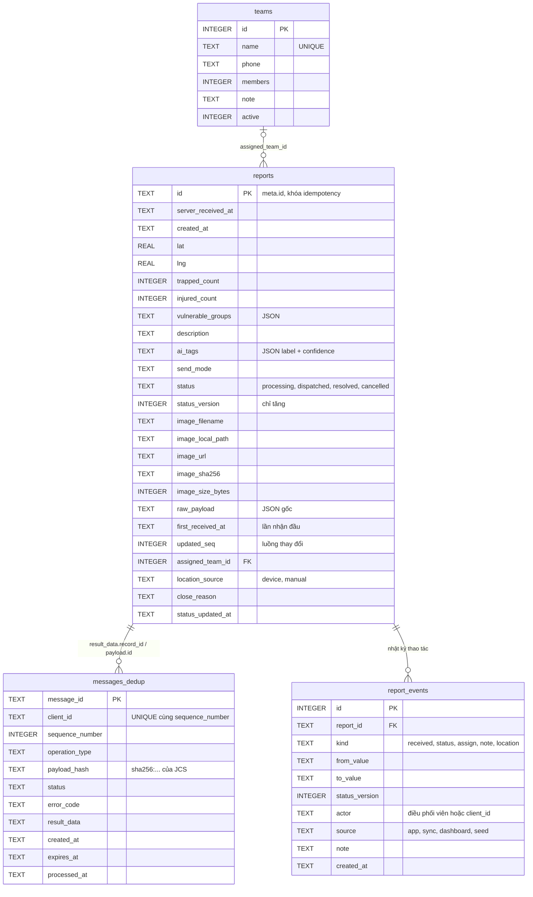
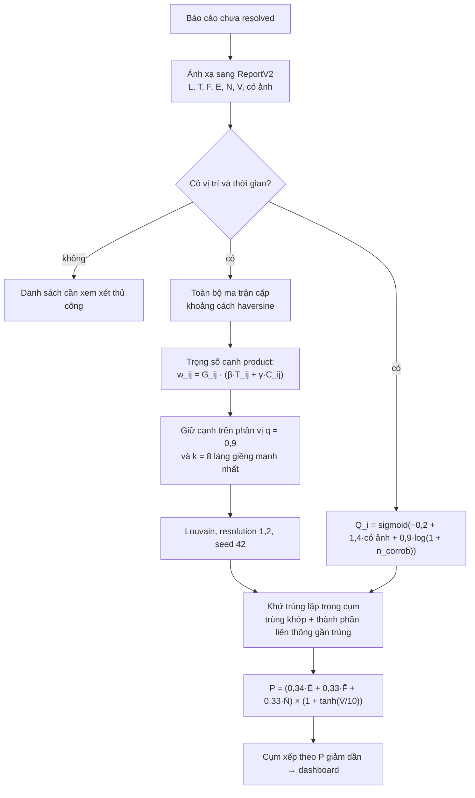

# Tài liệu thiết kế hệ thống

Đề tài: *Hệ thống phân tích đa phương thức và phân cụm sự kiện cứu hộ bão lũ dựa trên Edge AI*.
Tài liệu mô tả hệ thống **đúng như mã nguồn hiện có** trên nhánh làm việc (cập nhật 24/09/2026).
Hợp đồng chi tiết giữa app và server nằm ở [contact_connect.md](contact_connect.md), lược đồ
CSDL chi tiết ở [contact_db.md](contact_db.md); tài liệu này tổng hợp và vẽ sơ đồ.

## 1. Kiến trúc tổng thể

Hệ thống gồm ba thành phần: ứng dụng di động xử lý tại biên, máy chủ tiếp nhận và
phân cụm, và website điều phối.



| Thành phần | Công nghệ | Vị trí mã nguồn |
|---|---|---|
| Ứng dụng di động | Flutter 3, Hive, Workmanager, onnxruntime, ExecuTorch (Android) | `fe/app/` |
| Mô hình AI | PyTorch → ONNX / ExecuTorch `.pte` | `fe/model/`, `fe/tools/` |
| Máy chủ | Python, FastAPI, SQLite | `be/main.py`, `be/storage.py` |
| Thuật toán phân cụm, ưu tiên | NumPy, NetworkX, python-louvain | `be/rescue_core/`, `be/cluster_service.py` |
| Website điều phối | HTML/CSS/ES module tĩnh + Leaflet (đóng gói sẵn, không CDN), phục vụ bởi FastAPI hoặc nginx; đăng nhập bằng tài khoản riêng từng điều phối viên (vai trò admin/operator) | `be/templates/dashboard.html`, `be/static/`, `be/auth.py`, `be/accounts.py`, `be/dashboard_service.py` |

## 2. Luồng dữ liệu giữa Mobile và Server

Thiết kế theo nguyên tắc *lưu trước, gửi sau* (store-and-forward): báo cáo luôn được ghi
xuống outbox trên máy trước khi gửi, nên không mất khi mạng chập chờn. Metadata nhỏ được
ưu tiên gửi trước; ảnh gửi sau và có thể bị nén hoặc bỏ tùy chất lượng mạng.



Chế độ gửi thích ứng (`fe/app/lib/config.dart`):

| Điều kiện | Chế độ |
|---|---|
| Mạng mạnh (≥ 1000 kbps) và độ tin cậy AI ≥ 0,90 | Chỉ gửi văn bản/metadata |
| Mạng mạnh, độ tin cậy thấp | Gửi ảnh gốc để máy chủ đối chiếu |
| Mạng trung bình (≥ 50 kbps) | Ảnh nén (chất lượng 60, cạnh dài 1024 px) |
| Mạng rất yếu | Chỉ gửi văn bản |

## 3. Thiết kế cơ sở dữ liệu



- Hai bảng được ghi trong cùng một transaction khi xử lý `CREATE_RESCUE_RECORD`.
- Trạng thái cứu hộ chỉ tiến về phía trước (`processing → dispatched → resolved`, hoặc
  đóng `cancelled` kèm lý do); `resolved`/`cancelled` là trạng thái kết thúc. Quy tắc nằm
  trong một hàm duy nhất `storage.apply_status_update`, dùng chung cho app
  (`UPDATE_RESCUE_STATUS`) và dashboard (`PATCH /api/reports/{id}/status`,
  `POST /api/reports/bulk-status`); mỗi lần đổi ghi một dòng `report_events` kèm người thao tác.
- Dashboard quản lý dùng thêm bảng `report_events` (nhật ký tiếp nhận, trạng thái, giao đội,
  ghi chú, vị trí nhập tay), `teams` (đội cứu hộ), `sessions` (phiên đăng nhập, chỉ lưu
  SHA-256 của token) và `server_meta` (bộ đếm thay đổi cho `GET /api/reports/changes`).
  Chi tiết: `docs/contact_db.md`.
- Vị trí được lưu dạng `lat`/`lng` (WGS84); phân cụm tính khoảng cách haversine trên toàn bộ
  ma trận cặp báo cáo, không dùng chỉ mục không gian của CSDL. Lược đồ tương thích PostgreSQL/PostGIS khi cần mở rộng.
- Biến môi trường `RESCUE_DB_FILE` cho phép chạy trên DB riêng (ví dụ DB demo), không ghi
  đè `be/data/rescue_reports.db`.

## 4. Kiến trúc mô hình AI

| Hạng mục | Giá trị |
|---|---|
| Kiến trúc | MobileNetV3-Large, trọng số ImageNet; thay lớp phân loại cuối (dropout 0,35) |
| Lớp đầu ra | 4 lớp: `low`, `medium`, `high`, `non_flood` |
| Tiền xử lý | Letterbox giữ tỉ lệ về 224×224, chuẩn hóa mean/std ImageNet, tensor NCHW |
| Huấn luyện | AdamW (LR backbone 1e-5, head 2e-4), weight decay 5e-4, label smoothing 0,05, trọng số lớp, ReduceLROnPlateau, early stopping (patience 7), batch 32 |
| Chia dữ liệu | Phân tầng theo lớp, tách nhóm ảnh gần trùng (perceptual group) giữa train/val/test |
| Kết quả test độc lập (244 ảnh) | Accuracy 73,77%, macro-F1 72,21%, balanced accuracy 72,04% |
| Định dạng triển khai | ONNX (onnxruntime trên Android/Windows/Web) và ExecuTorch `.pte` backend XNNPACK (Android) |
| Kiểm tra chuyển đổi | ONNX so với PyTorch: trùng 100% nhãn dự đoán, cosine xác suất 0,99999 |

Kết quả test lấy từ output đã lưu của `fe/model/1706.ipynb` (lần chạy 07/09/2026). Báo cáo
`fe/reports/model_comparison/summary.md` (Accuracy 86,58%) được đo trên toàn bộ 1.625 ảnh,
gồm cả ảnh huấn luyện, nên chỉ dùng để chứng minh ONNX tương đương PyTorch, **không** dùng
làm độ chính xác của mô hình.

## 5. Thuật toán phân cụm và xếp hạng ưu tiên

Máy chủ dùng các công thức của bài báo ISDS 2026 #6444 (`be/rescue_core/`), với cấu hình
đã chọn `product_cij_louvain`. Khung mã lấy từ `demo/v2` (commit `a6be3e9`), đã chỉnh để khớp
bản cài đặt thực nghiệm của bài báo: `demo/pipeline` tại cùng commit (Eq. 1, khử trùng lặp,
hằng số Eq. 4) và notebook `Benchmark_Cij_Baselines_Colab` tại commit `6ac75c2` (Algorithm 1).
Trên cả 80 run của `src/data/gold`, nhãn cụm trùng notebook (ARI = 1, cùng số cạnh), còn
`Q_i` và `P_k` trùng `demo/pipeline` đến 4 chữ số thập phân.



- `G_ij = exp(-d²/(2σ²))` với σ = 700 m; `T_ij = exp(-Δt/τ)` với τ = 60 phút;
  `C_ij` so khớp mức ngập F (τ_F = 0,25) và mức khẩn cấp E (τ_E = 0,35), trường thiếu
  đóng góp 0. Ngưỡng θ là phân vị 0,9 của mọi trọng số cặp khác 0 (Algorithm 1).
- `Q_i` (Eq. 1): `n_corrob` đếm số payload quan sát **phân biệt** trong bán kính 400 m và
  60 phút; bản sao y hệt không làm tăng `Q_i`. Độ tin cậy của mô hình AI không vào `Q_i`.
- Bản gần trùng (≤ 100 m, ≤ 10 phút, chênh F/E ≤ 0,1, N, V, `Q_i` ≤ 0,1) được gom theo
  thành phần liên thông (có bắc cầu), đúng Mục 2.3 của bài báo.
- `P` bị chặn trong [0; 2] (ω = (0,34; 0,33; 0,33), μ = 2, s = 10, N_ref = 500, V_cap = 50).
  Nhân bản cùng một báo cáo không làm tăng điểm vì bước khử trùng lặp và phép lấy max theo
  họ báo cáo.
- Kết quả được cache và chỉ tính lại khi có báo cáo mới hoặc đổi trạng thái. Với 316 báo
  cáo mô phỏng, một lần tính mất khoảng 0,2 s; với khoảng 1.600 báo cáo mất khoảng 4 s (bộ nhớ
  và thời gian tăng theo bình phương số báo cáo đang hoạt động).

Ánh xạ từ dữ liệu app sang ký hiệu thuật toán (`be/cluster_service.py`) là **heuristic vận
hành**, chưa được kiểm định:

| Ký hiệu | Nguồn |
|---|---|
| F (mức ngập) | Nhãn AI: low = 0,33; medium = 0,66; high = 1,0; non_flood = 0 |
| E (khẩn cấp) | Từ khóa trong mô tả ("cứu gấp", "mắc kẹt", ...); không có mô tả thì bỏ trống |
| N | Số người mắc kẹt + bị thương |
| V | Số nhóm yếu thế được chọn (0–4), thay cho số người yếu thế |
| Có ảnh | Báo cáo có ảnh đính kèm (đầu vào của `Q_i`) |
| provenance_quality | Độ tin cậy của mô hình AI; chỉ nằm trong dấu vân tay bản trùng, không vào điểm ưu tiên |

Hạn chế đã biết: ngưỡng cạnh là phân vị tương đối của lô dữ liệu, nên khi chỉ có ít báo
cáo, một điểm nóng có thể bị tách thành vài cụm nhỏ (không trộn các điểm nóng khác nhau).

## 6. Triển khai và chạy thử

```bash
cd be
python3 -m venv .venv && .venv/bin/pip install -r requirements.txt
RESCUE_DB_FILE=data/demo.db .venv/bin/python seed_demo.py --reset   # dữ liệu mô phỏng
RESCUE_DB_FILE=data/demo.db .venv/bin/python main.py                # http://localhost:8000
.venv/bin/python -m unittest test_contract test_cluster_service test_dashboard_api -v
```

Dashboard yêu cầu đăng nhập bằng tài khoản riêng. Lần đầu dùng tài khoản quản trị `admin` /
`cuuho2026` (hoặc `RESCUE_ADMIN_USERNAME` / `RESCUE_ADMIN_PASSWORD`), rồi tạo tài khoản cho từng
điều phối viên ở mục "Tài khoản".

Dữ liệu nạp bởi `seed_demo.py` là bán tổng hợp (xem `src/data/README.md`); dashboard hiển
thị nhãn "Dữ liệu mô phỏng" khi có loại dữ liệu này.
