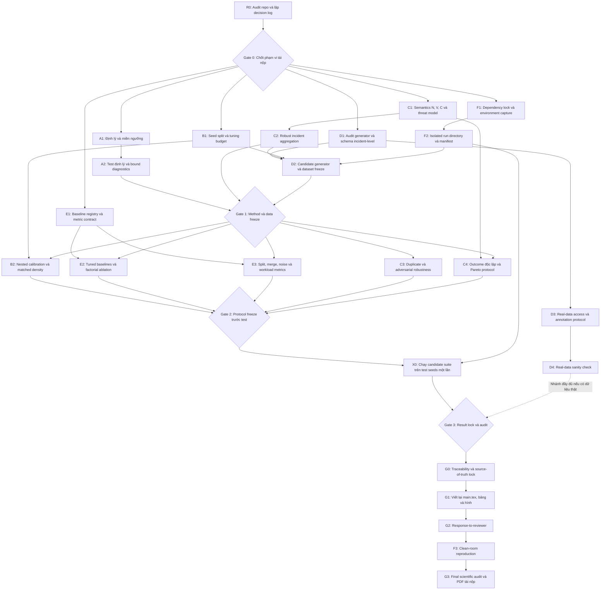

# Kế hoạch chỉnh sửa toàn diện để tái nộp

**Bài báo:** “A Product-Kernel Weighted Graph for Flood-Rescue Event Clustering and Cluster-Level Priority Scoring”
**Trạng thái đầu vào:** Reject and Resubmit, 4/10, reviewer confidence High
**Phạm vi tài liệu:** chỉ lập kế hoạch; chưa sửa mã phương pháp, chưa chạy lại suite, chưa chỉnh `paper/main.tex`
**Nguồn yêu cầu chính:** `phan-bien.md`
**Snapshot repo được audit:** 28/07/2026

## 1. Kết luận điều hành

Kế hoạch tái nộp phải đi theo hai đường song song nhưng có gate rõ ràng:

1. **Đường tối thiểu khả thi bằng tài nguyên hiện có:** sửa tính đúng đắn toán học; thiết kế lại protocol calibration/test; sửa semantics của priority trên dữ liệu synthetic có latent incident truth và duplicate reports; bổ sung baseline, factorial ablation, output-burden metrics; khóa môi trường và tái lập clean-room. Nếu không có dữ liệu thật, bài phải được định vị là **methodological/synthetic proof-of-concept**, không phải hệ thống cứu hộ đã được xác nhận.
2. **Đường đầy đủ để tăng khả năng chấp nhận:** thêm dữ liệu lũ thật có annotation incident-level, xác nhận chuyên gia cho priority/outcome và real-data sanity check. Nhánh này bị chặn bởi dữ liệu/quyền truy cập/chuyên gia bên ngoài, nhưng không chặn các workstream toán học, protocol, synthetic robustness, baseline và artifact.

Đường găng khoa học là:

```text
Audit + decision log
→ khóa phát biểu toán học, semantics priority và seed protocol
→ khóa schema/generator và phương pháp
→ khóa baseline/metric/tuning protocol trước khi mở test seeds
→ chạy candidate suite một lần trên test
→ result lock + traceability
→ viết lại paper/main.tex
→ clean-room reproduction + final audit
```

Không đặt mục tiêu “làm product thắng”. Một tie hoặc kết quả bất lợi sau calibration là outcome hợp lệ; khi đó sửa claim, không tiếp tục tuning trên test.

## 2. Những việc đã hoàn thành, không làm lại máy móc

Audit các vòng 16–17 và trạng thái hiện hành xác nhận các nền tảng sau đã có:

- Dataset v3 hiện hành có 485 báo cáo, 421 điểm có nhãn, 60 noise và 4 fake-campaign reports.
- Product form đã được định vị là kỹ thuật có trước; bài không còn nhận kernel form là mới.
- Đã có lemma đúng cho **cạnh** product trong miền `0 < theta < 1`.
- Đã có per-form threshold sweep, matched measurement conventions, bootstrap CI và Wilcoxon infrastructure.
- Đã có 20-seed geometry regeneration, confidence diagnostics, dispatch simulation, scaling experiment và traceability.
- Tám hình trong bài khớp với hình trong `demo/results/figures`.
- Bản hiện hành biên dịch bằng XeLaTeX thành PDF 12 trang.

Các hạng mục này là đầu vào để mở rộng, không phải lý do bỏ qua MC mới. Đặc biệt:

- Exp13 hiện hành chưa phải out-of-sample calibrated comparison.
- Lemma edge đúng không tự động tạo ex-ante cluster compactness.
- Dataset v3 khó hơn bản cũ nhưng vẫn là benchmark nội sinh.
- Priority cap `mu` đã chặn giá trị, nhưng confidence vẫn bypass `V` và aggregation vẫn có double-counting.

## 3. Kiểm chứng và phân loại MC1–MC8

| MC  | Phân loại                                 | Kết luận sau kiểm chứng                                                                                                                                                                                                                 | Phạm vi sửa |
| --- | ------------------------------------------- | ------------------------------------------------------------------------------------------------------------------------------------------------------------------------------------------------------------------------------------------- | ------------- |
| MC1 | **Chấp nhận**                       | Edge bound đúng; cluster bound phụ thuộc`h`; additive có bound trong miền `theta > beta+gamma`; violation count hiện chứa `theta >= 1`.                                                                                       | P0, WS-A      |
| MC2 | **Chấp nhận một phần**            | Bài đã tự gọi shared default là diagnostic và có per-form calibration. Tuy nhiên chưa có train/calibration/test, nested tuning hay matched-density test đa-seed.                                                                | P0, WS-B      |
| MC3 | **Chấp nhận; một phần bị chặn** | Generator cố ý tạo các trường hợp mà context/time phải có tác dụng. Multi-seed vẫn cùng họ generator. Real-data validity chưa có và bị chặn bởi dữ liệu ngoài.                                                      | P0/P1, WS-D   |
| MC4 | **Chấp nhận một phần**            | Confidence bypass`V` và double-counting `N,V` là thật. Nhận xét “priority tăng không giới hạn” là sai vì `tanh` và `mu` đã cap `A_k`; tiêu chí đúng phải là marginal influence được gate/có giới hạn. | P0, WS-C      |
| MC5 | **Chấp nhận**                       | Primary dispatch metric dùng lại`F,V`; trade-off mean arrival chưa được đặt ngang hàng; outcome chưa độc lập.                                                                                                                | P0/P1, WS-C   |
| MC6 | **Chấp nhận**                       | Baseline single-seed/tuning yếu; same-graph baselines chỉ kiểm partitioner; thiếu factorial ablation và baseline spatio-temporal trực tiếp.                                                                                          | P1, WS-E      |
| MC7 | **Chấp nhận**                       | ARI loại`gt=-1`; 52 clusters/39 singleton/38 noise-only ở seed 42; split/merge và operator burden chưa là headline metric.                                                                                                           | P0/P1, WS-E   |
| MC8 | **Chấp nhận**                       | README lỗi thời, không lock dependencies, paper thiếu immutable artifact reference, timing thiếu provenance, clean-room chưa có.                                                                                                     | P1, WS-F      |

### Minor concerns được route

| Minor concern                                        | Nhiệm vụ |
| ---------------------------------------------------- | ---------- |
| `< theta` trong mã nhưng `> theta` trong proof | A2         |
| “Kernel” chưa rõ nghĩa PSD/similarity           | A1, G1     |
| Bound chặt hơn khi`beta+gamma < 1`               | A1         |
| `N_ref` saturation                                 | C1, C2, C4 |
| Centroid trung bình lat/lng                         | C4, E3     |
| Multiple comparisons/SD/CI                           | B2, G1     |
| Bảng positioning dùng`~`                         | G1         |
| Related work chưa đủ sâu                         | E1, G1     |
| Packet size dùng placeholder/thiếu overhead        | F4, G1     |
| Comment và artifact cũ                             | F3         |

## 4. Các quyết định khoa học phải chốt trước khi sửa

Các quyết định sau được ghi vào `revision/decision-log.md` ở nhiệm vụ R0. Không task implementation P0 nào được merge nếu decision tương ứng còn mơ hồ.

### Q1 — Phạm vi bài khi không có dữ liệu thật

- **Khuyến nghị:** chọn “methodological synthetic study” làm phạm vi tối thiểu mặc định.
- Xóa/hạ mọi claim về deployment effectiveness, rescue impact, real-time readiness và misinformation detection.
- Real-data và expert validation là nhánh tăng cường; không giả định sẽ có.

### Q2 — Phát biểu toán học trung tâm

- Giữ edge-localization theorem.
- Cluster statement chỉ là conditional corollary theo hop-diameter `h`.
- Không gọi đây là ex-ante compact-cluster guarantee nếu pipeline không cưỡng chế `h`.
- Additive theorem phải chia miền `theta <= beta+gamma` và `theta > beta+gamma`.

### Q3 — Nghĩa của “kernel”

- **Khuyến nghị tối thiểu:** dùng “product similarity” trong claim và giải thích “kernel” theo nghĩa similarity function, trừ khi tác giả bổ sung proof PSD phù hợp với Haversine/geodesic domain.

### Q4 — Semantics của `N`, `V` và duplicate reports

- Generator mới phải có latent incident-level `N_true`, `V_true`.
- Mỗi report là quan sát noisy/partial, có `incident_id` chỉ dùng cho ground truth/evaluation.
- So sánh trước khi chọn aggregator: raw sum, capped sum, max, confidence-weighted robust estimator và duplicate-aware estimator.
- Inference không được dùng `incident_id`; chỉ evaluator được dùng.
- `V` do report cung cấp phải chịu confidence/provenance gate giống các trường khác, trừ khi có nguồn verified riêng.

### Q5 — Threat model cho confidence

- Exact duplicate.
- Near duplicate.
- Một low-confidence outlier thổi `N,V,F,E`.
- Coordinated campaign có confidence cao.
- Missing image/corroboration.
- Goal không phải biến `C` thành detector tốt; goal là giới hạn tác động của input không chắc chắn.

### Q6 — Protocol tuning/test

- Freeze ba tập seed bất giao:
  - development: `1000..1019`;
  - calibration: `2000..2019`;
  - test: `3000..3039`.
- Test seeds không được import bởi tuning code hoặc xuất intermediate metric trước protocol lock.
- Hai track:
  1. benchmark tuning dùng labels trên calibration, subject to operational constraints;
  2. label-free operational calibration dùng retained density/stability/diameter constraints.
- Tối đa 128 candidate configurations/method/track, hoặc exhaustive grid nhỏ hơn; mọi method dùng cùng metric contract.

### Q7 — Primary endpoints

- Clustering co-primary:
  - ARI trên labeled points;
  - incident split/merge loss;
  - false operational destinations/operator burden trên toàn bộ points kể cả `gt=-1`.
- Geography và noise là key secondary endpoints.
- Dispatch primary endpoint phải dựa trên latent incident outcome/deadline, không dùng lại trực tiếp priority formula làm outcome.
- Dùng Holm correction trong từng family co-primary; báo effect size + paired CI.

### Q8 — Source of truth và artifact promotion

- Không ghi đè `demo/results/tables` trong candidate runs.
- Candidate output nằm ở `demo/artifacts/runs/<run_id>/`.
- Chỉ một run qua Gate 3 được promote thành source of truth.
- Mọi số paper truy tới manifest + JSON selector hoặc hằng số mã.

## 5. Kiến trúc workstream song song

### WS-A — Toán học và phạm vi tuyên bố

- Sở hữu: `demo/pipeline/weighting.py`, test toán học mới, experiment bound mới.
- Không chỉnh: `paper/main.tex` trước Gate 3.
- Đầu vào: Q2, Q3.
- Đầu ra: theorem specification, executable tests, bound diagnostics.

### WS-B — Protocol hiệu chỉnh và so sánh công bằng

- Sở hữu: protocol/seed manifest, tuning engine, calibrated-comparison experiment.
- Không chỉnh trực tiếp generator hay priority.
- Đầu vào: method freeze từ WS-A/C/D; metric contract từ WS-E.
- Đầu ra: locked protocol, calibration selections, untouched-test results.

### WS-C — Priority semantics và dispatch

- Sở hữu: `demo/pipeline/priority.py`, priority robustness và dispatch trade-off experiments.
- Không tự chỉnh generator; cung cấp schema requirements cho WS-D.
- Đầu vào: Q4–Q7; candidate dataset từ WS-D.
- Đầu ra: robust aggregation, adversarial results, outcome/Pareto results.

### WS-D — Dữ liệu và external validity

- Sở hữu: `demo/data/generate.py`, schema và candidate datasets.
- Không chỉnh metrics/baselines.
- Đầu vào: semantics từ WS-C, seed protocol từ WS-B.
- Đầu ra: frozen synthetic candidate dataset; real-data protocol; optional real dataset results.

### WS-E — Baseline, ablation và error metrics

- Sở hữu: `demo/pipeline/baselines.py`, `demo/pipeline/metrics.py`, baseline/ablation/output-burden experiments.
- Đầu vào: metric decisions Q7, frozen dataset/method.
- Đầu ra: tuned baselines, factorial ablation, split/merge/noise/workload tables.

### WS-F — Tái lập và artifact

- Sở hữu: dependency files, environment capture, artifact writer, manifests, README và clean-room scripts.
- `demo/run_all.py` chỉ chỉnh tại integration gate sau khi experiment registry ổn định.
- Đầu ra: lockfile/container, isolated run layout, hardware manifest, clean-room report.

### WS-G — Tích hợp và viết lại

- Sở hữu sau Gate 3: `paper/main.tex`, `paper/references.bib`, figures, traceability, response-to-reviewer.
- Không thay đổi công thức, dataset hoặc protocol.
- Nếu phát hiện lỗi upstream: mở lại gate, không vá số trong LaTeX.

## 6. Dependency graph và đường găng

Nguồn Mermaid nằm tại `revision-plan-dependency.mmd`.



### Integration gates

- **Gate 0 — Decision lock:** Q1–Q8 có quyết định hoặc trạng thái external-blocked rõ ràng.
- **Gate 1 — Method/data freeze:** theorem/code tests đạt; priority API ổn định; generator/schema/dataset hash ổn định.
- **Gate 2 — Protocol lock:** baseline registry, search space, seed lists, endpoints và multiplicity policy được checksum; test seeds chưa bị đọc.
- **Gate 3 — Result lock:** candidate suite hoàn tất; manifest/checksum đầy đủ; không validation error; mọi kết quả bất lợi vẫn được giữ.
- **Gate 4 — Submission lock:** clean-room reproduction đạt; traceability 100%; PDF và response-to-reviewer không vượt claim.

Đường găng tối thiểu: `R0 → C1 → C2 → D2 → Gate 1 → B2/E2/E3/C3/C4 → Gate 2 → X0 → Gate 3 → G0 → G1 → F3 → G3`.

## 7. Kế hoạch chi tiết theo nhiệm vụ

### R0 — Audit snapshot và decision log

- **Vấn đề:** toàn bộ MC; tránh lặp loop cũ và tránh quyết định ngầm.
- **Mục tiêu:** tạo một snapshot bất biến của nguồn sự thật và chốt Q1–Q8.
- **Bằng chứng hiện tại:** loop 17 đã hoàn thành dataset v3, traceability và PDF; `phan-bien.md` phát hiện vấn đề mới.
- **Thay đổi dự kiến:** chỉ thêm tài liệu `revision/decision-log.md` và `revision/source-snapshot.json`.
- **File:** read-only toàn repo; output dưới `revision/`.
- **Đầu vào:** `phan-bien.md`, `paper/main.tex`, loop 16–17, JSON hiện hành.
- **Artifact:** decision log, hash snapshot, danh sách file dirty của người dùng.
- **Phụ thuộc:** không.
- **Song song:** không; hoàn tất trước Gate 0.
- **Kiểm:** checksum file nguồn; `git status --short`; link mỗi decision tới evidence.
- **Nghiệm thu:** 8/8 MC có classification; Q1–Q8 không còn `TBD` ngoại trừ external blockers; không file nguồn nào bị sửa.
- **Failure/rollback:** nếu evidence mâu thuẫn, dừng MC tương ứng và mở audit note; không chọn phương án theo report.
- **Rủi ro/giảm thiểu:** snapshot nhầm artifact cũ; chỉ dùng nguồn ưu tiên trong prompt.
- **Priority/Effort:** P0 / M.

### A1 — Đặc tả định lý và phạm vi claim

- **Vấn đề:** MC1; kernel terminology; bound khi `beta+gamma < 1`.
- **Mục tiêu:** có statement đúng cho product edge, conditional cluster corollary và additive theo miền.
- **Bằng chứng:** `paper/main.tex` lemma; `weighting.py::implied_distance_cutoff`.
- **Thay đổi:** soạn `revision/math-spec.md`; chưa sửa paper.
- **File:** `revision/math-spec.md`; read-only `paper/main.tex`, `demo/pipeline/weighting.py`.
- **Đầu vào:** Q2, Q3.
- **Artifact:** theorem/proof specification, domain table, counterexamples.
- **Phụ thuộc:** R0.
- **Song song:** B1, C1, D1, E1, F1.
- **Kiểm:** symbolic/manual proof review; boundary cases `theta<=0`, `theta>=1`, `theta=beta+gamma`.
- **Nghiệm thu:** product/additive statements phủ mọi parameter domain; không dùng `h` như đại lượng biết trước nếu chưa cưỡng chế; proof và proposed API dùng cùng strictness.
- **Failure/rollback:** nếu novelty chỉ còn Gaussian edge cutoff, hạ claim thành implementation property; không tạo theorem mới bằng diễn giải.
- **Rủi ro:** overclaim lặp lại; yêu cầu một reviewer toán độc lập sign-off trong decision log.
- **Priority/Effort:** P0 / M.

### A2 — Executable theorem tests và bound diagnostics

- **Vấn đề:** MC1; threshold equality; violation ngoài domain.
- **Mục tiêu:** biến math spec thành test và experiment có thể tái lập.
- **Bằng chứng:** Exp13 hiện dùng `theta>=1` và helper trả cutoff 0.
- **Thay đổi:** sửa strict threshold thống nhất; thêm unit/property tests; tạo `exp14_localization_bounds.py`.
- **File:** `demo/pipeline/weighting.py`, `demo/tests/test_localization.py`, `demo/experiments/exp14_localization_bounds.py`.
- **Đầu vào:** A1.
- **Artifact:** test report; per-seed `r_theta`, hop diameter, `h*r_theta`, actual diameter, tightness ratio.
- **Phụ thuộc:** A1.
- **Song song:** C2, F2; không sửa Exp13 đồng thời với B2.
- **Kiểm:** `pytest`; property tests trên random bounded attributes; theta domain audit.
- **Nghiệm thu:** 0 product violations trong valid domain; 0 counted rows ngoài declared domain; threshold equality code/proof thống nhất; mọi output cluster có connectivity status; bound diagnostics có selector JSON.
- **Failure/rollback:** nếu Louvain tạo disconnected community, không áp cluster corollary cho community đó; báo failure và dùng Leiden/connected post-process như variant, không che.
- **Rủi ro:** chỉnh strictness thay đổi downstream; đánh dấu bắt buộc rerun affected graph experiments.
- **Priority/Effort:** P0 / M.

### B1 — Seed manifest, endpoint và tuning-budget lock

- **Vấn đề:** MC2; test leakage; multiple comparisons.
- **Mục tiêu:** khóa protocol trước khi chạy test.
- **Bằng chứng:** Exp12/13 hiện không có train/calibration/test separation.
- **Thay đổi:** thêm protocol config và seed manifest; không chạy test.
- **File:** `demo/experiments/protocol.py`, `demo/protocol/seed_manifest.json`, `demo/protocol/metric_contract.json`.
- **Đầu vào:** Q6, Q7.
- **Artifact:** immutable protocol hash.
- **Phụ thuộc:** R0.
- **Song song:** A1, C1, D1, E1, F1.
- **Kiểm:** unit test đảm bảo tuning imports chỉ dev/calibration; static grep cấm test list trong tuner.
- **Nghiệm thu:** seed sets bất giao; 20 dev/20 calibration/40 test; max 128 configs/method/track; endpoint direction và Holm families khai trước.
- **Failure/rollback:** nếu compute budget không đủ, giảm đồng đều và cập nhật protocol trước test; không giảm riêng baseline.
- **Rủi ro:** test peeking qua logs; F2 phải ẩn test output đến Gate 2.
- **Priority/Effort:** P0 / M.

### B2 — Out-of-sample calibration và matched-density comparison

- **Vấn đề:** MC2.
- **Mục tiêu:** so method families sau tuning công bằng.
- **Bằng chứng:** shared `theta=.05` giữ mật độ rất khác; per-form sweep chỉ seed 42.
- **Thay đổi:** tạo calibration engine và `exp15_calibrated_comparison.py`.
- **File:** `demo/experiments/calibration.py`, `demo/experiments/exp15_calibrated_comparison.py`.
- **Đầu vào:** Gate 1, B1, metric contract E1.
- **Artifact:** selected configs from calibration; matched retained-fraction, matched-degree và operational-calibration test tables.
- **Phụ thuộc:** B1, A2, C2, D2, E1.
- **Song song:** E2, E3, C3, C4.
- **Kiểm:** audit search-count; hash selected configs before test; paired bootstrap/Wilcoxon on test only.
- **Nghiệm thu:** mỗi method ≤128 evaluations; matched retained fraction sai lệch ≤1 percentage point và matched mean degree sai lệch tương đối ≤5%; effect size, CI và corrected p-value cho co-primary endpoints.
- **Failure/rollback:** tie/bất lợi → hạ claim; test result không được dùng để mở search space.
- **Rủi ro:** search spaces không tương đương; E1 review parameter relevance, báo cả evaluation count và wall-clock.
- **Priority/Effort:** P0 / L.

### C1 — Priority semantics, threat model và policy contract

- **Vấn đề:** MC4, MC5; `N_ref`, weighted mean và confidence semantics.
- **Mục tiêu:** định nghĩa rõ mỗi trường là report evidence hay incident truth.
- **Bằng chứng:** `priority.py` gates E/F/N nhưng không V; generator fake V luôn 0.
- **Thay đổi:** viết `revision/priority-contract.md`; chưa sửa code.
- **File:** read-only `priority.py`, `generate.py`, Exp1/5/7/8; output `revision/priority-contract.md`.
- **Đầu vào:** Q4, Q5, Q7.
- **Artifact:** field provenance, attack matrix, aggregation candidates, range/invariance properties.
- **Phụ thuộc:** R0.
- **Song song:** A1, B1, D1, E1, F1.
- **Kiểm:** table-driven review cho N/V/F/E/C; enumerate exact/near duplicates và low-C attacks.
- **Nghiệm thu:** mọi field có provenance, confidence rule và incident aggregation rule; cap/marginal influence được định nghĩa; không còn câu “C gates all inputs” nếu không đúng.
- **Failure/rollback:** nếu không thể định nghĩa unique population, đổi score component thành “reported demand evidence” và hạ claim; không gọi là population truth.
- **Rủi ro:** chọn heuristic mới tùy tiện; so nhiều candidate aggregators trên dev/calibration, không chọn bằng test.
- **Priority/Effort:** P0 / M.

### C2 — Robust incident aggregation và confidence consistency

- **Vấn đề:** MC4.
- **Mục tiêu:** tránh exact-duplicate inflation và giới hạn tác động low-confidence report.
- **Bằng chứng:** raw `sum N_i*C_i`, raw `sum V_i`.
- **Thay đổi:** refactor priority aggregation qua API; thêm duplicate-aware/robust estimators và backward-compatible legacy variant.
- **File:** `demo/pipeline/priority.py`, `demo/pipeline/config.py` hoặc module config riêng, `demo/tests/test_priority_invariants.py`.
- **Đầu vào:** C1; schema requirements gửi WS-D.
- **Artifact:** estimator implementation, invariant tests, estimator comparison config.
- **Phụ thuộc:** C1.
- **Song song:** A2, F2; D1 chỉ thiết kế schema, chưa merge generator.
- **Kiểm:** unit/metamorphic tests.
- **Nghiệm thu:** exact duplicate cùng report fingerprint làm `N_hat`, `V_hat`, priority đổi 0%; report có `C=0` không thay đổi các component report-derived; near-duplicate stress có drift ngưỡng khai trước; priority vẫn trong declared range; legacy variant tái tạo số cũ trong tolerance.
- **Failure/rollback:** nếu robust estimator làm sai lệch latent truth hơn raw sum trên calibration, giữ nhiều estimator như ablation và không tuyên bố estimator đó đúng.
- **Rủi ro:** fingerprint dùng thông tin không có khi deployment; test riêng oracle-dedup và inference-feasible-dedup.
- **Priority/Effort:** P0 / L.

### C3 — Duplicate/adversarial robustness experiment

- **Vấn đề:** MC4; confidence campaign.
- **Mục tiêu:** định lượng score/rank drift dưới các threat cases.
- **Bằng chứng:** Exp8 mới đánh detector, không đánh full priority robustness.
- **Thay đổi:** thêm `exp16_priority_robustness.py`.
- **File:** experiment mới; không chỉnh generator sau Gate 1.
- **Đầu vào:** C2, D2, B1.
- **Artifact:** per-seed error, rank drift, top-k churn, false-priority lift.
- **Phụ thuộc:** Gate 1.
- **Song song:** B2, E2, E3, C4.
- **Kiểm:** exact duplicate, 2x/5x/10x coordinated duplicate, low-C and high-C inflated N/V/F/E.
- **Nghiệm thu:** báo 100% threat scenarios kể cả failure; exact duplicate invariance đạt; low-C marginal lift nằm trong policy contract; CI qua test seeds.
- **Failure/rollback:** nếu campaign high-C vẫn phá score, báo là known failure và yêu cầu human verification; không gọi C là misinformation robustness.
- **Rủi ro:** adversary quá khớp generator; thêm distribution-shift stress không dùng để tune.
- **Priority/Effort:** P0 / L.

### C4 — Dispatch outcome độc lập và Pareto trade-off

- **Vấn đề:** MC5.
- **Mục tiêu:** tách score input khỏi evaluation outcome và công bố equity-efficiency trade-off.
- **Bằng chứng:** current primary metric dùng raw F/V; mean arrival all bất lợi bị hạ vai trò.
- **Thay đổi:** tạo latent deadline/harm protocol trước test; thêm `exp17_dispatch_tradeoff.py`.
- **File:** experiment/simulator mới; có thể tách `demo/simulation/dispatch.py`.
- **Đầu vào:** C1, C2, D2, Q7.
- **Artifact:** Pareto tables/frontier; deadline-miss, mean, max/CVaR response, unique-population coverage.
- **Phụ thuộc:** Gate 1; protocol freeze trước test.
- **Song song:** B2, C3, E2, E3.
- **Kiểm:** multiple depot/boat/service/travel scenarios; paired test; Holm correction.
- **Nghiệm thu:** primary outcome không tính lại trực tiếp `P`, `core`, `F_max` hay `V_agg`; báo đầy đủ tất cả endpoints; frontier và trade-off có CI; conclusion không dựa vào một metric có lợi.
- **Failure/rollback:** nếu không có outcome độc lập hợp lý, dispatch chỉ giữ như illustrative simulation và không dùng để validate priority.
- **Rủi ro:** latent outcome vẫn synthetic; ghi rõ và chuyển expert/real validation sang C5/D4.
- **Priority/Effort:** P0 / L.

### C5 — Expert validation cho priority policy

- **Vấn đề:** MC4, MC5; policy weights/thresholds thiếu cơ sở nghiệp vụ.
- **Mục tiêu:** xác nhận semantics, endpoints và trade-off bởi chuyên gia cứu hộ/humanitarian logistics.
- **Bằng chứng:** repo không có expert elicitation record.
- **Thay đổi:** protocol phỏng vấn/Delphi/AHP tối giản; không tự suy đoán ý kiến.
- **File:** `revision/expert-validation-protocol.md`; dữ liệu phản hồi bên ngoài.
- **Đầu vào:** chuyên gia do tác giả cung cấp, ethics/consent nếu cần.
- **Artifact:** signed/anonymous validation summary, disagreements, chosen policy ranges.
- **Phụ thuộc:** C1; có thể chạy trong lúc C2–E3 triển khai.
- **Song song:** D3.
- **Kiểm:** trace mỗi policy parameter tới expert rationale.
- **Nghiệm thu:** ít nhất hai đánh giá độc lập hoặc một workshop có biên bản; mọi disagreement được báo; không giả citation/endorsement.
- **Failure/rollback:** nếu không có chuyên gia, giữ weights là illustrative policy knobs và hạ claim.
- **Rủi ro:** authority bias/small panel; báo đúng giới hạn.
- **Priority/Effort:** P1 / L; **external-blocked**.

### D1 — Audit generator và incident-level schema

- **Vấn đề:** MC3, MC4.
- **Mục tiêu:** tách “unit-test scenarios” khỏi “evaluation benchmark” và thêm latent incident truth.
- **Bằng chứng:** generator hiện cố ý tạo cases “chỉ context/time tách”.
- **Thay đổi:** thiết kế schema, scenario families và provenance; chưa sinh dataset.
- **File:** `revision/data-spec.md`; read-only `demo/data/generate.py`.
- **Đầu vào:** C1, B1.
- **Artifact:** schema version, causal diagram, generator parameters được freeze.
- **Phụ thuộc:** R0; hoàn thiện sau C1/B1.
- **Song song:** A1, E1, F1; D3.
- **Kiểm:** mỗi generated field có source/relationship; label rule không gọi proposed algorithm.
- **Nghiệm thu:** latent incident_id/N_true/V_true; report overlap/duplicates; context/time distributions có cả supportive và adversarial cases; generator acceptance không yêu cầu product thắng.
- **Failure/rollback:** nếu redesign chỉ đổi data để product tốt hơn, reject candidate generator.
- **Rủi ro:** tiếp tục nội sinh; giữ separate external-generator/stress families và báo family-stratified results.
- **Priority/Effort:** P0 / L.

### D2 — Candidate generator, dataset freeze và data quality gates

- **Vấn đề:** MC3, MC4; downstream source of truth.
- **Mục tiêu:** sinh candidate data không ghi đè current dataset, kiểm schema và freeze hash.
- **Bằng chứng:** mọi exp hiện đọc `demo/data/dataset.json`.
- **Thay đổi:** implement D1; output candidate datasets trong run directory.
- **File:** `demo/data/generate.py`, loader/schema tests, candidate artifact directory.
- **Đầu vào:** D1, C2 schema, B1, F2.
- **Artifact:** development/calibration/test dataset manifests và seed hashes.
- **Phụ thuộc:** C2 API/schema, B1, F2.
- **Song song:** A2.
- **Kiểm:** deterministic regeneration; schema validation; distribution report; duplicate/latent truth checks.
- **Nghiệm thu:** same seed regenerates byte-identical data; no overlap giữa seed sets; all latent totals reconcile; all data-quality gates method-agnostic; dataset hash frozen trước Gate 1.
- **Failure/rollback:** nếu candidate destroys intended task realism or has method-specific gate, return D1; current dataset remains untouched.
- **Rủi ro:** toàn bộ downstream invalidated; freeze API/schema before run.
- **Priority/Effort:** P0 / XL.

### D3 — Real-data access và annotation protocol

- **Vấn đề:** MC3 external validity.
- **Mục tiêu:** xác định dữ liệu tối thiểu, privacy và annotation incident-level.
- **Bằng chứng:** repo không có real rescue dataset/quyền truy cập.
- **Thay đổi:** viết protocol, data dictionary, de-identification và annotation guide.
- **File:** `revision/real-data-protocol.md`.
- **Đầu vào:** tác giả cung cấp source/contact/permission; không tự suy đoán.
- **Artifact:** approved data-access/annotation plan.
- **Phụ thuộc:** D1, C1.
- **Song song:** C5 và mọi synthetic workstream.
- **Kiểm:** privacy, coordinate/time precision, annotation conflicts, inter-annotator plan.
- **Nghiệm thu:** nguồn và quyền sử dụng xác nhận; incident_id annotation độc lập; ít nhất hai annotators hoặc adjudication; predefined real-data metrics.
- **Failure/rollback:** không có dữ liệu → kích hoạt minimal-scope fallback Q1.
- **Rủi ro:** sensitive data; không commit raw data, chỉ manifest/de-identified derivatives theo quyền.
- **Priority/Effort:** P1 / M; **external-blocked cho access**.

### D4 — Real-data sanity check

- **Vấn đề:** MC3, MC5.
- **Mục tiêu:** kiểm tra transfer của clustering và score assumptions.
- **Bằng chứng:** chưa có.
- **Thay đổi:** loader riêng, no tuning on test incidents, real-data experiment.
- **File:** adapter mới; artifact bảo vệ dữ liệu.
- **Đầu vào:** D3-compliant dataset.
- **Artifact:** aggregate metrics, error analysis, annotation agreement; không lộ PII.
- **Phụ thuộc:** D3, Gate 1, B1/E1 protocol.
- **Song song:** sau access có thể chạy cạnh synthetic test.
- **Kiểm:** held-out incidents/region/time; domain shift summary.
- **Nghiệm thu:** sample-size/coverage justification chốt trước run; incident-level metrics và failure cases báo đầy đủ; không claim superiority nếu CI inconclusive.
- **Failure/rollback:** result bất lợi → hạ external-validity claim; không chỉnh formula theo real test rồi báo lại cùng test.
- **Rủi ro:** leakage và small sample; separate development/held-out real split khi khả thi.
- **Priority/Effort:** P1 / XL; **external-blocked**.

### E1 — Baseline registry, literature audit và metric contract

- **Vấn đề:** MC6, MC7.
- **Mục tiêu:** chốt baseline nào kiểm representation, partitioner và spatio-temporal alternatives.
- **Bằng chứng:** current Exp4 single seed, limited hyperparameters.
- **Thay đổi:** registry gồm product/additive, tuned ST-DBSCAN, tuned DBSCAN/HDBSCAN, constrained spatial method, same-affinity partitioners và feasible multiple-kernel baseline.
- **File:** `revision/baseline-protocol.md`, `demo/protocol/baselines.json`.
- **Đầu vào:** Q6, Q7.
- **Artifact:** search spaces, dependency/license check, noise convention.
- **Phụ thuộc:** R0.
- **Song song:** A1, B1, C1, D1, F1.
- **Kiểm:** mỗi baseline có hypothesis, inputs, preset-K status, tuning budget.
- **Nghiệm thu:** ít nhất một direct spatio-temporal baseline; một spatially constrained baseline; additive family; same-representation partitioner; no method thiếu time/context mà vẫn bị gọi là equivalent competitor.
- **Failure/rollback:** package/license không khả thi → ghi lý do và dùng implementable equivalent; không silently omit.
- **Rủi ro:** baseline explosion; chỉ giữ baseline trả lời câu hỏi khoa học cụ thể.
- **Priority/Effort:** P1 / M.

### E2 — Tuned baselines và factorial ablation

- **Vấn đề:** MC6.
- **Mục tiêu:** tách vai trò geo/time/context/kNN/partitioner và confidence/aggregation trong priority.
- **Bằng chứng:** hiện chỉ có context ablation single seed và parameter sweeps.
- **Thay đổi:** `exp18_tuned_baselines.py`, `exp19_factorial_ablation.py`.
- **File:** `demo/pipeline/baselines.py`, experiments mới; không chỉnh protocol sau Gate 2.
- **Đầu vào:** E1, B1, D2, A2/C2.
- **Artifact:** calibration/test tables, component effects/interactions.
- **Phụ thuộc:** Gate 1; B1.
- **Song song:** B2, C3, C4, E3.
- **Kiểm:** clustering factorial 16 variants cho geo/temp/context/kNN presence; priority factorial riêng cho confidence/vulnerability/aggregator; paired test.
- **Nghiệm thu:** mọi variant dùng cùng seed/data/metric convention; effect size + CI; baseline search count audit; no test tuning.
- **Failure/rollback:** interaction làm main-effect vô nghĩa → báo interaction-stratified results; không chỉ chọn ablation thuận lợi.
- **Rủi ro:** một component “off” làm thang weight đổi; normalize/match density theo protocol B2.
- **Priority/Effort:** P1 / L.

### E3 — Split/merge/noise/operator-workload metrics

- **Vấn đề:** MC7.
- **Mục tiêu:** đánh giá toàn bộ reports, kể cả `gt=-1`, và chi phí vận hành của output.
- **Bằng chứng:** ARI che 39 singleton/38 noise-only/40.62% absorption ở seed 42.
- **Thay đổi:** thêm metric API và `exp20_output_burden.py`.
- **File:** `demo/pipeline/metrics.py`, tests, experiment mới.
- **Đầu vào:** Q7, D2, B1.
- **Artifact:** per-seed split, merge, noise rejection/absorption, false destinations, review queue size.
- **Phụ thuộc:** Gate 1.
- **Song song:** B2, C3, C4, E2.
- **Kiểm:** hand-worked fixtures có known split/merge/noise; cross-check denominators.
- **Nghiệm thu:** metrics bao phủ 100% points; noise bin không bị tính như cluster; report cả denominator; operator workload có CI; multimodal family có error table riêng.
- **Failure/rollback:** workload cần policy assumption → báo theo nhiều policy thresholds, không chọn một threshold duy nhất.
- **Rủi ro:** metric proliferation; Q7 xác định co-primary/key-secondary trước test.
- **Priority/Effort:** P0 / M.

### F1 — Dependency lock và environment provenance

- **Vấn đề:** MC8.
- **Mục tiêu:** môi trường dựng được từ đầu, không dựa `.venv` cá nhân.
- **Bằng chứng:** README chỉ liệt kê packages không version.
- **Thay đổi:** thêm `pyproject.toml`/lock hoặc `requirements.in` + hashed lock; ghi Python/system dependencies.
- **File:** dependency files, `demo/environment/`.
- **Đầu vào:** E1 packages; current environment inventory.
- **Artifact:** lockfile, license/dependency report.
- **Phụ thuộc:** R0; finalize sau E1.
- **Song song:** A1, B1, C1, D1, E1.
- **Kiểm:** create fresh venv from lock; import all experiment modules.
- **Nghiệm thu:** exact versions pinned; Python version bounded; no undeclared import; XeLaTeX/BibTeX requirements documented.
- **Failure/rollback:** unresolvable package conflict → containerize or choose baseline alternative before protocol lock.
- **Rủi ro:** OS-specific Leiden/igraph; provide container and native path.
- **Priority/Effort:** P1 / M.

### F2 — Isolated run layout, manifest và no-overwrite runner

- **Vấn đề:** MC8; artifact overwrite risk.
- **Mục tiêu:** mỗi run độc lập, có provenance và không chỉnh tay JSON.
- **Bằng chứng:** current scripts ghi trực tiếp `demo/results/tables`.
- **Thay đổi:** artifact context/output-dir API; manifest writer; candidate run wrapper.
- **File:** `demo/experiments/artifacts.py`, runner mới; `run_all.py` chỉ tích hợp sau registry freeze.
- **Đầu vào:** B1 seed manifest, F1 environment.
- **Artifact:** `demo/artifacts/runs/<run_id>/manifest.json`, logs, tables, figures, checksums.
- **Phụ thuộc:** F1; interface trước D2.
- **Song song:** A2, C2.
- **Kiểm:** dry-run path tests; refuse existing run_id; manifest schema validation.
- **Nghiệm thu:** manifest chứa commit, dirty status, config hash, seed hash, environment, CPU/RAM/BLAS/thread settings, start/end, command, checksums; no candidate writes current results.
- **Failure/rollback:** dirty source allowed only khi patch hash được lưu; promotion bị cấm nếu manifest incomplete.
- **Rủi ro:** refactor I/O chạm nhiều experiments; compatibility adapter và migrate theo batch.
- **Priority/Effort:** P0 / L.

### F3 — README, clean-room workflow và submission reproduction

- **Vấn đề:** MC8.
- **Mục tiêu:** reviewer chạy một lệnh từ môi trường sạch.
- **Bằng chứng:** root/demo README dùng số/đường dẫn cũ; compile instruction lệch XeLaTeX.
- **Thay đổi:** đồng bộ README; thêm `reproduce.sh` hoặc Make targets; clean-room checklist.
- **File:** `README.md`, `demo/README.md`, build scripts, `revision/clean-room-report.md`.
- **Đầu vào:** result lock, F1/F2, G1.
- **Artifact:** clean-room log và checksum comparison.
- **Phụ thuộc:** G2; runner/env stable.
- **Song song:** không với G1 trên README claims; ownership WS-F.
- **Kiểm:** fresh workspace/container; full run; figure verification; XeLaTeX–BibTeX–XeLaTeX×2.
- **Nghiệm thu:** deterministic JSON exact hoặc declared numeric tolerance; normalized figure checksum; PDF builds with 0 undefined refs/citations and no overfull >5pt; instructions contain current experiment/figure counts.
- **Failure/rollback:** isolate nondeterminism and declare tolerance; không sửa output thủ công.
- **Rủi ro:** runtime quá dài; có smoke profile và full profile, nhưng submission claims lấy full.
- **Priority/Effort:** P1 / L.

### F4 — Runtime, memory, packet và spatial-index provenance

- **Vấn đề:** MC8 minor runtime/packet; claim one-core/scalability.
- **Mục tiêu:** benchmark có hardware/thread/memory provenance và kiểm sparse implementation nếu giữ scalability claim.
- **Bằng chứng:** Exp11 single timing, không pin threads; Exp10 dùng `C=0.9` placeholder.
- **Thay đổi:** `exp22_runtime_repro.py`; packet schema dùng computed fields; optional spatial index implementation.
- **File:** scaling/packet experiments hoặc experiment mới; spatial builder module.
- **Đầu vào:** F1/F2; A1 cutoff.
- **Artifact:** median/IQR timing, peak RSS, packet min/median/max, dense-vs-spatial equivalence.
- **Phụ thuộc:** Gate 1 cho method; F2.
- **Song song:** B2/E2/E3 sau method freeze.
- **Kiểm:** 1 warm-up + ít nhất 5 measured repeats; threads pinned; hardware in manifest.
- **Nghiệm thu:** không ghi “one core” nếu không pin; matrix/edge equivalence tolerance `<=1e-9`; identical clustering labels up to permutation under fixed seed; packet uses actual computed C and states excluded protocol overhead.
- **Failure/rollback:** spatial implementation chưa tương đương → hạ scalability claim thành future work.
- **Rủi ro:** timing noisy; median/IQR, isolated host note.
- **Priority/Effort:** P1 / L.

### G0 — Result lock, traceability và promotion

- **Vấn đề:** toàn bộ MC; source-of-truth.
- **Mục tiêu:** chọn đúng một candidate run sau Gate 3.
- **Bằng chứng:** traceability hiện tốt nhưng chỉ cho suite cũ.
- **Thay đổi:** promote bằng script, không copy tay; tạo traceability mới.
- **File:** locked run manifest, `loop/revision/traceability.md`, promoted results.
- **Đầu vào:** X0 results; optional D4.
- **Artifact:** immutable result lock + selector map.
- **Phụ thuộc:** Gate 3.
- **Song song:** không; precedes paper writing.
- **Kiểm:** JSON schema/checksum; regenerate all headline numbers mechanically.
- **Nghiệm thu:** 100% quantitative claims planned cho paper có selector/hằng số; no orphan figure/table; negative/tie results preserved.
- **Failure/rollback:** mismatch → reject promotion và rerun from source; không chỉnh JSON.
- **Rủi ro:** accidental overwrite current truth; backup by git tag/run manifest, explicit promotion command.
- **Priority/Effort:** P0 / M.

### G1 — Viết lại bài, bảng, hình và claim matrix

- **Vấn đề:** MC1–MC8 và minor concerns.
- **Mục tiêu:** manuscript chỉ nói điều locked evidence hỗ trợ.
- **Bằng chứng:** current paper tự giới hạn khá tốt nhưng còn overclaim/omission.
- **Thay đổi:** chỉ sau G0; cập nhật theorem, method, experimental protocol, results, threats, data/code availability.
- **File:** `paper/main.tex`, `paper/references.bib`, generated figures/tables.
- **Đầu vào:** math spec, result lock, real-data status, expert status.
- **Artifact:** revised PDF/source, claim-evidence matrix.
- **Phụ thuộc:** G0.
- **Song song:** G2 có thể dựng skeleton nhưng không chốt nội dung trước G1.
- **Kiểm:** traceability linter; figure checksum; citation validation; scope-word grep.
- **Nghiệm thu:** shared-default chỉ diagnostic; calibrated test là primary; additive theorem đúng miền; `h` conditional; priority heuristic/real-data status chính xác; fragmentation/trade-off ở main text; all numbers trace.
- **Failure/rollback:** nếu result không hỗ trợ contribution, đổi title/abstract/scope; không cherry-pick seed/metric.
- **Rủi ro:** page limit; ưu tiên P0 evidence, chuyển sweep phụ sang supplement.
- **Priority/Effort:** P0 / L.

### G2 — Response-to-reviewer và change ledger

- **Vấn đề:** yêu cầu tái nộp.
- **Mục tiêu:** trả lời từng MC/minor bằng evidence, không chỉ lời hứa.
- **Bằng chứng:** `phan-bien.md`.
- **Thay đổi:** thêm response document và diff ledger.
- **File:** `revision/response-to-reviewer.md`, `revision/change-ledger.md`.
- **Đầu vào:** G1, G0, clean artifact references.
- **Artifact:** MC-by-MC response với old/new claim và selector.
- **Phụ thuộc:** G1.
- **Song song:** F3 chuẩn bị clean-room.
- **Kiểm:** 8/8 MC, tất cả minor/P0/P1/P2 có disposition.
- **Nghiệm thu:** mỗi accepted concern có code/data/paper evidence; partial/rejected concern có proof; external blockers có fallback claim.
- **Failure/rollback:** không có evidence → giữ “unresolved” và không tuyên bố fixed.
- **Rủi ro:** defensive tone; dùng factual disposition.
- **Priority/Effort:** P1 / M.

### G3 — Final scientific audit và submission lock

- **Vấn đề:** tránh tái phát mismatch.
- **Mục tiêu:** xác nhận manuscript, artifact và response cùng một source state.
- **Bằng chứng:** repo từng có README/log/artifact cũ.
- **Thay đổi:** audit only; chỉ sửa qua reopen gate.
- **File:** toàn submission package read-only; output audit report.
- **Đầu vào:** G2, F3.
- **Artifact:** `revision/final-audit.md`, submission checksum manifest.
- **Phụ thuộc:** F3.
- **Song song:** không.
- **Kiểm:** clean git checkout; full reproduction; claim grep; PDF log; orphan scan.
- **Nghiệm thu:** Gate 4 đạt; 0 untraced number; 0 stale README/path; 0 manually edited result; clean-room pass; external-validity wording đúng nhánh tối thiểu/đầy đủ.
- **Failure/rollback:** reopen đúng upstream gate; không vá PDF/JSON.
- **Rủi ro:** late scope creep; freeze feature additions sau Gate 2.
- **Priority/Effort:** P0 / M.

## 8. Ma trận file ownership và chống xung đột

| Path/file                         | Owner                                | Consumers       | Freeze rule                                                                         |
| --------------------------------- | ------------------------------------ | --------------- | ----------------------------------------------------------------------------------- |
| `demo/pipeline/weighting.py`    | WS-A                                 | B, E, F         | A2 merge trước Gate 1                                                             |
| `demo/pipeline/priority.py`     | WS-C                                 | D, E, dashboard | C2 merge trước D2/Gate 1                                                          |
| `demo/pipeline/config.py`       | WS-C integration owner               | A, B, D, E      | Không sửa song song; ưu tiên config module riêng                               |
| `demo/data/generate.py`         | WS-D                                 | B, C, E         | Chỉ D sửa; schema contract từ C                                                  |
| `demo/pipeline/baselines.py`    | WS-E                                 | B               | E1 registry khóa trước E2                                                        |
| `demo/pipeline/metrics.py`      | WS-E                                 | B, C            | Metric API freeze tại Gate 2                                                       |
| `demo/experiments/common.py`    | Integration owner B/F                | mọi exp        | Không sửa trực tiếp nếu có thể; thêm module`protocol.py`/`artifacts.py` |
| `demo/run_all.py`               | WS-F                                 | mọi WS         | Chỉ chỉnh sau experiment registry freeze                                          |
| `demo/data/dataset.json`        | Không WS nào ghi trong development | current suite   | Candidate data ở run directory; promote sau Gate 3                                 |
| `demo/results/**`               | Generated only                       | G               | Không chỉnh tay; candidate run không ghi vào đây                              |
| `paper/main.tex`                | WS-G                                 | final           | Locked read-only tới Gate 3                                                        |
| `paper/figures/**`              | WS-G/generated                       | final           | Chỉ copy/promote từ locked run                                                    |
| `loop/loop17/traceability.md`   | Read-only historical                 | G               | Tạo traceability revision mới, không sửa lịch sử                              |
| `README.md`, `demo/README.md` | WS-F                                 | reviewer        | Chốt sau runner/result layout ổn định                                           |
| `revision/**`                   | Theo task ID                         | toàn nhóm     | Mỗi task có file riêng; G2 tổng hợp                                            |

### Nguyên tắc merge

- Không hai workstream cùng sửa `config.py`, `common.py`, `run_all.py` trong một parallel group.
- Cross-stream requirement đi qua contract file, không sửa hộ module của owner.
- Mọi experiment mới nhận `output_dir`; cấm hard-code `demo/results/tables`.
- Dataset/formula/schema change làm invalid mọi result run trước Gate 1.
- Result JSON/hình chỉ sinh từ code; paper chỉ đọc locked run.

## 9. Ma trận phản biện → nhiệm vụ → artifact → nghiệm thu

| Concern | Tasks          | Artifact chính                                     | Acceptance                                                                  |
| ------- | -------------- | --------------------------------------------------- | --------------------------------------------------------------------------- |
| MC1     | A1, A2, G1     | math spec, exp14, theorem tests                     | Domain/proof/code thống nhất; không threshold ngoài domain              |
| MC2     | B1, B2, G1     | seed manifest, exp15                                | No test leakage; equal budget; matched density/degree; paired CI            |
| MC3     | D1–D4, G1     | data spec, candidate datasets, optional real report | Method-agnostic gates; real data hoặc scope fallback                       |
| MC4     | C1–C3, D1–D2 | priority contract, invariant tests, exp16           | Exact duplicate invariant; C=0 no contribution; latent truth error reported |
| MC5     | C4–C5, G1     | exp17 Pareto/outcome                                | Independent endpoint; all trade-offs reported                               |
| MC6     | E1–E2, B2     | baseline registry, exp18/19                         | Strong tuned baselines; factorial effects + CI                              |
| MC7     | E3, G1         | exp20                                               | Metrics cover all points; split/merge/noise/workload CI                     |
| MC8     | F1–F4, G0, F3 | lock, manifests, clean-room report                  | Fresh environment reproduces JSON/figures/PDF                               |

## 10. Kế hoạch thực nghiệm và quản lý seed/tuning/test

### Protocol lifecycle

1. Dev seeds dùng để debug code và chọn search-space boundaries.
2. Calibration seeds dùng để chọn configuration bằng objective đã khóa.
3. Hash configuration selections và protocol.
4. Gate 2 review.
5. Test seeds chạy đúng một lần cho candidate chính.
6. Nếu code bug thuần túy được phát hiện sau test, lập incident report; fix phải áp dụng cho mọi method và rerun toàn test. Không thay search space/objective.

### Tuning fairness

- Cùng max 128 evaluated configurations/method/track.
- Cùng seed sets, metrics, stopping rule và operational constraints.
- Báo cả best calibration config và test performance.
- Matched retained fraction tolerance ≤1 percentage point.
- Matched mean degree tolerance ≤5% tương đối.
- Methods requiring `K` được đánh giá ở:
  - `K` chọn từ calibration;
  - oracle `K` chỉ là upper-bound diagnostic, không là main result.

### Statistics

- Paired bootstrap CI trên per-seed differences.
- Wilcoxon signed-rank cho test seeds.
- Holm correction theo family co-primary.
- Báo mean, SD, CI, median và per-seed scatter cho metric lệch mạnh.
- Không gọi “different” nếu corrected CI/test không hỗ trợ.

## 11. Kế hoạch chạy lại và quản lý artifacts

### Khi nào phải tái sinh dataset

- **Bắt buộc:** thay schema latent incident truth, duplicate generation, `N/V` distribution, report provenance hoặc geometry/context generation.
- **Không bắt buộc:** chỉ sửa theorem wording/test, statistic formatting, README hoặc baseline code.

### Downstream invalidation

| Loại thay đổi                      | Bắt buộc chạy lại                                                                  |
| ------------------------------------- | -------------------------------------------------------------------------------------- |
| `weighting.py` edge semantics       | Exp0–4, 6, 9, 11–15, 18–20, figures graph-related, dashboard                        |
| `priority.py`/priority config       | Exp1 priority parts, Exp5–8, Exp16–17, ranking figures, dashboard                    |
| `generate.py`/dataset values/schema | Toàn bộ suite và mọi hình/dashboard                                               |
| Metrics convention                    | Mọi experiment dùng metric đó; paper tables tương ứng                           |
| Baseline-only                         | Exp4/9/18, baseline figures                                                            |
| Artifact/README-only                  | Clean-room validation; không chạy scientific suite nếu checksum source không đổi |

### Naming

- New experiments:
  - `exp14_localization_bounds`
  - `exp15_calibrated_comparison`
  - `exp16_priority_robustness`
  - `exp17_dispatch_tradeoff`
  - `exp18_tuned_baselines`
  - `exp19_factorial_ablation`
  - `exp20_output_burden`
  - `exp21_real_data_sanity` — optional/external
  - `exp22_runtime_repro`
- Run ID: `<UTC timestamp>_<git short hash>_<protocol hash prefix>`.
- Candidate artifact: `demo/artifacts/runs/<run_id>/`.

### Manifest bắt buộc

- Git commit, dirty status và patch hash.
- Python/package lock hash.
- OS, CPU, RAM, BLAS, thread variables.
- Command, protocol hash, config hash, dataset/seed hashes.
- Start/end, exit status.
- Mỗi JSON/figure/log checksum.
- Code version của generator và schema.

### Promotion

- Candidate run không ghi đè source-of-truth hiện tại.
- Promotion chỉ sau Gate 3 và qua script.
- Traceability được sinh từ manifest/selectors.
- Không xóa run bất lợi; đánh dấu `rejected_reason`.

## 12. Kế hoạch clean-room validation

1. Clone/copy sạch đúng locked commit.
2. Tạo môi trường từ lock hoặc container.
3. Chạy smoke tests/unit/property tests.
4. Chạy full candidate suite với manifest.
5. So:
   - deterministic JSON: exact hoặc tolerance khai trong schema;
   - floating metrics: tolerance `1e-8` nếu cùng dependency/CPU path;
   - runtime: so distribution, không checksum;
   - figures: normalized pixel/content checksum;
   - dataset: byte checksum.
6. Chạy `verify_figures.py`.
7. Biên dịch XeLaTeX → BibTeX → XeLaTeX ×2.
8. Kiểm 0 undefined citation/reference; overfull ≤5pt; đúng số trang theo venue.
9. Chạy traceability linter trên mọi số trong bảng/abstract/conclusion.
10. Lưu clean-room report cùng hardware/environment.

## 13. Kế hoạch tích hợp, viết lại bài và response-to-reviewer

### Paper rewrite order

1. Title/abstract/scope.
2. Theorem/product/additive statement.
3. Incident aggregation và priority policy assumptions.
4. Experimental protocol, seed isolation và tuning fairness.
5. Calibrated comparison.
6. Baseline/factorial ablation/output burden.
7. Dispatch trade-off.
8. External validity branch:
   - có real data → real sanity check;
   - không có → explicit synthetic-only scope.
9. Runtime/reproducibility/code-data availability.
10. Threats/conclusion.

### Response-to-reviewer format

Mỗi concern gồm:

- Disposition: accept/partial/reject/blocked.
- Old claim/code.
- Change.
- New evidence selector.
- New manuscript location.
- Remaining limitation.

Không viết “fixed” nếu chỉ thay câu chữ mà không có test/evidence tương ứng.

## 14. Rủi ro, blocker và đầu vào cần tác giả cung cấp

| Blocker/input                         | Không thể tự suy đoán                | Workstream vẫn chạy được   | Fallback                                          |
| ------------------------------------- | ----------------------------------------- | ------------------------------- | ------------------------------------------------- |
| Real flood reports + quyền sử dụng | Source, consent, privacy, incident labels | A, B, C synthetic, D1–D2, E, F | Synthetic-method scope                            |
| Chuyên gia cứu hộ/logistics        | Identity, authority, policy preferences   | C1–C4, D/E/F                   | Gọi weights là illustrative knobs               |
| Venue/page limit                      | Template, page/supplement rules           | Mọi scientific task            | G1 chờ venue decision                            |
| Public repository/DOI                 | Destination, release authority            | F1–F3 local                    | Commit hash + private artifact package tạm thời |
| ORCID/authorship approval             | ORCID thật, author order/consent         | Toàn bộ technical work        | Để trống đến submission system               |

### Rủi ro khoa học lớn

- Generator redesign lại vô tình ưu ái product.
- Priority estimator được chọn vì test score.
- Baseline search space yếu hơn proposed method.
- Test leakage qua logs.
- Outcome “độc lập” chỉ đổi tên nhưng vẫn algebraically dùng lại score.
- Artifact promotion nhầm candidate.
- Real-data small sample bị overclaim.

Mỗi rủi ro được giảm bằng protocol hash, owner separation, method-agnostic gates, untouched test, negative-result retention và final claim audit.

## 15. Checklist nghiệm thu cuối

### P0 scientific correctness

- [ ] Product/additive theorem và code cùng domain/strictness.
- [ ] Không violation count ngoài domain.
- [ ] Cluster bound ghi conditional theo measured/controlled `h`.
- [ ] Test seeds không được tuning truy cập.
- [ ] Equal tuning budget và matched-density/degree comparisons hoàn tất.
- [ ] Priority xử lý exact duplicate và C=0 đúng contract.
- [ ] Latent incident population/vulnerability có evaluation.
- [ ] Dispatch outcome độc lập hoặc được hạ thành illustration.
- [ ] Split/merge/noise/workload bao phủ toàn bộ points.
- [ ] Tie/negative results được giữ và claim tương ứng đã hạ.

### P1 evidence/reproducibility

- [ ] Strong baseline registry hoàn tất.
- [ ] Factorial ablation có effect size/CI.
- [ ] Environment/dependency lock.
- [ ] Run manifest có hardware/seed/config/checksum.
- [ ] Clean-room full run đạt.
- [ ] Real-data/expert branch có evidence hoặc explicit blocker/fallback.

### P2 presentation

- [ ] README đồng bộ.
- [ ] “Kernel” terminology rõ.
- [ ] SD/CI/multiplicity rõ.
- [ ] Packet/runtime assumptions rõ.
- [ ] Không stale log/path/count.
- [ ] Code/data availability có immutable reference.
- [ ] Response-to-reviewer phủ toàn bộ concern.

## 16. Thứ tự thực thi đề xuất

### Có thể bắt đầu ngay và chạy song song

Sau R0/Gate 0:

- A1 — math specification.
- B1 — seed/endpoint/tuning protocol.
- C1 — priority semantics/threat model.
- D1 — generator/schema design.
- E1 — baseline registry/metric contract.
- F1 — dependency/environment lock.
- D3 — real-data protocol phần không cần quyền truy cập.
- C5 — expert protocol phần không cần chuyên gia thực tế.

### Phải chờ integration gate

- A2 chờ A1.
- C2 chờ C1.
- D2 chờ C1/C2, B1 và F2.
- B2, C3, C4, E2, E3, F4 chờ Gate 1.
- Test run X0 chờ Gate 2.
- G0–G3 và F3 chờ Gate 3/result lock theo dependency graph.

### Bị chặn bởi đầu vào bên ngoài

- C5 phần thu thập expert validation.
- D3 phần xác nhận quyền truy cập.
- D4 real-data sanity check.
- Public DOI/repository release và ORCID.

## 17. Bảng tổng hợp nhiệm vụ

| Task | Priority | Workstream | Dependencies    | Parallel group | Files                     | Output                   | Acceptance test                               | Effort |
| ---- | -------- | ---------- | --------------- | -------------- | ------------------------- | ------------------------ | --------------------------------------------- | ------ |
| R0   | P0       | Cross      | —              | 0              | `revision/*`            | snapshot + decisions     | 8/8 MC, Q1–Q8 resolved/blocked               | M      |
| A1   | P0       | A          | R0              | 1              | `revision/math-spec.md` | theorem spec             | full domain, no overclaim                     | M      |
| A2   | P0       | A          | A1              | 2              | weighting/tests/exp14     | bound diagnostics        | 0 invalid-domain rows                         | M      |
| B1   | P0       | B          | R0              | 1              | protocol/seed manifests   | protocol hash            | disjoint 20/20/40 seeds, ≤128 configs        | M      |
| B2   | P0       | B          | Gate 1, B1, E1  | 3              | calibration/exp15         | test comparison          | no leakage, matched density/degree, CI        | L      |
| C1   | P0       | C          | R0              | 1              | priority contract         | semantics/threat model   | provenance + rules for all fields             | M      |
| C2   | P0       | C          | C1              | 2              | priority/tests            | robust aggregation       | duplicate invariant; C=0 no effect            | L      |
| C3   | P0       | C          | Gate 1          | 3              | exp16                     | robustness tables        | all threat cases + CI                         | L      |
| C4   | P0       | C          | Gate 1, C1      | 3              | simulator/exp17           | Pareto/outcome           | independent endpoint; full trade-off          | L      |
| C5   | P1       | C          | C1, external    | external       | expert protocol           | validation summary       | independent expert evidence or fallback       | L      |
| D1   | P0       | D          | R0, C1/B1 input | 1              | data spec                 | incident schema          | method-agnostic labels/gates                  | L      |
| D2   | P0       | D          | C2, B1, F2      | 2              | generator/schema          | frozen datasets          | deterministic hashes, latent totals reconcile | XL     |
| D3   | P1       | D          | D1, external    | 1/external     | real-data protocol        | access/annotation plan   | rights + annotation process                   | M      |
| D4   | P1       | D          | D3, Gate 1      | external       | adapter/exp21             | real sanity check        | held-out metrics + error analysis             | XL     |
| E1   | P1       | E          | R0              | 1              | baseline protocol         | registry/search spaces   | direct spatio-temporal + spatial + additive   | M      |
| E2   | P1       | E          | Gate 1, E1/B1   | 3              | baselines/exp18/19        | tuned baselines/ablation | same budget; factorial CI                     | L      |
| E3   | P0       | E          | Gate 1          | 3              | metrics/exp20             | burden metrics           | covers 100% points/denominators               | M      |
| F1   | P1       | F          | R0, E1 input    | 1              | lock/environment          | reproducible env         | fresh install/import pass                     | M      |
| F2   | P0       | F          | F1, B1          | 2              | artifacts/runner          | isolated run manifest    | no overwrite; full provenance                 | L      |
| F3   | P1       | F          | G2, result lock | 4              | README/build/report       | clean-room report        | full JSON/figures/PDF reproduce               | L      |
| F4   | P1       | F          | Gate 1, F2      | 3              | exp22/runtime/packet      | runtime/memory tables    | 5 repeats, pinned threads, actual C           | L      |
| G0   | P0       | G          | Gate 3          | 4              | locked run/traceability   | result lock              | 100% claim selectors                          | M      |
| G1   | P0       | G          | G0              | 4              | paper/figures             | revised manuscript       | no unsupported claim/untraced number          | L      |
| G2   | P1       | G          | G1              | 4              | response/ledger           | response package         | all MC/minor dispositions                     | M      |
| G3   | P0       | G          | F3/G2           | 5              | submission package        | final audit/PDF          | Gate 4 pass                                   | M      |

## 18. Hai mức hoàn thành

### Mức tối thiểu khả thi để tái nộp

Hoàn tất R0, A1–A2, B1–B2, C1–C4, D1–D2, E1–E3, F1–F4, G0–G3. Không yêu cầu C5/D4 thành công, nhưng paper bắt buộc:

- tự nhận là synthetic methodological study;
- không claim field effectiveness;
- gọi priority là bounded policy heuristic;
- nêu real/expert validation là unresolved limitation.

### Mức đầy đủ để tăng khả năng chấp nhận

Ngoài mức tối thiểu:

- C5 có expert validation;
- D3–D4 có real-data held-out sanity check;
- public immutable repository/DOI;
- nếu dữ liệu đủ, external validity và incident-level annotation agreement được báo trong main text.

Không được trì hoãn P0 để chờ nhánh đầy đủ. Nếu dữ liệu thật không đến trước submission lock, kích hoạt fallback scope thay vì dùng dữ liệu không có quyền hoặc tự tạo “real-like evidence”.
