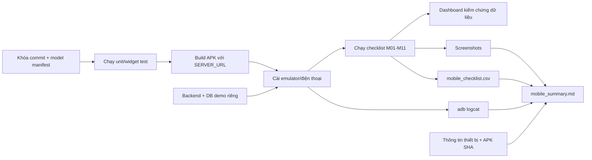

# Pipeline thực nghiệm ứng dụng Android

> **Trạng thái:** Hướng dẫn thực hiện và lưu bằng chứng. Source hiện tại chưa có runner tự động end-to-end dành riêng cho Android, vì vậy phần chính của pipeline là kiểm thử có kiểm soát trên emulator/điện thoại và ghi checklist.
>
> **Không gộp:** Kết quả web E2E không được dùng thay kết quả Android. Khảo sát người dùng cũng không thay thế kiểm thử kỹ thuật trên thiết bị.

## 1. Mục tiêu

Pipeline này đánh giá các phần chỉ có hoặc có hành vi khác trên Android:

1. APK cài và mở được trên thiết bị.
2. App xin và xử lý quyền camera, ảnh, vị trí đúng.
3. AI on-device nạp model và trả nhãn/confidence.
4. SOS và báo cáo ảnh tới backend qua mạng mạnh.
5. Khi mất mạng, báo cáo nằm trong outbox và không bị mất.
6. Khi có mạng lại, báo cáo đồng bộ đúng một lần.
7. Workmanager có thể đồng bộ khi app không ở foreground.
8. Báo cáo thiếu GPS được xử lý đúng.
9. SMS fallback hoạt động trên thiết bị có SIM khi dùng số kiểm thử được kiểm soát.
10. Có thể quan sát hành vi dưới mạng bị giới hạn nếu có router/hotspot/emulator hỗ trợ shaping.

## 2. Source hiện tại có gì và có dùng tiếp được không?

| Thành phần | Vị trí | Có thể dùng tiếp? | Ghi chú |
|---|---|---|---|
| App Flutter | `products/fe/app` | **Có** | Source chính của app. |
| Android project | `products/fe/app/android` | **Có** | Có quyền Internet, camera, vị trí, media và SMS. |
| Script chạy app | `products/scripts/demo/run_app.ps1` | **Có** | Truyền device và `SERVER_URL`. |
| Script backend | `products/scripts/demo/run_server.ps1` | **Có** | Chạy backend trên `0.0.0.0` để điện thoại truy cập qua LAN. |
| Unit/widget tests | `products/fe/app/test` | **Có** | Kiểm tra policy, outbox, upload, contract, model và UI điều kiện khẩn cấp. |
| Integration test nền | `products/fe/app/integration_test/system_test.dart` | **Dùng làm precheck** | Kiểm tra repository ↔ server trên desktop Linux; chưa điều khiển UI Android và đường dẫn ảnh hiện thiết kế cho host. |
| ONNX/PTE/manifest | `products/fe/app/assets/models` | **Có trong checkout hiện tại** | Gồm `model.onnx`, `model.pte`, `model_manifest.json`, `urgency_logistic.json`. |
| SMS native | `products/fe/app/android/.../MainActivity.kt` | **Có, cần thiết bị thật** | Emulator thường không kiểm chứng được SMS qua SIM. |
| Android E2E runner tự động | — | **Chưa có** | Chưa có Patrol/Appium/Maestro hoặc integration test UI Android hoàn chỉnh. |
| Kết quả thiết bị thật | — | **Chưa có artifact chính thức** | Cần chạy và lưu theo pipeline này. |

### Kết luận tái sử dụng

Có thể dùng tiếp app, backend, model, unit test và script khởi động. Phần còn thiếu là runner Android tự động và bộ kết quả. Trong phạm vi hiện tại, dùng checklist có mã ca kiểm thử, logcat, ảnh chụp và manifest để tạo bằng chứng có thể audit.

## 3. Hai tầng thực nghiệm

### Tầng A — Emulator Android

Mục tiêu là kiểm tra APK, giao diện, quyền, kết nối backend và luồng phần mềm. Emulator không đại diện đầy đủ cho camera, GPS, SIM, pin hoặc phần cứng AI của điện thoại.

### Tầng B — Điện thoại Android thật

Mục tiêu là kiểm tra camera/GPS thực, AI on-device, foreground/background, thay đổi kết nối và SMS. Báo cáo phải ghi rõ model máy, Android, loại mạng và cách kết nối backend.

Kết quả hai tầng để riêng; không gộp thành một tỷ lệ nếu môi trường khác nhau.

## 4. Sơ đồ pipeline



## 5. Cấu trúc thư mục kết quả

```text
thuc_nghiem_nq/results/mobile_app/<YYYYMMDD-HHmmss>/
├── manifest.txt
├── git_status.txt
├── flutter_doctor.txt
├── flutter_devices.txt
├── unit_tests.txt
├── build_apk.txt
├── build_exit_code.txt
├── apk_sha256.txt
├── adb_install.txt
├── device_getprop.txt
├── adb_logcat.txt
├── adb_logcat_error.txt
├── mobile_checklist.csv
├── mobile_summary.md
├── notes.md
└── screenshots/
    ├── M01_home.png
    ├── M04_sos_sent.png
    ├── M06_offline_queue.png
    └── ...
```

Không đưa APK vào thư mục kết quả Git nếu không cần; lưu SHA-256 và đường dẫn build là đủ. APK lớn có thể phân phối riêng.

## 6. Điều chỉnh nơi lưu kết quả

Trong PowerShell:

```powershell
$Repo = "D:\nckh-flood-rescue\nckh2"
$ResultRoot = Join-Path $Repo "thuc_nghiem_nq\results\mobile_app"
$RunId = Get-Date -Format "yyyyMMdd-HHmmss"
$ResultDir = Join-Path $ResultRoot $RunId
$ScreenshotDir = Join-Path $ResultDir "screenshots"

New-Item -ItemType Directory -Force -Path $ScreenshotDir | Out-Null
$ResultDir
```

Muốn lưu nơi khác chỉ đổi `$ResultRoot`. Dùng cùng `$RunId` trong mọi terminal của một lần chạy.

## 7. Chuẩn bị trước khi chạy

### Thiết bị và kết nối

- Android emulator hoặc điện thoại bật Developer options và USB debugging.
- Điện thoại và máy chạy backend ở cùng LAN nếu dùng điện thoại thật.
- Backend lắng nghe `0.0.0.0:8000`.
- Firewall Windows cho phép thiết bị truy cập cổng 8000.
- Nếu kiểm tra SMS, dùng số điện thoại thử nghiệm do nhóm kiểm soát; không dùng số cứu hộ thật.

### Dữ liệu

- Dùng tình huống và ảnh thử nghiệm, không nhập thông tin nạn nhân thật.
- Có thể dùng ảnh trong `products/fe/model/Dataset_Flood`.
- Database phải là `demo.db` hoặc database riêng, không dùng database mẫu đã commit.

## 8. Hướng dẫn chạy từng bước

### Bước 1 — Tạo thư mục kết quả và manifest

**Mục đích:** khóa run ID và provenance trước khi build.

```powershell
cd D:\nckh-flood-rescue\nckh2

$Repo = "D:\nckh-flood-rescue\nckh2"
$ResultRoot = Join-Path $Repo "thuc_nghiem_nq\results\mobile_app"
$RunId = Get-Date -Format "yyyyMMdd-HHmmss"
$ResultDir = Join-Path $ResultRoot $RunId
$ScreenshotDir = Join-Path $ResultDir "screenshots"
New-Item -ItemType Directory -Force -Path $ScreenshotDir | Out-Null

@(
  "experiment=mobile_app"
  "run_id=$RunId"
  "git_commit=$(git -C $Repo rev-parse HEAD)"
  "model_manifest_sha256=$((Get-FileHash -Algorithm SHA256 (Join-Path $Repo 'products\fe\app\assets\models\model_manifest.json')).Hash)"
) | Set-Content -LiteralPath (Join-Path $ResultDir "manifest.txt") -Encoding UTF8

git -C $Repo status --short |
  Set-Content -LiteralPath (Join-Path $ResultDir "git_status.txt") -Encoding UTF8

"# Ghi chú lần chạy`r`n" |
  Set-Content -LiteralPath (Join-Path $ResultDir "notes.md") -Encoding UTF8
```

### Bước 2 — Ghi môi trường Flutter và thiết bị

**Mục đích:** kết quả Android phụ thuộc SDK và thiết bị; phải lưu thông tin này.

```powershell
flutter doctor -v |
  Set-Content -LiteralPath (Join-Path $ResultDir "flutter_doctor.txt") -Encoding UTF8

flutter devices |
  Set-Content -LiteralPath (Join-Path $ResultDir "flutter_devices.txt") -Encoding UTF8

adb devices
```

Đặt device ID nhìn thấy từ `adb devices`:

```powershell
$DeviceId = "<device-id>"
adb -s $DeviceId shell getprop |
  Set-Content -LiteralPath (Join-Path $ResultDir "device_getprop.txt") -Encoding UTF8
```

### Bước 3 — Chạy unit/widget test trước APK

**Mục đích:** phát hiện lỗi logic nhanh trước khi dành thời gian kiểm thử thủ công.

```powershell
cd "$Repo\products\fe\app"

flutter test 2>&1 |
  Tee-Object -FilePath (Join-Path $ResultDir "unit_tests.txt")

$UnitExitCode = $LASTEXITCODE
"unit_test_exit_code=$UnitExitCode" |
  Add-Content -LiteralPath (Join-Path $ResultDir "manifest.txt") -Encoding UTF8
```

Nếu unit test thất bại, dừng lần chạy và ghi nguyên nhân vào `notes.md`.

### Bước 4 — Khởi động backend demo

**Mục đích:** điện thoại gửi dữ liệu vào database riêng có thể reset.

Mở PowerShell thứ hai:

```powershell
cd D:\nckh-flood-rescue\nckh2
.\products\scripts\demo\run_server.ps1 -Demo -Seed -Run 1 -Port 8000
```

Lấy IP LAN của máy:

```powershell
Get-NetIPAddress -AddressFamily IPv4 |
  Where-Object {
    $_.IPAddress -notlike "127.*" -and
    $_.IPAddress -notlike "169.254.*" -and
    $_.PrefixOrigin -ne "WellKnown"
  } |
  Select-Object IPAddress,InterfaceAlias
```

Trên trình duyệt điện thoại, mở `http://<IP-LAN>:8000/docs`. Chỉ tiếp tục khi truy cập được.

### Bước 5 — Kiểm tra model được đóng gói

**Mục đích:** không tuyên bố đã kiểm tra AI on-device nếu APK thiếu model.

```powershell
$ModelDir = Join-Path $Repo "products\fe\app\assets\models"
Get-ChildItem -LiteralPath $ModelDir

@(
  "model.onnx"
  "model.pte"
  "model_manifest.json"
  "urgency_logistic.json"
) | ForEach-Object {
  if (-not (Test-Path -LiteralPath (Join-Path $ModelDir $_))) {
    throw "Thiếu model asset: $_"
  }
}
```

Nếu thiếu artifact, vẫn có thể kiểm tra gửi/đồng bộ nhưng phải đánh dấu ca AI là `NOT_RUN`.

### Bước 6 — Build APK với đúng server

**Mục đích:** ghi cố định backend và số SMS thử nghiệm vào build.

Điện thoại thật:

```powershell
$ServerUrl = "http://<IP-LAN-của-máy>:8000"
$EmergencyPhone = "+84<so-thu-nghiem-do-nhom-kiem-soat>"

cd "$Repo\products\fe\app"
flutter build apk --debug `
  --dart-define=SERVER_URL=$ServerUrl `
  --dart-define=EMERGENCY_PHONE=$EmergencyPhone `
  2>&1 | Tee-Object -FilePath (Join-Path $ResultDir "build_apk.txt")

$BuildExitCode = $LASTEXITCODE
$BuildExitCode |
  Set-Content -LiteralPath (Join-Path $ResultDir "build_exit_code.txt") -Encoding ASCII
```

Nếu không chạy ca SMS M11, bỏ biến `$EmergencyPhone` và bỏ hẳn tham số `--dart-define=EMERGENCY_PHONE=...`. Không để nguyên chuỗi placeholder trong bản build chính thức.

Emulator Android dùng:

```powershell
$ServerUrl = "http://10.0.2.2:8000"
```

Ghi hash APK:

```powershell
$Apk = Join-Path $Repo "products\fe\app\build\app\outputs\flutter-apk\app-debug.apk"
Get-FileHash -Algorithm SHA256 -LiteralPath $Apk |
  Format-List |
  Out-File -LiteralPath (Join-Path $ResultDir "apk_sha256.txt") -Encoding UTF8
```

### Bước 7 — Cài APK

**Mục đích:** ghi lại việc cài đặt có thành công trên đúng thiết bị hay không.

```powershell
adb -s $DeviceId install -r $Apk 2>&1 |
  Tee-Object -FilePath (Join-Path $ResultDir "adb_install.txt")
```

### Bước 8 — Bắt đầu logcat

**Mục đích:** lưu crash, lỗi plugin, lỗi model và lỗi mạng trong suốt phiên.

```powershell
adb -s $DeviceId logcat -c

$LogcatProcess = Start-Process `
  -FilePath "adb" `
  -ArgumentList @("-s", $DeviceId, "logcat", "-v", "threadtime") `
  -RedirectStandardOutput (Join-Path $ResultDir "adb_logcat.txt") `
  -RedirectStandardError (Join-Path $ResultDir "adb_logcat_error.txt") `
  -NoNewWindow `
  -PassThru
```

Giữ `$LogcatProcess` để dừng ở bước cuối.

### Bước 9 — Tạo checklist kết quả

**Mục đích:** mọi thiết bị chạy cùng ca và ghi cùng schema.

```powershell
@'
case_id,environment,status,duration_s,evidence,notes
M01,android,NOT_RUN,,,
M02,android,NOT_RUN,,,
M03,android,NOT_RUN,,,
M04,android,NOT_RUN,,,
M05,android,NOT_RUN,,,
M06,android,NOT_RUN,,,
M07,android,NOT_RUN,,,
M08,android,NOT_RUN,,,
M09,android,NOT_RUN,,,
M10,android,NOT_RUN,,,
M11,android,NOT_RUN,,,
'@ | Set-Content -LiteralPath (Join-Path $ResultDir "mobile_checklist.csv") -Encoding UTF8
```

Giá trị `status` chỉ dùng `PASS`, `FAIL` hoặc `NOT_RUN`.

### Bước 10 — Thực hiện các ca kiểm thử

| ID | Thao tác | Kết quả mong đợi | Mục đích |
|---|---|---|---|
| M01 | Mở app sau khi cài | App vào màn hình chính, không crash | Xác nhận APK chạy được. |
| M02 | Mở camera/chọn ảnh và xử lý quyền | Có thể chọn ảnh; từ chối quyền được xử lý rõ | Kiểm tra Android permission/plugin. |
| M03 | Cho phép GPS rồi gửi SOS | Backend nhận đúng tọa độ và thời gian | Kiểm tra GPS thật. |
| M04 | Gửi SOS khi online | Báo cáo tới server và xuất hiện dashboard | Kiểm tra luồng tối thiểu. |
| M05 | Gửi báo cáo có ảnh trên mạng mạnh | Ảnh và metadata tới server, SHA hợp lệ | Kiểm tra upload thực. |
| M06 | Tắt Wi-Fi và mobile data rồi gửi SOS | Bản ghi nằm trong outbox, server chưa nhận | Kiểm tra offline-first. |
| M07 | Bật mạng lại và đồng bộ | Server nhận đúng một bản ghi; outbox về 0 | Kiểm tra retry/idempotency. |
| M08 | Tạo pending, đưa app xuống nền, bật mạng và chờ Workmanager | Bản ghi được đồng bộ nền hoặc ghi rõ chưa xảy ra trong cửa sổ chờ | Kiểm tra background behavior. |
| M09 | Từ chối GPS rồi gửi SOS | lat/lng trống; dashboard đưa vào hàng xem xét | Kiểm tra không tạo tọa độ giả. |
| M10 | Chọn ảnh và xem trạng thái AI | Model báo sẵn sàng, có nhãn/confidence; không chạy web fallback | Kiểm tra AI on-device. |
| M11 | Tắt data, gửi tới số SMS thử nghiệm | Thiết bị gọi kênh SMS; ghi rõ trạng thái gửi | Kiểm tra native SMS có kiểm soát. |

Mỗi ca ghi thời gian, trạng thái, tên screenshot và ghi chú vào `mobile_checklist.csv`. Không để ô trạng thái trống.

### Bước 11 — Chụp bằng chứng

**Mục đích:** gắn trạng thái checklist với màn hình cụ thể.

Ví dụ cho M06:

```powershell
adb -s $DeviceId shell screencap -p /sdcard/M06_offline_queue.png
adb -s $DeviceId pull /sdcard/M06_offline_queue.png "$ScreenshotDir\M06_offline_queue.png"
adb -s $DeviceId shell rm /sdcard/M06_offline_queue.png
```

Đặt tên screenshot bắt đầu bằng mã ca kiểm thử.

### Bước 12 — Dừng logcat và lưu tóm tắt

**Mục đích:** đóng phiên đo và tránh log tiếp tục ghi sau thực nghiệm.

```powershell
Stop-Process -Id $LogcatProcess.Id
```

Tạo `mobile_summary.md` với tối thiểu:

```markdown
# Kết quả Android

- Run ID:
- Thiết bị:
- Android:
- APK SHA-256:
- Số PASS:
- Số FAIL:
- Số NOT_RUN:
- Ca thất bại:
- Crash/lỗi logcat:
- Giới hạn:
```

## 9. Cách đánh giá

### Chỉ số chính

- Số ca PASS/FAIL/NOT_RUN.
- Tỷ lệ hoàn thành trên số ca thực sự chạy: `PASS / (PASS + FAIL)`.
- Số crash hoặc lỗi plugin chưa xử lý.
- Đồng bộ offline có mất hoặc trùng bản ghi hay không.
- AI on-device có nạp đúng model/version và tạo output hay không.
- Workmanager và SMS ghi kết quả riêng vì phụ thuộc thiết bị/cấu hình.

Không tính `NOT_RUN` là PASS. Không dùng tỷ lệ này làm “độ chính xác AI”.

### Kiểm tra nhanh CSV bằng PowerShell

```powershell
$Rows = Import-Csv -LiteralPath (Join-Path $ResultDir "mobile_checklist.csv")
$Pass = @($Rows | Where-Object status -eq "PASS").Count
$Fail = @($Rows | Where-Object status -eq "FAIL").Count
$NotRun = @($Rows | Where-Object status -eq "NOT_RUN").Count
"PASS=$Pass FAIL=$Fail NOT_RUN=$NotRun"
```

## 10. Thử mạng yếu trên Android

Source hiện tại chưa có tool tự động áp profile mạng cho điện thoại. Có thể chọn một trong hai cách và phải ghi rõ cách dùng:

1. **Emulator:** dùng phần Network/Cellular của Android Emulator Extended Controls.
2. **Điện thoại thật:** kết nối qua Wi-Fi/hotspot/router có traffic shaping.

Với mỗi profile, ghi:

- bandwidth và RTT đặt ở công cụ;
- số lượt gửi;
- số lượt thành công;
- thời gian từ lúc nhấn gửi đến khi backend nhận;
- chế độ gửi mà dashboard ghi nhận;
- model máy và loại kết nối.

Không gọi đây là mạng 2G/3G/4G thật nếu chỉ dùng traffic shaping.

## 11. Tiêu chí hoàn tất pipeline

Một lần chạy Android đủ điều kiện báo cáo khi:

1. Có Git SHA, model manifest SHA và APK SHA.
2. Có thông tin thiết bị/Android.
3. Unit tests và build APK có exit code được lưu.
4. Checklist không còn trạng thái trống.
5. FAIL và NOT_RUN được giải thích.
6. Có logcat và bằng chứng cho các ca chính.
7. Không dùng dữ liệu cá nhân hoặc số cứu hộ thật.

## 12. Phần cần xây dựng nếu muốn tự động hóa sau này

- Runner UI Android bằng Flutter integration_test/Patrol/Appium/Maestro.
- Cách đưa ảnh fixture vào sandbox Android ổn định.
- Xuất kết quả JSON/JUnit.
- Bộ điều khiển network shaping tự động.
- Đo thời gian inference, CPU, RAM và pin.

Các phần này chưa có trong source hiện tại; pipeline trên không giả định chúng đã tồn tại.
