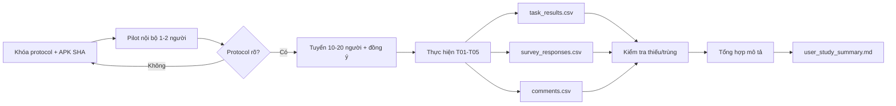

# Pipeline khảo sát người dùng bằng APK Android

> **Trạng thái:** Hướng dẫn khảo sát pilot. Source hiện tại chưa có bảng hỏi, dữ liệu người tham gia hoặc kết quả khảo sát.
>
> **Phạm vi khuyến nghị:** 10–20 người dùng cho khảo sát thăm dò có giám sát trong cùng mạng LAN. Kết quả mang tính mô tả, không đại diện cho toàn bộ người dân hoặc lực lượng cứu hộ.

## 1. Mục tiêu

Khảo sát trả lời các câu hỏi về khả dụng:

1. Người dùng có hiểu chức năng SOS và gửi báo cáo hay không?
2. Người dùng có hoàn thành được các nhiệm vụ chính mà không cần trợ giúp hay không?
3. Người dùng có hiểu trạng thái offline, hàng đợi và trạng thái cứu hộ hay không?
4. Bước nào gây nhầm lẫn hoặc mất nhiều thời gian?
5. Người dùng đánh giá giao diện dễ sử dụng và đáng tin ở mức nào?

Khảo sát này không đo độ chính xác MobileNetV3, độ trễ mạng, độ tin cậy backend hoặc hiệu quả cứu hộ thực tế.

## 2. Source hiện tại có gì và có dùng tiếp được không?

| Thành phần | Vị trí | Có thể dùng tiếp? | Ghi chú |
|---|---|---|---|
| APK Flutter | Build từ `products/fe/app` | **Có** | Phải khóa commit, server URL và APK SHA trước khảo sát. |
| Backend + dashboard | `products/be` | **Có** | Chạy DB demo riêng; điều phối viên có thể đổi trạng thái để người dùng quan sát. |
| Tình huống chức năng | `products/scripts/demo/e2e/e2e_system.py` | **Dùng làm cơ sở** | Chuyển các luồng SOS, ảnh, offline và trạng thái thành nhiệm vụ cho người dùng. |
| Ảnh thử nghiệm | `products/fe/model/Dataset_Flood` | **Có, dùng có kiểm soát** | Cung cấp ảnh fixture; không yêu cầu người tham gia chụp nạn nhân thật. |
| Phiếu khảo sát | — | **Chưa có** | Pipeline này định nghĩa schema và câu hỏi gợi ý. |
| Dữ liệu người tham gia | — | **Chưa có** | Chỉ tạo sau khi có đồng ý tham gia. |
| Script phân tích khảo sát | — | **Chưa có** | Hiện tổng hợp bằng bảng tính/Markdown. |

### Kết luận tái sử dụng

Có thể dùng APK, backend, dashboard và các kịch bản E2E. Không có artifact khảo sát sẵn; phải chuẩn bị protocol, phiếu đồng ý, bảng nhiệm vụ và file kết quả trước khi tuyển người tham gia.

## 3. Nguyên tắc dữ liệu và quyền riêng tư

- Người tham gia phải biết đây là app nghiên cứu/demo, không phải kênh cứu hộ thật.
- Chỉ dùng dữ liệu và tình huống mô phỏng.
- Không thu tên, số điện thoại, địa chỉ, GPS thật hoặc hình ảnh nhận diện người nếu không thật sự cần.
- Dùng mã `P001`, `P002`, ... trong dữ liệu phân tích.
- Phiếu đồng ý có danh tính phải lưu riêng, không commit vào Git và không đặt trong `results/`.
- Người tham gia có quyền dừng bất kỳ lúc nào.
- Không yêu cầu gửi SMS tới số khẩn cấp hoặc số của người ngoài.

Nếu đơn vị chủ trì có quy trình đạo đức/nghiên cứu với con người, phải thực hiện quy trình đó trước khi thu dữ liệu.

## 4. Thiết kế khảo sát khuyến nghị

### Quy mô

- 10–20 người cho pilot.
- Ghi tiêu chí tuyển chọn trước khi khảo sát.
- Nếu có hai nhóm vai trò khác nhau, ví dụ người dân và điều phối viên, báo cáo tách nhóm; không gộp khi nhiệm vụ khác nhau.

### Hình thức

Khuyến nghị khảo sát có giám sát tại cùng địa điểm:

- APK chạy trên điện thoại Android.
- Backend/dashboard chạy trên laptop cùng Wi-Fi.
- Người thực nghiệm bấm giờ và ghi lỗi/trợ giúp.
- Mỗi người dùng cùng APK, cùng kịch bản và cùng dữ liệu ảnh.

Hình thức này đơn giản và kiểm soát tốt hơn gửi APK từ xa. Gửi từ xa đòi hỏi server công khai, HTTPS, quản lý phiên bản và hỗ trợ cài APK ngoài cửa hàng.

## 5. Nhiệm vụ cho người tham gia

| Task | Mô tả cho người tham gia | Kết quả hoàn thành | Dữ liệu ghi |
|---|---|---|---|
| T01 | Tìm và gửi SOS | Backend nhận đúng một SOS | success, thời gian, lỗi, trợ giúp |
| T02 | Gửi báo cáo có ảnh fixture và mô tả | Backend nhận metadata + ảnh | success, thời gian, lỗi, trợ giúp |
| T03 | Gửi SOS khi người hướng dẫn ngắt mạng | App giữ báo cáo trong hàng đợi | success, mức hiểu trạng thái |
| T04 | Bật mạng lại và quan sát đồng bộ | Backend nhận báo cáo, hàng đợi về 0 | success, thời gian chờ, lỗi |
| T05 | Mở lịch sử và xem trạng thái “Đang đến” sau khi điều phối viên cập nhật | Người dùng tìm thấy trạng thái | success, thời gian, lỗi, trợ giúp |

Không hướng dẫn từng nút trước khi đo, trừ phần giới thiệu chung. Nếu phải trợ giúp, ghi số lần và nội dung trợ giúp.

## 6. Sơ đồ pipeline



## 7. Cấu trúc thư mục kết quả

```text
thuc_nghiem_nq/results/user_study/<YYYYMMDD-HHmmss>/
├── protocol.md
├── manifest.txt
├── git_status.txt
├── apk_sha256.txt
├── participants.csv
├── task_results.csv
├── survey_responses.csv
├── comments.csv
├── data_check.txt
├── user_study_summary.md
└── notes.md
```

Không đặt phiếu đồng ý có tên/chữ ký vào thư mục này. Nếu cần ảnh/video phiên khảo sát, phải có đồng ý riêng và lưu ngoài repo.

## 8. Điều chỉnh nơi lưu kết quả

Trong PowerShell:

```powershell
$Repo = "D:\nckh-flood-rescue\nckh2"
$ResultRoot = Join-Path $Repo "thuc_nghiem_nq\results\user_study"
$RunId = Get-Date -Format "yyyyMMdd-HHmmss"
$ResultDir = Join-Path $ResultRoot $RunId

New-Item -ItemType Directory -Force -Path $ResultDir | Out-Null
$ResultDir
```

Muốn lưu ngoài repo:

```powershell
$ResultRoot = "E:\ket_qua_nckh\user_study"
```

Nếu file có dữ liệu nhận diện, bắt buộc lưu ngoài repo và giới hạn quyền truy cập.

## 9. Hướng dẫn thực hiện từng bước

### Bước 1 — Khóa protocol trước khi tuyển người

**Mục đích:** tránh thay nhiệm vụ, câu hỏi hoặc tiêu chí sau khi đã thấy kết quả.

Tạo `protocol.md` trong `$ResultDir` với nội dung:

```markdown
# Protocol khảo sát

- Run ID:
- Mục tiêu:
- Số người dự kiến: 10-20
- Tiêu chí tham gia:
- Tiêu chí loại trừ:
- Thiết bị sử dụng:
- Task: T01-T05
- Thang trả lời: 1-5
- Chỉ số tổng hợp:
- Quy tắc xử lý dữ liệu thiếu:
- Ngưỡng thành công nếu có:
- Người điều phối khảo sát:
```

Nếu muốn dùng ngưỡng như “ít nhất 80% hoàn thành”, phải ghi ở bước này. Không đặt ngưỡng sau khi thu dữ liệu.

### Bước 2 — Khóa APK và môi trường

**Mục đích:** mọi người dùng cùng một phiên bản app.

```powershell
cd D:\nckh-flood-rescue\nckh2

$Repo = "D:\nckh-flood-rescue\nckh2"
$Apk = Join-Path $Repo "products\fe\app\build\app\outputs\flutter-apk\app-debug.apk"

Get-FileHash -Algorithm SHA256 -LiteralPath $Apk |
  Format-List |
  Out-File -LiteralPath (Join-Path $ResultDir "apk_sha256.txt") -Encoding UTF8

@(
  "experiment=user_study"
  "run_id=$RunId"
  "git_commit=$(git -C $Repo rev-parse HEAD)"
  "server_url=<ghi URL dùng trong APK>"
  "apk_path=$Apk"
) | Set-Content -LiteralPath (Join-Path $ResultDir "manifest.txt") -Encoding UTF8

git -C $Repo status --short |
  Set-Content -LiteralPath (Join-Path $ResultDir "git_status.txt") -Encoding UTF8
```

Không build lại APK giữa các phiên. Nếu buộc phải sửa app, kết thúc run hiện tại và tạo run ID mới.

### Bước 3 — Chuẩn bị backend và dữ liệu demo

**Mục đích:** mọi người thao tác trên dữ liệu mô phỏng và có thể reset.

```powershell
cd D:\nckh-flood-rescue\nckh2
.\products\scripts\demo\run_server.ps1 -Demo -Seed -Run 1 -Port 8000
```

Trước mỗi người tham gia, xác định cách dọn các báo cáo do người trước tạo. Không xóa dữ liệu trong khi người tham gia đang làm nhiệm vụ.

### Bước 4 — Tạo file dữ liệu rỗng

**Mục đích:** cố định schema trước khi nhập dữ liệu.

```powershell
@'
participant_id,session_date,age_group,android_experience,device_code,completed_session,notes
'@ | Set-Content -LiteralPath (Join-Path $ResultDir "participants.csv") -Encoding UTF8

@'
participant_id,task_id,success,duration_s,error_count,help_count,observer_notes
'@ | Set-Content -LiteralPath (Join-Path $ResultDir "task_results.csv") -Encoding UTF8

@'
participant_id,q1,q2,q3,q4,q5,q6
'@ | Set-Content -LiteralPath (Join-Path $ResultDir "survey_responses.csv") -Encoding UTF8

@'
participant_id,topic,comment
'@ | Set-Content -LiteralPath (Join-Path $ResultDir "comments.csv") -Encoding UTF8

"# Ghi chú chung`r`n" |
  Set-Content -LiteralPath (Join-Path $ResultDir "notes.md") -Encoding UTF8
```

`age_group` là nhóm tuổi, không ghi ngày sinh. `device_code` là mã thiết bị trong protocol, không cần IMEI.

### Bước 5 — Chuẩn bị câu hỏi sau nhiệm vụ

**Mục đích:** thu phản hồi nhất quán cho mọi người.

Dùng thang 1–5:

```text
1 = Hoàn toàn không đồng ý
2 = Không đồng ý
3 = Trung lập
4 = Đồng ý
5 = Hoàn toàn đồng ý
```

Các câu hỏi gợi ý:

| Mã | Câu hỏi |
|---|---|
| Q1 | Tôi dễ nhận biết cách gửi SOS. |
| Q2 | Tôi dễ tạo một báo cáo cứu hộ có ảnh. |
| Q3 | Trạng thái mất mạng/hàng đợi được trình bày dễ hiểu. |
| Q4 | Tôi dễ tìm trạng thái xử lý báo cáo. |
| Q5 | Các thông báo của ứng dụng giúp tôi biết thao tác đã thành công hay chưa. |
| Q6 | Nhìn chung, ứng dụng dễ sử dụng trong kịch bản thử nghiệm. |

Đây là bảng hỏi tùy chỉnh cho pilot, không gọi là SUS hoặc thang đo đã chuẩn hóa.

Hai câu hỏi mở:

1. Bước nào khó hiểu nhất?
2. Bạn muốn thay đổi điều gì trước tiên?

### Bước 6 — Chạy pilot nội bộ 1–2 người

**Mục đích:** phát hiện hướng dẫn mơ hồ và lỗi setup trước mẫu chính.

- Chạy toàn bộ T01–T05.
- Kiểm tra bấm giờ và cách ghi lỗi/trợ giúp.
- Kiểm tra backend nhận dữ liệu đúng.
- Sửa protocol nếu cần.
- Không gộp dữ liệu pilot vào mẫu chính nếu protocol đã thay đổi.

### Bước 7 — Thực hiện mỗi phiên khảo sát

**Mục đích:** giữ quy trình giống nhau giữa người tham gia.

Thứ tự:

1. Giải thích mục tiêu, quyền dừng và dữ liệu được thu.
2. Nhận đồng ý tham gia.
3. Gán mã `P001`, `P002`, ...; không ghi tên vào CSV.
4. Đưa tình huống mô phỏng và ảnh fixture.
5. Người tham gia làm T01–T05 theo đúng thứ tự protocol.
6. Người quan sát ghi thời gian, lỗi và số lần trợ giúp.
7. Người tham gia trả lời Q1–Q6 và hai câu hỏi mở.
8. Kiểm tra dữ liệu của phiên đã ghi đủ trước khi kết thúc.

Định nghĩa phải khóa trước:

- `success=1`: hoàn thành đúng kết quả mà không cần người điều phối làm thay.
- `error_count`: số thao tác sai hoặc đi vào luồng không mong muốn.
- `help_count`: số lần người điều phối phải gợi ý.
- `duration_s`: từ lúc đọc xong yêu cầu đến khi đạt kết quả.

### Bước 8 — Kiểm tra dữ liệu sau mỗi ngày

**Mục đích:** phát hiện thiếu dòng, trùng ID hoặc giá trị ngoài thang đo khi còn có thể đối chiếu ghi chú.

```powershell
$Participants = Import-Csv -LiteralPath (Join-Path $ResultDir "participants.csv")
$Tasks = Import-Csv -LiteralPath (Join-Path $ResultDir "task_results.csv")
$Survey = Import-Csv -LiteralPath (Join-Path $ResultDir "survey_responses.csv")

@(
  "participants=$($Participants.Count)"
  "task_rows=$($Tasks.Count)"
  "survey_rows=$($Survey.Count)"
  "duplicate_participant_ids=$(@($Participants | Group-Object participant_id | Where-Object Count -gt 1).Count)"
  "duplicate_task_rows=$(@($Tasks | Group-Object participant_id,task_id | Where-Object Count -gt 1).Count)"
) | Set-Content -LiteralPath (Join-Path $ResultDir "data_check.txt") -Encoding UTF8
```

Không tự điền giá trị còn thiếu. Ghi `NA` và giải thích quy tắc xử lý trong protocol.

### Bước 9 — Tổng hợp kết quả

**Mục đích:** tạo bảng mô tả phù hợp với mẫu pilot nhỏ.

Tổng hợp ít nhất:

- số người bắt đầu và hoàn thành;
- tỷ lệ hoàn thành từng task;
- median và khoảng thời gian từng task;
- median số lỗi và số lần trợ giúp;
- phân bố hoặc median/IQR Q1–Q6;
- nhóm chủ đề từ câu hỏi mở;
- số phiên bị loại và lý do.

Không dùng p-value hoặc kết luận đại diện dân số nếu protocol không được thiết kế cho suy luận thống kê.

### Bước 10 — Viết `user_study_summary.md`

**Mục đích:** tạo file đánh giá cuối cùng có thể trích vào báo cáo.

Cấu trúc:

```markdown
# Kết quả khảo sát người dùng

## Protocol và mẫu
- Run ID:
- APK SHA:
- Số người:
- Tiêu chí tham gia:
- Bối cảnh:

## Kết quả nhiệm vụ
| Task | Hoàn thành | Median thời gian | Lỗi | Trợ giúp |

## Phản hồi thang 1-5
| Câu | Median | IQR | Phân bố |

## Ý kiến định tính
- Chủ đề 1:
- Chủ đề 2:

## Lỗi/giới hạn
- Mẫu pilot 10-20 người.
- Không đại diện toàn bộ người dùng.
- Dữ liệu và tình huống mô phỏng.
```

## 10. File chạy, file kết quả và file đánh giá

### File chạy

Khảo sát không có runner tự động. “Runner” là `protocol.md`, APK đã khóa SHA và người điều phối thực hiện đúng quy trình.

### File kết quả

- `participants.csv`: đặc điểm mẫu ở mức tối thiểu và ẩn danh.
- `task_results.csv`: kết quả khách quan theo task.
- `survey_responses.csv`: điểm Q1–Q6.
- `comments.csv`: phản hồi mở đã gắn participant ID.

### File đánh giá

- `data_check.txt`: kiểm tra số dòng và ID trùng.
- `user_study_summary.md`: kết quả mô tả và giới hạn.

## 11. Tiêu chí hoàn tất pipeline

Khảo sát đủ điều kiện đưa vào báo cáo khi:

1. Protocol được khóa trước mẫu chính.
2. Tất cả người tham gia đã đồng ý.
3. Mọi file phân tích chỉ dùng participant ID.
4. Mỗi người có đủ task rows hoặc lý do dữ liệu thiếu.
5. APK SHA và commit được lưu.
6. Kết quả pilot không bị trình bày như đại diện dân số.
7. Báo cáo phân biệt rõ số đo quan sát, ý kiến người dùng và suy luận của nhóm.

## 12. Những điều không được kết luận từ khảo sát này

- Không kết luận app làm giảm thiệt hại hoặc thời gian cứu hộ thực tế.
- Không kết luận app hoạt động ổn định trên mọi điện thoại/mạng.
- Không thay kết quả kỹ thuật mạng yếu hoặc Android E2E bằng mức hài lòng.
- Không gọi phản hồi 10–20 người là đại diện cho toàn bộ người dân.
- Không gọi Q1–Q6 là thang đo chuẩn hóa.
