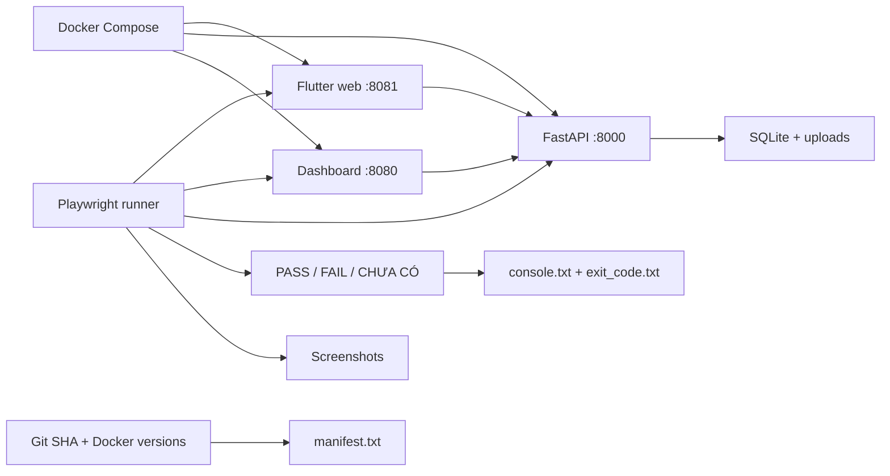

# Pipeline thực nghiệm end-to-end trên bản web

> **Trạng thái:** Hướng dẫn chạy thực nghiệm. File này không phải kết quả thực nghiệm.
>
> **Phạm vi:** Chromium đóng vai người dùng app Flutter web và điều phối viên dashboard. Pipeline đánh giá luồng web → backend → dashboard; không đánh giá camera, SMS, Workmanager hoặc AI on-device của Android.

## 1. Mục tiêu

Thực nghiệm kiểm tra toàn bộ chuỗi chức năng:

1. App web tạo SOS và báo cáo có ảnh.
2. Backend xác thực, lưu, phân cụm và cung cấp trạng thái.
3. Dashboard đăng nhập, hiển thị dữ liệu và điều phối.
4. App nhận lại trạng thái điều phối.
5. Báo cáo không bị mất khi offline và được đồng bộ khi có mạng lại.
6. Chính sách gửi thích ứng chọn ảnh gốc, ảnh nén hoặc chỉ metadata.
7. Báo cáo thiếu GPS được đưa vào hàng xem xét thay vì gắn tọa độ giả.

Đây là kiểm thử chấp nhận chức năng. Kết quả chính là PASS/FAIL, không phải benchmark tải hoặc độ trễ hệ thống.

## 2. Source hiện tại có gì và có dùng tiếp được không?

| Thành phần | Vị trí | Có thể dùng tiếp? | Ghi chú |
|---|---|---|---|
| Runner E2E | `products/scripts/demo/e2e/e2e_system.py` | **Có** | Playwright điều khiển Chromium và gọi API kiểm chứng. |
| Dependency | `products/scripts/demo/e2e/requirements.txt` | **Có** | Dùng Playwright. |
| Docker Compose | `docker-compose.yml` và `products/docker/` | **Có, khuyến nghị** | Cung cấp đúng ba URL và reverse proxy mà runner mặc định sử dụng. |
| App Flutter web | `products/fe/app` | **Có** | Chạy tại cổng 8081 trong Docker. |
| Backend | `products/be` | **Có** | Chạy tại cổng 8000. |
| Dashboard | Backend template và container dashboard | **Có** | Chạy tại cổng 8080 trong Docker. |
| Ảnh kiểm thử | `products/fe/model/Dataset_Flood/high` | **Có** | Runner lấy ảnh đầu tiên theo thứ tự tên file. |
| Dữ liệu seed | `thucnghiem/data/gold/run_001` | **Có** | Dashboard có sẵn cụm để kiểm tra. |
| Kết quả lần chạy cũ | `docs/nghiem-thu/doi_chieu_thuyet_minh.md` | **Chỉ là ghi nhận** | Ghi 46/46 nhưng không kèm console, manifest hoặc screenshot của lần chạy. |

### Vì sao nên dùng Docker cho pipeline này?

Runner mặc định dùng:

- app: `http://localhost:8081`;
- API: `http://localhost:8000`;
- dashboard: `http://localhost:8080`.

Container app và dashboard có reverse proxy cho `/api`, `/uploads`, `/docs`, `/probe` và `/sync`. Chạy Flutter web bằng dev server mà không có proxy có thể làm các kiểm tra ảnh hoặc `/docs` sai URL. Vì vậy Docker là đường chạy phù hợp nhất với runner hiện tại.

## 3. Những nhóm kiểm tra hiện có

| Nhóm | Nội dung |
|---|---|
| Dashboard | Đăng nhập, cụm, bản đồ, chi tiết, lịch sử, thống kê, Swagger và lỗi console. |
| App online | SOS, GPS, UTC, gửi ảnh, SHA-256, mô tả và trạng thái. |
| Offline/online | Đưa SOS vào outbox, server chưa nhận khi offline, tự đồng bộ và outbox về 0. |
| Phân cụm/điều phối | Báo cáo xuất hiện trong cụm; dashboard đổi trạng thái; app nhận “Đang đến”. |
| Gửi thích ứng | 300 kbit/s dùng ảnh nén; 20 kbit/s chỉ gửi text. |
| Không GPS | Vẫn gửi được; lat/lng để trống; backend đưa vào hàng xem xét. |

Số PASS có thể thay đổi khi source thêm hoặc bớt assertion. Tiêu chí ổn định là **không có FAIL và exit code bằng 0**, không khóa cứng con số 46.

## 4. Sơ đồ pipeline



## 5. Cấu trúc thư mục kết quả

```text
thuc_nghiem_nq/results/web_end_to_end/<YYYYMMDD-HHmmss>/
├── console.txt
├── exit_code.txt
├── manifest.txt
├── git_status.txt
├── docker_ps_before.txt
├── docker_ps_after.txt
├── docker_logs.txt
├── notes.md
└── screenshots/
    ├── dashboard.png
    ├── app_submitted.png
    └── app_history.png
```

Runner chưa xuất JSON/JUnit. `console.txt` và `exit_code.txt` là bằng chứng máy đọc được ở mức hiện tại; screenshot hỗ trợ kiểm tra trực quan.

## 6. Điều chỉnh nơi lưu kết quả

Chạy các lệnh từ PowerShell ở gốc repo. Chỉ cần đổi `$Repo` hoặc `$ResultRoot`:

```powershell
$Repo = "D:\nckh-flood-rescue\nckh2"
$ResultRoot = Join-Path $Repo "thuc_nghiem_nq\results\web_end_to_end"
$RunId = Get-Date -Format "yyyyMMdd-HHmmss"
$ResultDir = Join-Path $ResultRoot $RunId
$ScreenshotDir = Join-Path $ResultDir "screenshots"

New-Item -ItemType Directory -Force -Path $ScreenshotDir | Out-Null
$ResultDir
```

Nếu muốn lưu ở ổ khác:

```powershell
$ResultRoot = "E:\ket_qua_nckh\web_end_to_end"
```

Giữ nguyên `$RunId` và `$ResultDir` trong toàn bộ lần chạy.

## 7. Hướng dẫn chạy từng bước

### Bước 1 — Kiểm tra công cụ

**Mục đích:** dừng sớm nếu thiếu Docker, Python hoặc Git.

```powershell
cd D:\nckh-flood-rescue\nckh2
docker --version
docker compose version
python --version
git --version
```

Docker Desktop phải đang chạy.

### Bước 2 — Tạo thư mục kết quả

**Mục đích:** cách ly artifact của lần chạy, tránh ghi đè lần trước.

```powershell
$Repo = "D:\nckh-flood-rescue\nckh2"
$ResultRoot = Join-Path $Repo "thuc_nghiem_nq\results\web_end_to_end"
$RunId = Get-Date -Format "yyyyMMdd-HHmmss"
$ResultDir = Join-Path $ResultRoot $RunId
$ScreenshotDir = Join-Path $ResultDir "screenshots"
New-Item -ItemType Directory -Force -Path $ScreenshotDir | Out-Null
```

### Bước 3 — Ghi manifest trước khi chạy

**Mục đích:** biết kết quả được tạo bởi commit và môi trường nào.

```powershell
@(
  "experiment=web_end_to_end"
  "run_id=$RunId"
  "git_commit=$(git -C $Repo rev-parse HEAD)"
  "app=http://localhost:8081"
  "api=http://localhost:8000"
  "dashboard=http://localhost:8080"
  "python=$(python --version 2>&1)"
  "docker=$(docker --version)"
  "docker_compose=$(docker compose version)"
) | Set-Content -LiteralPath (Join-Path $ResultDir "manifest.txt") -Encoding UTF8

git -C $Repo status --short |
  Set-Content -LiteralPath (Join-Path $ResultDir "git_status.txt") -Encoding UTF8

"# Ghi chú lần chạy`r`n" |
  Set-Content -LiteralPath (Join-Path $ResultDir "notes.md") -Encoding UTF8
```

Nếu `git_status.txt` không rỗng, phải ghi trong báo cáo rằng thực nghiệm chạy trên working tree có thay đổi.

### Bước 4 — Tạo môi trường Playwright

**Mục đích:** cài đúng dependency của runner mà không trộn vào venv backend.

```powershell
cd $Repo

if (-not (Test-Path ".venv-e2e\Scripts\python.exe")) {
  python -m venv .venv-e2e
}

& ".\.venv-e2e\Scripts\Activate.ps1"
python -m pip install --upgrade pip
python -m pip install -r products\scripts\demo\e2e\requirements.txt
python -m playwright install chromium
```

`.venv-e2e` đã được `.gitignore` bỏ qua.

### Bước 5 — Khởi động ba service

**Mục đích:** dựng đúng môi trường mà E2E runner đã được viết để kiểm tra.

```powershell
cd $Repo
docker compose up -d --build
docker compose ps |
  Set-Content -LiteralPath (Join-Path $ResultDir "docker_ps_before.txt") -Encoding UTF8
```

Mở và kiểm tra:

- App web: <http://localhost:8081>
- Backend: <http://localhost:8000>
- Dashboard: <http://localhost:8080>

Chờ đến khi các service báo healthy. Nếu không healthy, xem:

```powershell
docker compose logs --no-color
```

### Bước 6 — Chạy E2E và lưu output

**Mục đích:** chạy toàn bộ kịch bản và lưu bằng chứng của từng assertion.

```powershell
cd $Repo
& ".\.venv-e2e\Scripts\Activate.ps1"

python products\scripts\demo\e2e\e2e_system.py `
  --app http://localhost:8081 `
  --api http://localhost:8000 `
  --dashboard http://localhost:8080 `
  --screenshots $ScreenshotDir `
  2>&1 | Tee-Object -FilePath (Join-Path $ResultDir "console.txt")

$E2EExitCode = $LASTEXITCODE
$E2EExitCode |
  Set-Content -LiteralPath (Join-Path $ResultDir "exit_code.txt") -Encoding ASCII
```

Không thao tác thủ công trên app hoặc dashboard trong lúc runner đang chạy.

### Bước 7 — Lưu trạng thái và log container

**Mục đích:** có dữ liệu chẩn đoán nếu runner thất bại.

```powershell
docker compose ps |
  Set-Content -LiteralPath (Join-Path $ResultDir "docker_ps_after.txt") -Encoding UTF8

docker compose logs --no-color |
  Set-Content -LiteralPath (Join-Path $ResultDir "docker_logs.txt") -Encoding UTF8
```

### Bước 8 — Kiểm tra kết quả

**Mục đích:** xác nhận artifact tối thiểu đã được tạo.

```powershell
Get-Content -LiteralPath (Join-Path $ResultDir "exit_code.txt")
Select-String -LiteralPath (Join-Path $ResultDir "console.txt") -Pattern "FAIL|CHƯA CÓ|Tổng:"
Get-ChildItem -LiteralPath $ScreenshotDir
```

Điều kiện đạt:

- `exit_code.txt` bằng `0`;
- dòng tổng kết có `0 FAIL`;
- không có container unhealthy hoặc restart bất thường;
- các mục `CHƯA CÓ`, nếu xuất hiện, được ghi lại trong `notes.md` và báo cáo.

### Bước 9 — Dừng môi trường

**Mục đích:** giải phóng cổng và container sau khi đã lưu log.

```powershell
docker compose down
```

Lệnh trên giữ volume. Chỉ dùng `docker compose down -v` khi chắc chắn muốn xóa database Docker của lần demo.

## 8. File chạy, file kết quả và file đánh giá

### File chạy

```text
products/scripts/demo/e2e/e2e_system.py
```

### File kết quả

- `console.txt`: từng assertion PASS/FAIL/CHƯA CÓ và dòng tổng.
- `exit_code.txt`: trạng thái tiến trình.
- `screenshots/*.png`: bằng chứng giao diện tại các mốc runner hỗ trợ.
- `docker_logs.txt`: log hệ thống để điều tra lỗi.

### File đánh giá

Runner đang tự đánh giá ngay trong `e2e_system.py` bằng hàm `check()`. Source hiện tại chưa có evaluator hoặc report JSON riêng. Khi tổng hợp báo cáo, chỉ trích kết quả từ `console.txt` của lần chạy có manifest đầy đủ.

## 9. Cách đọc kết quả

| Trạng thái | Diễn giải |
|---|---|
| `PASS` | Assertion cho kết quả mong đợi. |
| `FAIL` | Có lỗi chức năng; runner trả exit code 1. |
| `CHƯA CÓ` | Chức năng được liệt kê là khoảng trống nhưng không làm runner thất bại. |

Không lấy “số PASS” chia cho tổng assertion để gọi là độ chính xác. Đây là danh sách kiểm thử chức năng; một FAIL quan trọng có thể nghiêm trọng hơn nhiều PASS nhỏ.

## 10. Tiêu chí hoàn tất pipeline

Một lần chạy đủ điều kiện báo cáo khi:

1. Có manifest, git status, console, exit code và log Docker.
2. Runner chạy trên service healthy.
3. Exit code bằng 0 và không có FAIL.
4. Screenshot được lưu hoặc ghi rõ lý do thiếu.
5. Database và source không bị thay đổi thủ công trong lúc chạy.
6. Mọi giới hạn được ghi trong `notes.md`.

## 11. Những gì cần bổ sung sau này

Không gộp các mục sau vào kết luận E2E web hiện tại:

- E2E Android thật với camera, GPS, Workmanager và SMS.
- AI on-device ONNX/ExecuTorch.
- Benchmark latency, throughput hoặc nhiều người dùng đồng thời.
- Mạng di động thật và mức tiêu thụ pin.
- Khảo sát người dùng.

Các nội dung Android và khảo sát có pipeline riêng trong `experiment_mobile_app.md` và `experiment_user.md`.
