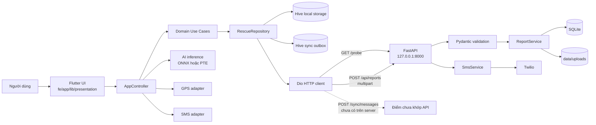
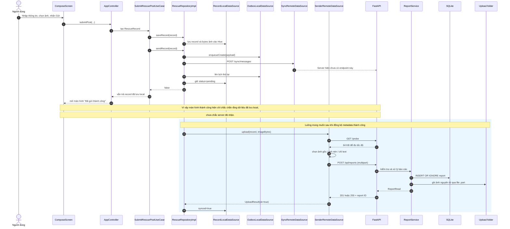
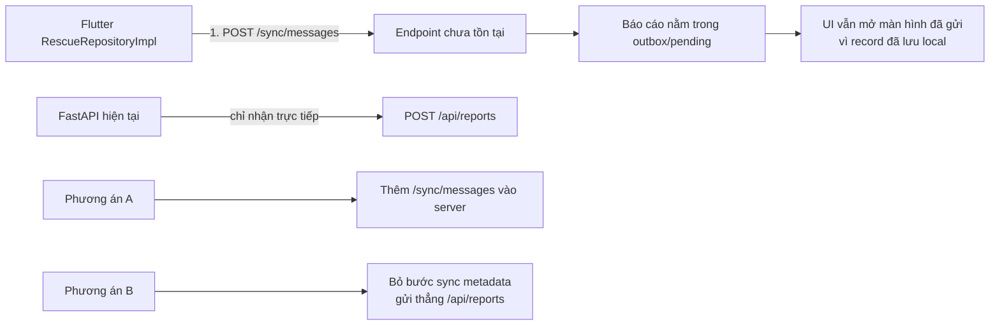

# Cấu trúc code App và Server

Tài liệu này mô tả cấu trúc đang được dùng để chạy hệ thống cứu hộ trên Android và Chrome.

## 1. Hai thư mục chính

| Thành phần | Thư mục | Vai trò |
|---|---|---|
| Flutter App | `fe/app/` | Giao diện, AI trên thiết bị, GPS, lưu offline và gửi báo cáo. Android và Chrome dùng chung thư mục này. |
| FastAPI Server | `web_fullstack/backend/` | Nhận báo cáo, kiểm tra dữ liệu, lưu SQLite/ảnh và gửi SMS qua Twilio. |
| Script chạy hệ thống | `web_fullstack/scripts/` | Chuẩn bị runtime, chạy app/server, test và build. |

> `web_fullstack/frontend/` là frontend thử nghiệm cũ/tách riêng. Luồng chính hiện tại chạy Flutter từ `fe/app/` thông qua `web_fullstack/scripts/run_frontend.ps1`.

## 2. Kiến trúc tổng thể



## 3. Luồng gửi báo cáo chi tiết



## 4. Flutter App — `fe/app/`

### 4.1 File gốc và cấu hình

| File/thư mục | Chức năng |
|---|---|
| `lib/main.dart` | Khởi tạo datasource, repository, controller và chạy `RescueApp`. |
| `lib/config.dart` | URL backend, số SMS và các ngưỡng mạng/nén/AI. |
| `pubspec.yaml` | Khai báo package Flutter, dependency và asset. |
| `pubspec.lock` | Khóa phiên bản dependency đã cài. |
| `analysis_options.yaml` | Quy tắc analyzer/lint cho Dart. |
| `assets/labels.json` | Tên nhãn đầu ra của model AI. |
| `assets/models/` | Model ONNX, PTE và manifest dùng trên thiết bị. |
| `assets/images/` | Logo và ảnh giao diện. |
| `model.pth` | Checkpoint PyTorch nguồn dùng để xuất model. |

### 4.2 Presentation — giao diện và trạng thái

| File | Chức năng |
|---|---|
| `presentation/controllers/app_controller.dart` | Điều phối đăng nhập, GPS, AI, gửi báo cáo, đồng bộ và SMS; cung cấp trạng thái cho UI. |
| `presentation/screens/splash_screen.dart` | Màn hình khởi động và nạp dữ liệu ban đầu. |
| `presentation/screens/main_navigation_screen.dart` | Điều hướng giữa trang chủ, lịch sử, hướng dẫn, cài đặt, soạn và kết quả. |
| `presentation/screens/home/home_screen.dart` | Trang chủ và nút thao tác cứu hộ chính. |
| `presentation/screens/compose/compose_screen.dart` | Form nhập báo cáo, chọn ảnh và gọi AI phân tích. |
| `presentation/screens/submitted/submitted_screen.dart` | Hiển thị thông tin báo cáo vừa lưu/gửi. |
| `presentation/screens/history/history_screen.dart` | Danh sách báo cáo đã lưu trên thiết bị. |
| `presentation/screens/guide/guide_screen.dart` | Hướng dẫn ứng phó và sơ cứu. |
| `presentation/screens/settings/settings_screen.dart` | Thông tin người dùng và tùy chọn model AI. |
| `presentation/screens/auth/login_screen.dart` | Đăng nhập local hoặc tiếp tục với tư cách khách. |
| `presentation/screens/auth/register_screen.dart` | Tạo tài khoản local. |
| `presentation/widgets/app_header.dart` | Phần đầu trang dùng chung. |
| `presentation/widgets/compose_cta_card.dart` | Thẻ kêu gọi tạo báo cáo. |
| `presentation/widgets/number_stepper_input.dart` | Tăng/giảm số người mắc kẹt hoặc bị thương. |
| `presentation/widgets/post_card.dart` | Hiển thị một báo cáo và ảnh trong lịch sử. |
| `presentation/widgets/quick_call_panel.dart` | Các nút gọi nhanh số khẩn cấp. |
| `presentation/widgets/phone_link_card.dart` | Thẻ số điện thoại có thể bấm gọi. |
| `presentation/widgets/screen_header.dart` | Tiêu đề và nút quay lại dùng chung. |
| `presentation/widgets/sms_confirmation_dialog.dart` | Hộp thoại xác nhận cuối trước khi gửi SMS. |
| `presentation/widgets/sos_button.dart` | Nút SOS thao tác nhanh. |
| `presentation/widgets/status_badge.dart` | Nhãn trạng thái báo cáo. |
| `presentation/widgets/status_tracker.dart` | Thanh tiến trình xử lý cứu hộ. |
| `presentation/widgets/tag_chip.dart` | Hiển thị nhãn AI. |
| `presentation/widgets/vulnerable_group_selector.dart` | Chọn nhóm ưu tiên như trẻ em/người cao tuổi. |
| `presentation/widgets/ai_model_settings_sheet.dart` | Chọn ONNX/PTE và chế độ so sánh model. |
| `presentation/widgets/ai_model_runtime_card.dart` | Hiển thị model đang chạy và benchmark. |

### 4.3 Domain — luật nghiệp vụ

#### Entities

| File | Chức năng |
|---|---|
| `domain/entities/rescue_record.dart` | Dữ liệu báo cáo cứu hộ và trạng thái đồng bộ. |
| `domain/entities/rescue_image.dart` | Bytes ảnh, tên file và MIME type. |
| `domain/entities/sync_message.dart` | Cấu trúc message đồng bộ tổng quát. |
| `domain/entities/ai_tag.dart` | Nhãn và độ tin cậy AI. |
| `domain/entities/ai_model_type.dart` | Loại model ONNX/PTE và kết quả benchmark. |
| `domain/entities/user.dart` | Thông tin tài khoản local. |
| `domain/entities/emergency_number.dart` | Mô hình số điện thoại khẩn cấp. |
| `domain/entities/first_aid_item.dart` | Mục hướng dẫn sơ cứu. |
| `domain/entities/region.dart` | Thông tin khu vực. |

#### Repository contracts

| File | Chức năng |
|---|---|
| `domain/repositories/rescue_repository.dart` | Hợp đồng lưu, gửi và đồng bộ báo cáo. |
| `domain/repositories/inference_repository.dart` | Hợp đồng nạp/chạy model AI. |
| `domain/repositories/network_repository.dart` | Hợp đồng đọc trạng thái mạng. |

#### Use cases

| File | Chức năng |
|---|---|
| `domain/usecases/submit_rescue_post_usecase.dart` | Tạo, lưu local rồi yêu cầu gửi báo cáo đầy đủ. |
| `domain/usecases/send_sos_usecase.dart` | Tạo báo cáo SOS tối giản và gửi nhanh. |
| `domain/usecases/sync_pending_records_usecase.dart` | Gửi lại các báo cáo chưa đồng bộ. |
| `domain/usecases/get_rescue_records_usecase.dart` | Lấy danh sách báo cáo local. |
| `domain/usecases/analyze_image_usecase.dart` | Chạy AI trên bytes ảnh và tạo tag. |

### 4.4 Data — triển khai lưu trữ, mạng và nền tảng

#### Repository implementations

| File | Chức năng |
|---|---|
| `data/repositories/rescue_repository_impl.dart` | Kết hợp Hive record, outbox, sync metadata và upload ảnh. |
| `data/repositories/inference_repository_impl.dart` | Chuyển lời gọi domain sang inference datasource. |
| `data/repositories/network_repository_impl.dart` | Đọc trạng thái và thay đổi kết nối mạng. |

#### Báo cáo và đồng bộ

| File | Chức năng |
|---|---|
| `data/datasources/record_local_datasource.dart` | Lưu/đọc `RescueRecord` bằng Hive. |
| `data/datasources/outbox_local_datasource.dart` | Hàng đợi đồng bộ, retry, backoff, dead-letter và chống trùng. |
| `data/datasources/sync_remote_datasource.dart` | Gửi batch tới `POST /sync/messages`. Endpoint này hiện chưa có ở FastAPI. |
| `data/datasources/sender_remote_datasource.dart` | Đo `/probe`, chọn chất lượng ảnh và upload multipart tới `/api/reports`. |
| `data/models/sync_message_model.dart` | Chuyển sync message sang JSON lưu local và JSON gửi server. |
| `core/sync/payload_hash.dart` | Chuẩn hóa payload và tạo SHA-256 để kiểm tra trùng/lệch dữ liệu. |

#### Đồng bộ theo nền tảng

| File | Chức năng |
|---|---|
| `data/datasources/sync/platform_sync.dart` | Interface chung của bộ kích hoạt đồng bộ. |
| `data/datasources/sync/platform_sync_factory.dart` | Chọn implementation native hoặc web bằng conditional import. |
| `data/datasources/sync/platform_sync_native.dart` | Android dùng WorkManager để chạy đồng bộ nền. |
| `data/datasources/sync/platform_sync_web.dart` | Chrome đồng bộ khi khởi động và khi trình duyệt online lại. |
| `data/datasources/sync/browser_online_events_web.dart` | Bọc sự kiện `online` của trình duyệt. |
| `data/datasources/sync/serialized_sync_runner.dart` | Không cho nhiều lượt sync chạy chồng nhau. |

#### AI inference

| File | Chức năng |
|---|---|
| `data/datasources/inference/inference_data_source.dart` | Interface inference chung. |
| `data/datasources/inference/inference_data_source_factory.dart` | Chọn native/web implementation. |
| `data/datasources/inference/inference_native_data_source.dart` | Tiền xử lý ảnh và chạy ONNX/PTE trên native. |
| `data/datasources/inference/inference_web_data_source.dart` | Tiền xử lý/kết quả inference trên Chrome. |
| `data/datasources/inference/web_inference_bridge.dart` | Export bridge thích hợp cho nền tảng. |
| `data/datasources/inference/web_inference_bridge_web.dart` | Gọi JavaScript ONNX Runtime Web. |
| `data/datasources/inference/web_inference_bridge_stub.dart` | Stub để code ngoài Web vẫn biên dịch. |
| `data/datasources/inference_local_datasource_native.dart` | Implementation inference native thế hệ cũ/khác namespace. |
| `data/datasources/inference_local_datasource_web.dart` | Implementation inference web thế hệ cũ/khác namespace. |
| `services/inference_service_native.dart` | Service ONNX native cũ, hiện không được luồng chính import trực tiếp. |
| `services/inference_service_web.dart` | Service Web tương ứng, hiện không được luồng chính import trực tiếp. |

#### Ảnh, vị trí, mạng, người dùng và SMS

| File | Chức năng |
|---|---|
| `data/datasources/image/image_compressor.dart` | Interface nén ảnh. |
| `data/datasources/image/image_compressor_factory.dart` | Chọn bộ nén native/web. |
| `data/datasources/image/image_compressor_native.dart` | Nén bằng plugin native. |
| `data/datasources/image/image_compressor_web.dart` | Nén ảnh bằng codec chạy trên Web. |
| `data/datasources/location/location_data_source.dart` | Interface lấy GPS. |
| `data/datasources/location/location_data_source_factory.dart` | Chọn GPS native/web. |
| `data/datasources/location/location_native_data_source.dart` | Xin quyền và lấy GPS thiết bị. |
| `data/datasources/location/location_web_data_source.dart` | Lấy vị trí qua trình duyệt. |
| `data/datasources/network_remote_datasource.dart` | Theo dõi Wi-Fi/mobile/offline bằng connectivity plugin. |
| `data/datasources/user_local_datasource.dart` | Lưu tài khoản local bằng Hive. |
| `data/datasources/sms/sms_gateway.dart` | Interface capability và gửi SMS đã xác nhận. |
| `data/datasources/sms/sms_gateway_factory.dart` | Chọn SMS native/web. |
| `data/datasources/sms/sms_gateway_native.dart` | Gửi SMS qua native method channel. |
| `data/datasources/sms/sms_gateway_web.dart` | Gọi capability và API SMS của backend. |

### 4.5 Web runtime

| File/thư mục | Chức năng |
|---|---|
| `web/index.html` | Trang HTML chứa Flutter Web. |
| `web/manifest.json` | Metadata PWA. |
| `web/onnx_bridge.js` | JavaScript nạp model và chạy ONNX Runtime Web. |
| `web/vendor/ort/` | Runtime ONNX Web được phục vụ local, không phụ thuộc CDN. |
| `web_runtime/package.json` | Khóa package npm dùng để chuẩn bị runtime ONNX. |
| `web_runtime/package-lock.json` | Khóa phiên bản npm chính xác. |

### 4.6 Native platform

| Thư mục | Chức năng |
|---|---|
| `android/` | Gradle, manifest, MainActivity, WorkManager và bridge ExecuTorch/SMS cho Android. |
| `ios/` | Cấu hình và runner iOS. |
| `macos/` | Cấu hình và runner macOS. |
| `windows/` | CMake và runner Windows. |
| `linux/` | CMake và runner Linux. |

Các file icon, storyboard, Gradle wrapper và runner sinh bởi Flutter được giữ theo chuẩn nền tảng; thường không cần sửa khi thay đổi nghiệp vụ.

### 4.7 Test Flutter

| File | Chức năng |
|---|---|
| `test/ai_model_test.dart` | Kiểm tra model mặc định, ảnh lỗi và mapping nhãn AI. |
| `test/assets/model_assets_test.dart` | Kiểm tra model/manifest đã được bundle. |
| `test/sync_contract_test.dart` | Kiểm tra payload hash và wire contract của sync message. |
| `test/domain/rescue_image_test.dart` | Kiểm tra serialize/deserialize ảnh. |
| `test/data/record_local_datasource_test.dart` | Kiểm tra lưu/đọc báo cáo và ảnh trong Hive. |
| `test/data/sender_remote_datasource_test.dart` | Kiểm tra chọn chế độ ảnh và multipart upload. |
| `test/data/platform_sync_web_test.dart` | Kiểm tra các lượt sync Web không chạy chồng nhau. |
| `test/data/inference_repository_test.dart` | Kiểm tra repository chuyển tiếp trạng thái/model đúng. |
| `test/data/inference_web_data_source_test.dart` | Kiểm tra kết quả inference Web hợp lệ. |
| `test/data/image_compressor_web_test.dart` | Kiểm tra nén Web tạo JPEG đúng kích thước. |
| `test/data/sms_gateway_web_test.dart` | Kiểm tra capability, xác nhận và request SMS. |
| `test/presentation/app_controller_test.dart` | Kiểm tra khởi tạo, GPS, reconnect và SMS. |
| `test/presentation/main_navigation_screen_test.dart` | Kiểm tra điều hướng và nút Back. |
| `test/presentation/sms_confirmation_dialog_test.dart` | Kiểm tra bước xác nhận SMS. |
| `test/presentation/ai_model_runtime_card_test.dart` | Kiểm tra widget thông tin model. |

## 5. FastAPI Server — `web_fullstack/backend/`

### 5.1 File ứng dụng

| File | Chức năng |
|---|---|
| `app/main.py` | Tạo FastAPI app, middleware CORS, service/repository và đăng ký route. |
| `app/config.py` | Đọc `.env`: host, port, SQLite, upload, CORS và Twilio. |
| `app/domain.py` | Pydantic model cho report, SMS, trạng thái và validation. |
| `app/database.py` | Tạo bảng SQLite và CRUD report/SMS. |
| `app/report_service.py` | Kiểm tra ảnh, chống trùng report, lưu DB và ghi ảnh an toàn. |
| `app/sms.py` | Kiểm tra cấu hình/xác nhận/rate limit/idempotency rồi gọi Twilio. |
| `app/routes/reports.py` | API tạo, liệt kê và xem một báo cáo. |
| `app/routes/sms.py` | API gửi SMS và xem trạng thái SMS. |
| `app/__init__.py` | Đánh dấu `app` là Python package. |
| `app/routes/__init__.py` | Đánh dấu `routes` là Python package. |

### 5.2 Cấu hình và dữ liệu

| File/thư mục | Chức năng |
|---|---|
| `.env.example` | Mẫu biến môi trường an toàn để commit. |
| `.env` | Cấu hình thật trên máy; chứa secret và không được commit. |
| `pyproject.toml` | Metadata Python và dependency FastAPI/Uvicorn/Twilio. |
| `README.md` | Hướng dẫn chạy backend và cấu hình. |
| `data/flood_rescue.db` | SQLite database được tạo khi server chạy. |
| `data/uploads/` | Ảnh báo cáo đã nhận. |

### 5.3 API hiện có

| Method | Endpoint | Chức năng |
|---|---|---|
| `GET` | `/health` | Kiểm tra server đang sống. |
| `GET` | `/probe` | Trả 64 KB để app đo tốc độ mạng. |
| `GET` | `/api/capabilities` | Báo khả năng lưu trữ và gửi SMS. |
| `POST` | `/api/reports` | Nhận report multipart và ảnh tùy chọn. |
| `GET` | `/api/reports` | Liệt kê report đã lưu. |
| `GET` | `/api/reports/{report_id}` | Xem một report. |
| `POST` | `/api/reports/{report_id}/sms` | Gửi SMS sau xác nhận. |
| `GET` | `/api/sms/status/{message_id}` | Xem trạng thái SMS. |

### 5.4 Test backend

| File | Chức năng |
|---|---|
| `tests/conftest.py` | Tạo app, database và dependency giả cho test. |
| `tests/test_health.py` | Kiểm tra health, CORS, capability và probe. |
| `tests/test_reports.py` | Kiểm tra tạo/list report, ảnh, validation và idempotency. |
| `tests/test_sms.py` | Kiểm tra xác nhận, cấu hình, rate limit và lỗi Twilio. |

## 6. Script — `web_fullstack/scripts/`

| File | Chức năng |
|---|---|
| `run_backend.ps1` | Tạo `.venv`, cài backend và chạy Uvicorn cổng 8000. |
| `run_frontend.ps1` | Chuẩn bị ONNX runtime rồi chạy Flutter Web cổng 8080. |
| `run_all.ps1` | Chạy backend và frontend cùng nhau. |
| `prepare_frontend_runtime.ps1` | Cài/copy ONNX Runtime Web vào `fe/app/web/vendor/ort`. |
| `export_web_model.ps1` | Xuất model PyTorch sang ONNX và đồng bộ artifact. |
| `test_backend.ps1` | Cài dependency test và chạy test FastAPI. |
| `verify.ps1` | Chạy kiểm tra tổng hợp backend, Flutter, model và build. |

## 7. Điểm chưa khớp cần xử lý tiếp



Hiện tại `GET /api/reports` trả danh sách rỗng dù app hiện “Đã gửi thành công” vì bước `/sync/messages` thất bại trước khi app chạy upload `/api/reports`.

## 8. Lệnh chạy nhanh

```powershell
# Backend
.\web_fullstack\scripts\run_backend.ps1

# Flutter Web (terminal khác)
.\web_fullstack\scripts\run_frontend.ps1

# Chạy cả hai
.\web_fullstack\scripts\run_all.ps1
```

- Flutter Web: `http://127.0.0.1:8080`
- Backend: `http://127.0.0.1:8000`
- Swagger: `http://127.0.0.1:8000/docs`

